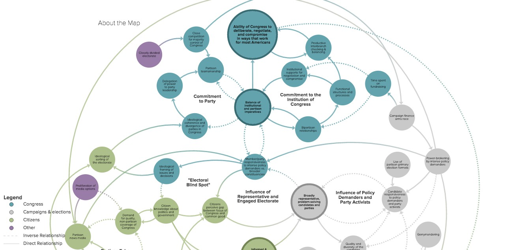
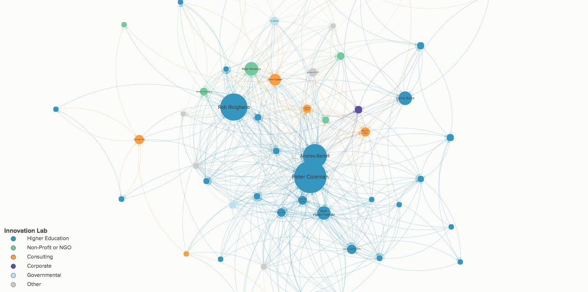
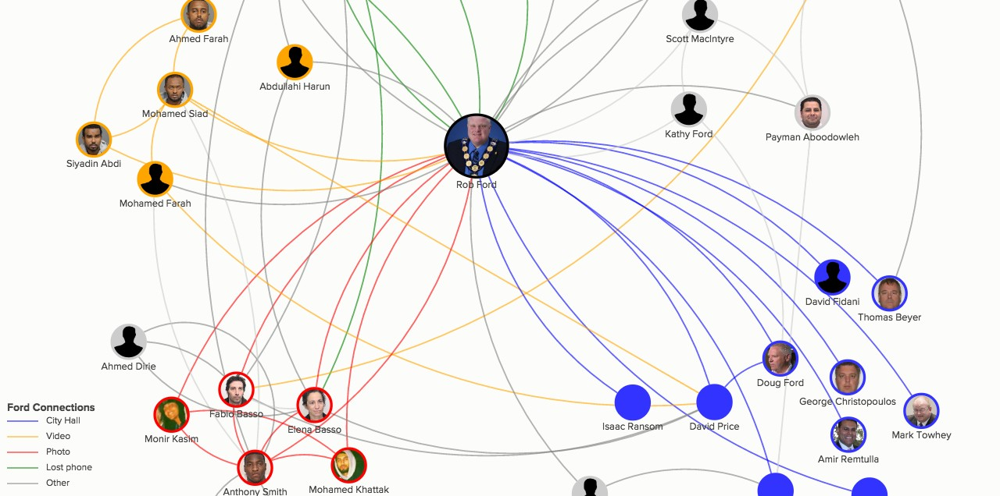

# How does it work?

Kumu works by making it easy to create a visual representation of a network or system. It is a web-based platform that allows shared access so that teams can easily collaborate.

## Examples

Here's a few examples of what's possible with Kumu:

**Creating a system map to better understand how our democracy works**

**Mapping a network to identify key influencers and gaps**

**Investigating relationships in cases of possible corruption**

You can build a map directly within Kumu's UI by hand or you can [import data](../guides/import/) from a spreadsheet.
