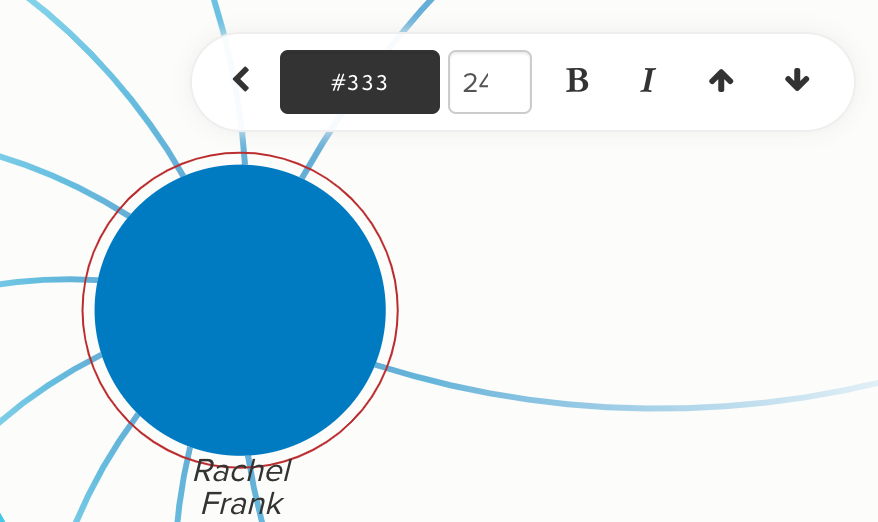

# How do I change font color?

There's multiple ways to change the color of the font on your map:

* Customize the default color for all fonts in your map
* Use Direct Decorations to color specific fonts
* Change font color in the Advanced Editor

## Change default font color

To change the color of all text in your map, use the following steps:

1. Click on the Settings button to open the Basic Editor on the right side
2. Click **Customize Defaults**
3. Scroll down to **Font Color** and choose the color there

_Note that changing the default font color of your map also changes the font color of your legend._

## Change font color with Direct Decorations

[Direct Decorations](../guides/direct-decorations.md) are best used when wanting to change the font color of only one or a few elements in your map. To do so: hover over the element or connection whose font color you'd like to change so the edit pencil shows up. Click on the Pencil and then Click on the Text icon to change its color there.



## Change font color in the Advanced Editor

By adding code to the Advanced Editor you can change font color driven by the data stored inside of your profiles.

For example, to change all fonts of element labels to blue, you can use:

```scss
element {
  font-color: blue;
}
```

Or use [hex codes](https://htmlcolorcodes.com/) to find more specific colors:

```scss
element {
  font-color: #3EF4B5;
}
```

Note that the code snippet above will only change the font size for elements, but will leave connections and loops at the default font size. For more information on how to change the `element` selector to something even more specific (for example, just the elements whose Element Type is "Organization"), see [our full guide on selectors](../guides/selectors.md).
