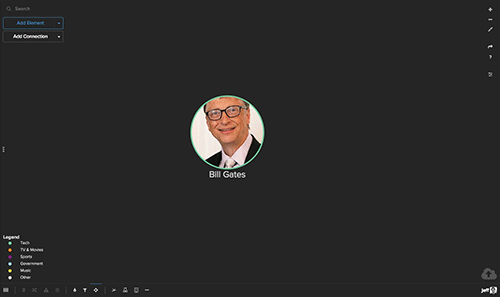

# First steps
This overview is a great place to start if you're new to Kumu. Take some time to read it through from end to end!

#### Jump to a section

* [Create an account](#create-an-account)
* [Create your first project](#create-your-first-project)
* [Picking a template](#picking-a-template)
* [Build your first map](#build-your-first-map)
* [Decorate elements and connections](#decorate-elements-and-connections)
* [Refine your view](#refine-your-view)
* [Add a contributor](#add-a-contributor)

## Create an account

Create an account by visiting [https://kumu.io/join](https://kumu.io/join). You'll use this account to sign in to Kumu and manage all of your projects inside of [workspaces](/overview/accounts-and-workspaces.html).

## Create your first project

To create your first project, visit your [dashboard](https://kumu.io/dashboard) and click on the **NEW PROJECT** button.

Work through the next couple of screens to name your project, decide whether it will be public or private, give it a description, etc. During this process, you'll also create your first map, and Kumu will ask you to pick a template for your map.

## Picking a template

After creating a new project in Kumu, your next step is to pick which template you want to use for your first map:

We recommend most people start with the **system**, **stakeholder**, or **SNA** template, unless they have a good reason to do otherwise. Below is a description of each template's effect:

* **System template.** Pick this template if you are creating a system map, causal loop diagram, or a stock and flow diagram. You'll position elements manually in a fixed position.
* **Stakeholder template.** Pick this template anytime you are mapping the people and organizations involved in a system, and the relationships between. Elements will float around, finding their final position automatically.
* **SNA template.** Pick this template anytime you are mapping large networks (1000+ elements). This template uses our "fast" mode, which draws elements as squares and connections as straight lines to improve performance. Elements are positioned automatically and will float around.
* **Custom template.** Pick this template if you'd like to start out without any custom decorations or settings. Elements will float to find their final position and are displayed as small, grey circles.

Not sure which one you need? [Check out our full guide on templates](/guides/templates.md).

## Build your first map

Once you've chosen a template, you'll land on this screen:

This is your blank canvas, where you'll add elements (circles) and connections (lines) to visualize your system or network. If you're mapping a system, you will probably be adding loops (groups of two or more connections) as well.

At this point, you need to decide how to get all of this information into the map. There are three basic ways to do this:

In this guide, we'll cover how to build your map by hand. If you'd rather import from a spreadsheet or Google Sheets, [check out our full guide on imports](/guides/import.md).

### Build your map by hand

Building your map by hand is a good choice for system maps or smaller network maps. If your map will have less than 50 elements, you can probably build it comfortably by hand. There are two ways to build a map by hand.

1. The green <i class="fa fa-plus"></i> button
1. Sketch mode

#### The green <i class="fa fa-plus"></i> button

Click on the green <i class="fa fa-plus"></i> button at the bottom of the map, and you'll see several options:
* Add element
* Add connection
* Add loop
* Sketch
* Import

Try clicking on the first option, **Add element**, to create a new element. Kumu will prompt you to give the element a label and press the `enter` key on your keyboard. Voila! You've added your first element.

Add a few more elements, then try selecting **Add connection** from that menu to connect your elements. Once you have a few connections, you can select **Add loop** to create a group of connections.

  Tip: Speed up this process by using keyboard shortcuts! Press <code>E</code> to add an element, <code>C</code> to add a connection, and <code>L</code> to add a loop. Or, hold <code>alt</code> on Windows/<code>option</code> on Mac, then click the map to add an element. Hold <code>alt</code> and click-and-drag from an element to create a connection.

#### Sketch mode

If you're building your map by hand, you should definitely give sketch mode a try! Click the green <i class="fa fa-plus"></i> button and select **Sketch** to activated sketch mode.

Once sketch mode is activated, you can add an element by clicking anywhere on the map, and you can add a connection by clicking and dragging from an existing element.

Quickly enter sketch mode by pressing <code>K</code> on your keyboard, and press the <code>esc</code> key to exit. While in sketch mode, you can move elements by holding the <code>alt</code> key on your keyboard, then clicking and dragging the element.

## Decorate elements and connections

Once you have built part of your map, it's the perfect time to learn how to use decorations to bring the data to life. It's possible to [change the color or size of individual elements and connections](/faq/how-do-i-decorate-a-single-element-or-connection.md), but it's much faster and more scaleable to create decoration rules based on the  information stored inside your elements and connections.

To add that information, you'll use the panel on the left side of the map, which is called the **profile**.

### Use the profile to add additional information

Each element, connection, and loop has a profile that can be used to store additional information in various fields.

Label, Type, Description, and Tags are all examples of fields. Use these fields to provide additional context for each element and connection, and click **+NEW FIELD** to add a custom field.

For this walkthrough, fill out the Type field for each of your elements—try to use a few different values so that you can assign decorations to them.

### Create your first decoration

Click the Settings icon <i class="fa fa-sliders"></i> on the right side of the map to open up the Basic Editor. You'll see the three most popular settings listed, allowing you to size or color elements by a field, or connect your elements by shared values (we'll cover that third option a bit later).

If you have filled out the Type field for your elements, try selecting **Element Type** from the dropdown menu next to **Color by**. Kumu will automatically color-code all of your elements by Type, and you can click the expand icon <i class="fa fa-angle-down"></i> to choose a different color scale.

Your first decoration is complete! If you like what you see, click **SAVE** at the bottom of the Basic Editor, and click the Settings icon <i class="fa fa-sliders"></i> again (or press `T` on your keyboard) to return to your map.

When you're ready to add more customized, detailed decorations, take a look at our [decorations guide](/guides/decorate.md).

## Refine your view

Great work so far—you've created a project, started building your first map, and even added decorations to liven things up. But as you expand your map with more data, you will probably want to view different slices of the data at different times, so you can tell a story without overwhelming your map readers.

To do that, you'll use **filter**, **focus**, **showcase**, and **cluster**—four different ways to refine what is visible or dominant in the map.

Settings for filter, focus, showcase, and cluster can be saved to a View, allowing you to easily switch between different refined versions of your data. To learn more, <a class="alert-link" href="/guides/views.md">check out our guide on Views</a>.

### Filter
Filters make it easy to show and hide elements, connections or loops based on data stored in the profile. To experiment with filters, just open the Basic Editor, click **MORE OPTIONS**, and select **Filter elements and connections**.

If you're filtering by element or connection type, simply un-check the types you want to hide. To filter using other fields, use the **Also include** and **But ignore** tools. Click the rocketship icon <i class="fa fa-rocket"></i> in each of those tools to select what you want to hide or make visible.

If you've hidden certain elements and connections using the Type checkboxes above, you can use the <b>Also include</b> tool to bring things back into view. But, you first have to un-check some of the boxes above, or this tool will have no effect.

Use the <b>But ignore</b> tool to hide elements and connections from your map. Anything you add here will override the settings in the checkboxes above and the <b>Also include</b> tool.

### Focus

Focus works by showing only the portion of the network within a certain number of connections. Focus is activated in one of two ways:
1. Click and hold on any element or connection, OR
1. Select one or more elements, connections, or loops (press `shift` and click to select multiple items), then click the focus button in the bottom right of the profile.

Once focus is activated, everything except your selected items will be hidden from the map. Press the `+` key on your keyboard to extend the focus further out from your selection, and press the `-` key to narrow the focus back to your selection. Also, you can click and hold on any element to bring that element's direct connections into view.

If you'd like to clear your focus and bring back the full map, click the focus icon on the right (underneath the Settings icon <i class="fa fa-sliders"></i>) and select **Clear**.

To extend focus to a specific degree, use the numbers <code>0-9</code> on your keyboard. To quickly clear your focus, press the <code>esc</code> key.

### Showcase

Showcase is similar to filter, which allows you to show or hide elements, connections, and loops based on the information they contain. But, instead of hiding your data, showcase will make it translucent, fading it into the background.

Experiment with showcase by opening the Basic Editor, clicking **MORE OPTIONS**, and selecting **Highlight elements and connections**.

Click the rocketship icon <i class="fa fa-rocket"></i> to build the selection of items that you want to showcase.

### Cluster

Clustering allows you to connect elements based on the data in their fields, and it's particularly useful on stakeholder and network maps. To set up your first cluster, open the Basic Editor, and use the dropdown next to **Connect by** to select a field. (If you've followed this guide all the way through, **Element Type** is a great first choice).

When clustering is activated, Kumu will create new elements to represent each possible value for the field that you chose, and it will draw a connection between your elements and the value(s) in their field. For example, if you have an element with the element type "Organization", Kumu will create an element labelled "Organization" and connect your element to it.

To add multiple cluster rules, click the settings icon to the right of the **Connect by** tool.

Just click **Add rule** to cluster by any of the information inside your elements.

[Check out our full clustering guide](/guides/clustering.md) to learn more.

## Add a contributor

Building maps in Kumu can be a lot of work! Inviting somebody else to contribute to your project is a great way to reach your final destination more quickly. Even if your project is small and manageable, it's a good idea to let someone else weigh in on your data and design to make sure your story gets told effectively.

To add a contributor to a project, click the menu icon <i class="fa fa-bars">  </i> in the upper left of your project, then select **MEMBERS** from the sidebar.

In the **Username** box, type the Kumu username of the person you want to add (if they don't have a username, they can get one for free at https://kumu.io/join) and click **Add contributor**.

For more info on collaboration in Kumu, visit [our full guide on collaboration](/overview/collaboration.html).

  <b>You've completed the Getting Started series!</b> For additional help, you can browse our other guides, <a class="alert-link" href="http://chat.kumu.io">join our open Slack team</a>, or email us at <a class="alert-link" href="mailto:support@kumu.io">support@kumu.io</a>.

<a class="btn" href="http://chat.kumu.io">Join us on Slack</a>

<a href="https://github.com/kumu/docs/blob/master/getting-started/overview.md" target="_blank"><i class="fa fa-github"></i> edit this page</a>
