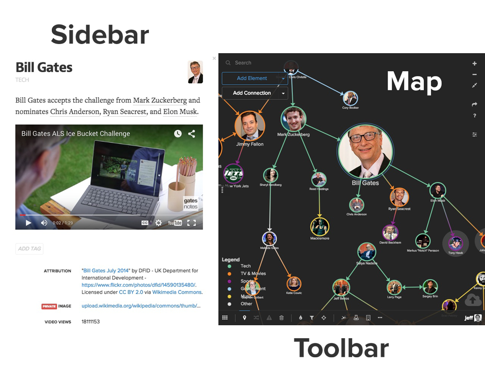
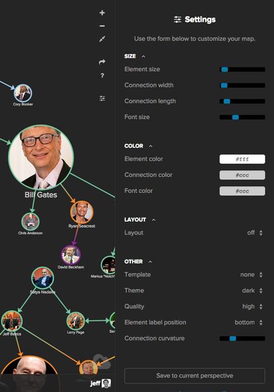
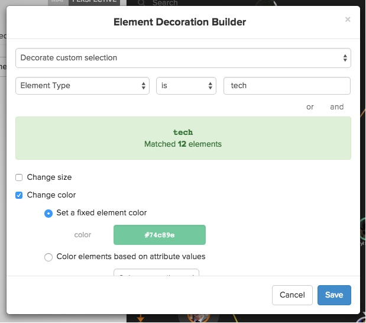
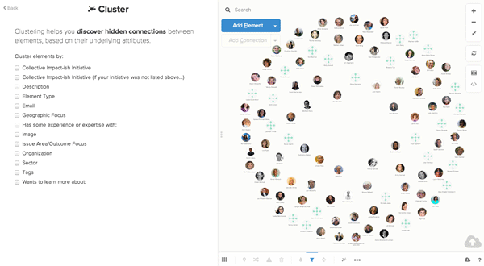

# Introduction

This page contains everything you need to hit the ground running with Kumu. Carve out 20 minutes to review this page and you'll have awareness of at least 80% of Kumu's features.

## Getting to know the user interface

### The Map
Elements are the circles you see on the map and connections are the lines between the elements. To select either of them, simply click on the circle or the line.

### The Sidebar
 The sidebar displays the *map overview*, the active *perspective* settings (you can toggle between the two in the upper right corner of the sidebar), or the profile for an element, connection or loop (if selected). Hide the sidebar by clicking the three vertical dots (<i class="fa fa-ellipsis-v"></i>) on the edge of the sidebar.

### The Toolbar
Use the toolbar to pin elements in place, add direction to connections, access the main menu, and much more.

### Map Navigation
The upper right corner has buttons to zoom in and out, zoom fit, share your map (including present mode, screenshots, embeds, and exporting), access help, and change default map settings.

<!--
### Main menu (<i class="fa fa-th"></i>)

Use this menu to quickly change between maps and perspectices or switch between projects. You'll also find links to manage attributes, members, rename a project, and delete a project.

### Pin (<i class="fa fa-map-marker"></i>)

Pinning allows you to add a fix the position of the element on the map. You can pin individual elements by selecting the element and then clicking the pin button. You can also select mutiple elements (or all of the elements by hitting the ***a*** keystroke) and then click the pin button to pin multiple elements at once.

### Direction (<i class="fa fa-random"></i>)

Connections can be directed, undirected, or mutual (arrows both ways). Select a connection and then click the direction button to choose between the options. You also have an option to switch directions when the connection is directed.

### Delay (<i class="fa fa-warning"></i>)

Delays are used in system maps (especially causal loop diagrams) to signify a time delay between two factors. A delay shows up as two perpendicular lines on a connection and can be added by selecting a connection and then clicking the delay button.

### Delete (<i class="fa fa-trash-o"></i>)

Elements, connections and loops can be deleted by selecting it and then clicking the delete button (or by clicking delete on your keyboard). When elements are deleted, they are initially moved into a "trash can" and can later be permanently deleted by emptying the trash can.

### Cluster

Clustering is a powerful way to connect elements based on data stored in the profile. To learn more, read our [Clustering Guide](/guides/clustering.html). To activate clustering, click the cluster button and then choose the attribute you want to cluster by. You can then choose to permanently save a cluster by clicking "save" or remove the cluster by clicking "cancel." If you refresh the page any unsaved clusters will be removed.

### Decorate (<i class="fa fa-tint"></i>)

The decorate button allows you to quickly add decorations to your map. To learn more, read [Decorating Your Map](/basics/decorations.html).

### Filter (<i class="fa fa-filter"></i>)

The filter button allows you to change which element and connection types are visible by choosing which to display. Keep all the options checked to have all types displayed or uncheck specific types to hide only those entities with the given type. The undefined option allows you to show and hide entities which do not have any type assigned.

### Focus (<i class="fa fa-crosshairs"></i>)

Focus allows you to show only a certain part of your map. Click on an element and then click the focus button and you'll be presented with the following options:

* **Selected** - Hide all but the specific element
* **Direct (1 degree)** - Display the specific element and one step out
* **Indirect (2 degrees)** - Display the specific element and two steps out
* **Extended (3 degrees)** - Display the specific element and three steps out

We've also wrapped the focus behavior into your navigation of the map by allowing you to click and hold on a specific element to activate the direct focus. Below are the primary actions for activating focus using a long click:

<dl>
<dt>Click and hold an element without focus activated</dt>
<dd>Activates direct focus for the specified element</dd>
<dt>Click and hold another element when focus is already activated</dt>
<dd>Adds the selected element to the given focus, allowing you to expand outward</dd>
<dt>Click and hold on the map background</dt>
 <dd>Deactivates the focus</dd>
 </dl>
-->

## Building your first map

### Adding elements and connections

**Use the add element/add connection buttons.** Add an element by clicking the blue "Add Element" button in the upper left of the map. Type the name of the element you want to add and then hit enter. To add a connection, select the element you want to connect from first and then click the "Add Connection" button. Type the name of the element you want to connect to and then hit enter. If the element you are trying to connect to doesn't exist yet, Kumu will create the element for you first and then create the connection to it.

  Speed up this process by hitting "e" to add an element and "c" to add a connection.

**Hold alt and click or click & drag.** Alt is another great way to shorten the time to build a map. Hold alt and click anywhere on the map to add an element. Hold alt and drag from an existing element to add a connection.

### Importing data

**Import data from a spreadsheet.** Drag a spreadsheet onto the map or click the cloud icon in the lower right corner. Make sure your spreadsheet (.xlsx or .csv) includes the following columns:

- *For elements:* Label, Type (optional), Description (optional)
- *For connections:* From, To, Type (optional), Label (optional)

Additional fields can be imported by including extra columns in your spreadsheet. Here's an example:

<table class="table">
  <thead>
    <tr>
      <th>Label</th>
      <th>Type</th>
      <th>Description</th>
      <th>Tags</th>
    </tr>
  </thead>
  <tbody>
    <tr>
      <td>Jeff Mohr</td>
      <td>Person</td>
      <td>Co-Founder and CEO, always  up for learning</td>
      <td>Founder|Male|Runner</td>
    </tr>
    <tr>
      <td>Kumu</td>
      <td>Company</td>
      <td>A web-based platform for mapping relationships...</td>
      <td>Mapping|Technology</td>
    </tr>
  </tbody>
</table>

And here's a sample of how your connection spreadsheet might look:

<table class="table">
  <thead>
    <tr>
      <th>From</th>
      <th>To</th>
      <th>Type</th>
      <th>Strength</th>
    </tr>
  </thead>
  <tbody>
    <tr>
      <td>Barack</td>
      <td>Michelle</td>
      <td>Personal</td>
      <td>Strong</td>
    </tr>
    <tr>
      <td>Ed Snowden</td>
      <td>NSA</td>
      <td>Contractor</td>
      <td>It's complicated</td>
    </tr>
  </tbody>
</table>

Head over to the [import guide](../guides/import-export.md) for more details.

### Positioning elements and connections

Depending on the template you selected, elements will either be fixed (manually positioned by you) or floating (automatically positioned using our layout algorithm). Here's a few things people run into with positioning:

* **My elements won't stop moving, how do I stop them?** Use the "a" keystroke to select all elements and then hit the pin button in the bottom toolbar.
* **New elements I add keep moving even though others are pinned...** You'll see a dropdown in the map overview to change the default behavior (fixed or floating). Choose fixed to have them pinned by default.

If your elements are pinned in place, you can also change the curvature of the connections by dragging them.

### Populating the the profile

Each element, connection and loop has a profile which can be used to store additional fields.

Make sure to add background for each element and connection using the description, and then click "New Attribute" to add a custom field.

## Styling your maps

Styles and decorations are controlled perspectives. You can create multiple perspectives to highlight different views of your map. Use the toggle in the upper right corner of the map overview to switch to the perspective view.

### Default settings and colors

Click the settings icon (<i class="fa fa-sliders"></i>) on the right side to change default map settings:

If you're running into bunching and overlap with your map, try adjusting the settings in the layout section (lower gravity and increase element charge). Make sure to save your changes to active perspective by clicking save when you are finished.

### Decorating elements

You can easily decorate elements based on the data stored in the profile for any element. Switch to the perspective view and then click "Decorate Elements".

Use the top dropdowns to indicate which elements should be decorated, and then use the checkboxes below to determine whether you want to change size, change color, add a bullsye, or add a shadow. Optionally add text to the "label" field to add a legend entry in the lower left corner of your map. If you leave this blank the decoration won't be included in the legend.

### Decorating connections

Decorating connections is quite similar to decorating elements. Just follow the instructions above but choose the "Decorate Connections" button instead.

## Keeping things comprehensible

As your map grows in size you'll want to use both focus and filter to keep users from being overwhelmed.

### Focus
Focus is activated in one of two ways, by clicking and holding on any element or connection or by clicking the focus button in the bottom toolbar. Once activated, you can walk in and out by degree using the "+" and "-" keys on your keyboard (don't hold shift, just hit the key).

If you click the focus button in the toolbar, you'll be prompted with a menu of how many degrees out you'd like to focus. Once focus is activated, you can click and hold on any element to bring that element's direct connections into view.

### Filter
Filters can be added on the fly (meaning they aren't saved to the perspective) or saved to the perspective. Click the filter button in the bottom toolbar or click the filter tab within perspectives.

If you're filtering by element or connection type, simply uncheck the types you want to filter and then click update (or update and save to save to the current perspective). To filter using other attributes, click more options and you'll see two fields: include and ignore. Click the rocket icon (<i class="fa fa-rocket"></i>) on the right side of the input to build out the selector which defines what you want to include or ignore.

* **Include** For include to work properly, first uncheck the types. Remember that include adds things back to the map so if everything is already there, this field has no effect.
* **Ignore** This field works as a blacklist to remove elements and connections from your map.

## Collaborating with teammates

### Public vs. private

Projects can be either public or private. With a public project, anyone can view your maps but you control who can edit. With a private project, you're in complete control of who can view and edit your maps.

### Inviting members

**Personal Accounts.** For projects under a personal account, you can add collaborators through the main menu within your project. Click the upper left corner and choose "Members" and then type the username of who you'd like to add (they need to first have a Kumu username before they can be added).

**Organization Accounts.** For project under an organization account, you have additional flexibility to add people to a project with view, edit, or admin access. Access is controlled via teams and managed in the organization dashboard.

### Conflicts

With Kumu you can work at the same time with other members of your team but it is *not* realtime. In order to pull in recent changes, just refresh the page. We'll do the work to combine any edits that can be automatically merged and then prompt you if we run into any conflicts. If you see the conflict window, follow the prompts to resolve the conflict and save the final version.

## Sharing your work

### Presentations

Use [presentations](../guides/presentations.md) to create a slide by slide walkthrough of your map(s). Combine text, video, images and maps into a single, engaging presentation that anyone can access via URL.

Access presentations by clicking the menu in the upper left corner of your map.

### Share via URL/embed

You can also share maps through our embed feature. Click the share menu and then click embed. Once an embed has been created, you can use the link created for the embed to share with others (without them needing to be added as a contributor first).

## Advanced features

### Clustering

Use [clustering](../guides/clustering.md) to quickly connect elements based on their shared attribute values.

### Metrics

Kumu has a powerful [metrics engine](../guides/metrics.md) which includes a number of popular social network analysis (SNA) metrics like betweeness, closeness, degree, indegree, outdegree, eigenvector and community detection.

Run metrics and then use size and color scales to quickly and easily analyze the results.
