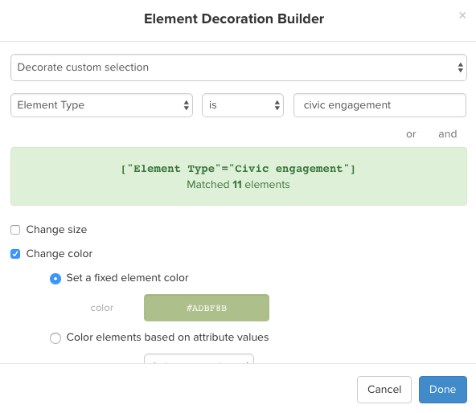
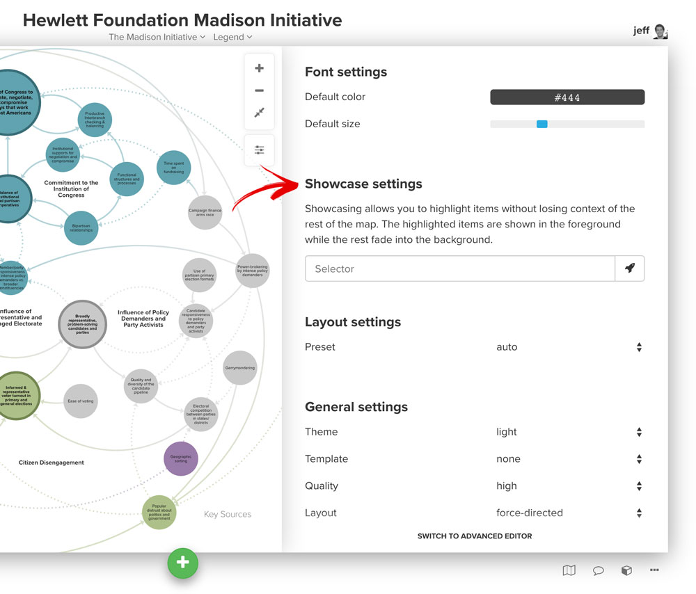

# Overview

## Create an account

Create an account by visiting [https://kumu.io/join](https://kumu.io/join). Everyone has a personal account that they use to sign in with (you can optionally create an [organization](/guides/organizations.html) from within that personal account at a later time).

## Create your first project

To create your first project, visit your [dashboard](https://kumu.io/dashboard) and click on the "new project" button.

Projects are how maps are organized within Kumu. A project can have an unlimited number of maps. When you add a collaborator you add them to the project rather than an individual map.

## Picking a template

After creating a new project in Kumu, your next step is to pick which template you want to use for your first map:

We recommend most people start with the **stakeholder template** unless they have a good reason to do otherwise. Below is a description of each template's effect:

* **System template.** Pick this template if you are creating a causal loop diagram or a stock and flow diagram. Elements are positioned manually and are displayed as text labels. `fixed`
* **Stakeholder template.** Pick this template anytime you are mapping relationships between people. Elements are positioned automatically by a layout algorithm and are displayed as large circles. `floating`
* **SNA template.** Pick this template anytime you are mapping large networks (>1000 elements). This template uses our "fast" mode which draws elements as squares and connections as straight lines to improve performance. Elements are positioned automatically. `floating`
* **Custom template.** Pick this template if you'd like to start out without any custom decorations or settings. Elements are positioned automatically by a layout algorithm and are displayed as small circles. `floating`

## Build your first map

Now that you've chosen a template, you'll land on this blank screen:

Your first step is to decide whether you will be building your map by hand or importing from a spreadsheet.

### Build your map by hand

**Use the green "+" button.** Add an element by clicking the green "+" button at the bottom of the map and choose "add element". Type the name of the element you want to add and then hit enter. Add a connection by clicking the green "+" button and choose "add connection". Type the name of the elements you want to connect and hit enter. You can also select an element before choosing "add connection" and that element will automatically be included in the from input for the add connection interface.

  Speed up this process by using keyboard shortcuts! Just hit "e" to add an element and "c" to add a connection.

**Sketch mode.** Activate sketch mode by clicking the green "+" button and then clicking "sketch mode". Once activated, you can add an element by clicking anywhere on the map and you can add a connection by dragging from an existing element. You can move elements by holding alt while dragging the element.

**Alt and click or click & drag.** Alt is a great shortcut for building a map. Hold alt and click anywhere on the map to add an element. Hold alt and drag from an existing element to add a connection.

### Import data

**Import data from a spreadsheet.** Drag a spreadsheet onto the map or click the green "+" button at the bottom of the map. Make sure your spreadsheet (.xlsx or .csv) includes the following columns:

- *For elements:* Label, Type (optional), Description (optional)
- *For connections:* From, To, Type (optional), Label (optional)

Additional fields can be imported by including extra columns in your spreadsheet. Here's an example:

<table class="table">
  <thead>
    <tr>
      <th>Label</th>
      <th>Type</th>
      <th>Description</th>
      <th>Tags</th>
    </tr>
  </thead>
  <tbody>
    <tr>
      <td>Jeff Mohr</td>
      <td>Person</td>
      <td>Co-Founder and CEO, always  up for learning</td>
      <td>Founder|Male|Runner</td>
    </tr>
    <tr>
      <td>Kumu</td>
      <td>Company</td>
      <td>A web-based platform for mapping relationships...</td>
      <td>Mapping|Technology</td>
    </tr>
  </tbody>
</table>

And here's a sample of what your connection spreadsheet might look like:

<table class="table">
  <thead>
    <tr>
      <th>From</th>
      <th>To</th>
      <th>Type</th>
      <th>Strength</th>
    </tr>
  </thead>
  <tbody>
    <tr>
      <td>Barack</td>
      <td>Michelle</td>
      <td>Personal</td>
      <td>Strong</td>
    </tr>
    <tr>
      <td>Ed Snowden</td>
      <td>NSA</td>
      <td>Contractor</td>
      <td>It's complicated</td>
    </tr>
  </tbody>
</table>

## Decorating elements and connections

Once you have built at least part of your map, now is the time to learn how to use decorations to bring the data to life. Rather than just changing the color or size of individual elements, Kumu encourages you to create decoration rules based on the data stored in the profile for the elements and connections.

### Use the profile to add additional fields

Each element, connection and loop has a profile which can be used to store additional fields.

Use these fields to provide additional context for each element and connection and click "+ New Field" to add a custom field.

### Create your first decoration

Click the settings button on the right side of the map and then click "decorate."

Click "add element rule".

Use the top dropdowns to indicate which elements should be decorated, and then use the checkboxes below to determine whether you want to change size, change color, add a bullsye, or add a shadow. Optionally add text to the "label" field to add a legend entry in the lower left corner of your map. If you leave this blank the decoration won't be included in the legend.

### Decorating connections

Decorating connections is quite similar to decorating elements. Just follow the instructions above but choose the "add connection rule" button instead.

## Refine your view

You don't necessarily want all of the elements and connections in your map visible all the time. Filter, focus and showcase are three different ways to refine what is visible (or dominant) in the map.

### Filter
Filters work by showing/hiding elements and connections based on the data in the profiles. Filters can be edited by clicking the settings button on the right side of the map.

If you're filtering by element or connection type, simply uncheck the types you want to hide. To filter using other fields, use the "also include" and "but ignore" fields. Click the rocket icon (<i class="fa fa-rocket"></i>) to the right of the input of each field to build out the selector for what you want to hide or make visible.

* **Also include** If you've hidden certain elements and connections using the type checkboxes, you can use the "also include" field to bring things back into view. **Remember! Unless you have some types unchecked above, this field will have no effect!**
* **But ignore** Use this field to hide elements and connections from your map. Whatever selector you add here will win out over anything you've set using the checkboxes or the "also include" field.

### Focus
Focus works by showing only the portion of the network within a certain number of connections. Focus is activated in one of two ways, by clicking and holding on any element or connection or by selecting one or more elements, connections or loops and clicking the focus button in the bottom right of the selection profile. Once activated, you can walk in and out by degree using the "+" and "-" keys on your keyboard (don't hold shift, just hit the respective keys) or using the 1-9 numerical keys.

When you click the focus button, you'll be prompted with a menu of how many degrees out you'd like to focus. Once focus is activated, you can click and hold on any element to bring that element's direct connections into view.

### Showcase
Showcase is similar to the filter, but instead of removing the content from the map it just mutes it so it fades into the background.

Add a showcase by clicking the settings button on the right side of your map, choosing the "setting" tab and then scrolling down to the showcase settings section.

## Add a collaborator<a id="adding-a-collaborator-permalink">

Adding a collaborator to a map works differently depending on whether you are working in a personal or an organization project.

### Adding a collaborator to a personal project

To add a collaborator to a personal project, click the menu in the upper left and then choose "members". From there, type the username of the person you want to add, and then click "add contributor".

### Adding a collaborator to an organization project

Organization projects come with the added benefit of allowing you to add members as either viewers, editors, or admins. To add someone to an organization project, first go to your [dashboard](https://kumu.io/dashboard). From there, use the menu in the upper right corner to switch to your organization. Then click "settings" and then "add member" and choose to add then as either a guest (can only see projects they are granted access to), member (can see names of all projects), or owner (can access every project in the organization).

Once you do that, create a team and add them to the team. From there, the team can be granted access to a project.

  <strong>You've completed the getting started series!</strong> Now go apply what you've learned and join us in the Slack Kumunity or dive even deeper by browsing the guides.

<a class="btn" href="http://chat.kumu.io">Join the Slack Kumunity</a>
