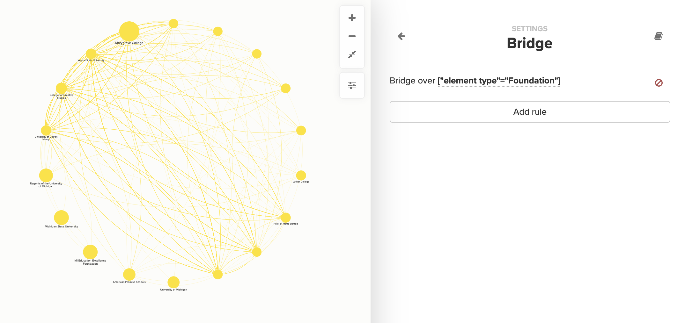

# Bridge

Kumu's **bridge** feature allows you to automatically draw connections between any two elements that have a "mutual friend"—an element in between that they're both connected to.

For example, if two people are connected to an organization on your map, you can tell Kumu to bridge over the organization, connecting those two people directly and hiding the organization from view.

## Bridge in the Basic Editor

The easiest way to bridge over elements is with the [Basic Editor](../overview/view-editors.md#basic-editor). Open the Basic Editor, then click **More Options**, and select **Build bridges across mutual connections**.

Use the **Bridge** interface to set up rules for bridging over elements that meet a given [selector](selectors.md).




**Kumu's Bridging feature has two caveats to remember:**&#x20;

* If your connections are _undirected_, Kumu will create two connections between the bridged elements. If you wish to de-duplicate these connections, [please follow this guide](../faq/how-do-i-collapse-duplicate-connections.md).
* If your connections are _directed_, Kumu will only bridge the elements where one connection is incoming and the other connection is outgoing. If all the connections are incoming to a common element, it doesn't work. As a workaround, you can use the "KUMU\_BRIDGE example" tab[ in this Google Sheet with custom Kumu formulas](https://docs.google.com/spreadsheets/d/1qRhkn6qECtBaAncWykMa0hAG97jPK6q_bODrwntqze8/edit?usp=sharing) (Click "File" > "Make a copy" to create your own editable copy of the sheet).

If any of the above is unclear, don't hesitate to reach out to [support@kumu.io](mailto:support@kumu.io) for help!&#x20;


## Bridge in the Advanced Editor

To bridge using the [Advanced Editor](../overview/view-editors.md#advanced-editor), here's the basic syntax:

```scss
@settings {
  bridge: selector;
}
```

`selector` can be any valid [element selector](selectors.md). You can separate multiple selectors with commas to bridge over multiple different groups of elements.

For example, lets say you had a map of people connected to projects and organizations, and you wanted to connect people to people. Here's how you could use bridging to accomplish that (assuming project elements have the element type "Project", and organization elements have the element type "Organization"):

```scss
@settings {
  bridge: project, organization;
}
```

Voila! You've now mapped a detailed network of people, without having to gather additional data or re-structure your existing data.

#### Combine clustering and bridging

Bridging can also be used in combination with [fine-tuned clustering](clustering.md#fine-tune-cluster-settings) to draw connections directly between two elements based on the information in their fields.

In the example above, imagine that, instead of a network of people, projects, and organizations, you only had:

* A group of elements representing people
* A "Projects" field inside each element, containing a list of each person's projects
* An "Organization" field inside each element, indication which organization each person is affiliated with.

Here's how you would cluster and bridge to build a network of people connected to other people, based on the projects and organizations in their fields:

```scss
@settings {
  cluster: person by "Projects" as "Project", person by "Organization" as "Organization";
  bridge: project, organization;
}
```

When reading this code, Kumu will follow these steps:

1. Create a **new element** for each project and organization, with the element types set to "Project" and "Organization" respectively
2. Draw connections **from** each person **to** their projects and their organization
3. **Bridge** over the projects and organizations, connecting people directly to other people

You can also bridge between the elements created by clustering. Let's say you were working with that same dataset (elements represent people, with project and organization data stored in fields) and you wanted to see a network of organizations connected to other organizations. Here's how you can do that:

```scss
@settings {
  cluster: person by "Organization" as "Organization";
  bridge: person;
}
```

And remember: all of these settings are saved in [views](../overview/kumus-architecture.md#views), so you can quickly toggle between different bridge and cluster settings, showing radically different versions of your network without changing the underlying data in any way.

Bridging has the ability to create a lot of new connections—so many that they might bog down your map!

If you notice your map freezing or moving slowly after you bridge, check out our guide on [Kumu's data limits](../faq/how-much-data-can-kumu-handle.md) for more tips on how to improve speed.
