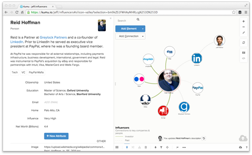

# Collaboration

Kumu is built to be collaborative whether you have a public or private project.

## Personal vs. organization accounts

### Personal
Personal projects only allow adding people as collaborators, which means they have view and edit access. To add a collaborator, first ask that person to sign up for Kumu (if they haven't already) by visiting (https://kumu.io/join). Ask for their username and then go to the "members" section of your project via the upper left menu. Enter their username and then click "add contributor".

### Organization
Organization projects allow adding people with view, edit or admin access through teams. Read the [organizations](../getting-started/organizations.md) guide for more information.

## Public Projects

Public projects allow you to easily share and build upon the work of the whole Kumu community. For more information, view the [public projects guide](/guides/public-projects.html).

## Presentations

Presentations combine the best of PowerPoint, Prezi, and Kumu into one easy-to-use tool. You'll find presentations in the main menu of your project. Here's a quick guide to getting started:

https://vimeo.com/118975099

## Embeds

Embeds make it easy to include an interactive, read-only version of your map on a blog or wesbite. Click the share button in the upper right corner of your map and then create the embed. Learn more about embeds [here](../guides/sharing.md).

## Conflicts

We've intentionally designed Kumu *not* to be realtime. When working with complex data it's distracting to have things changing constantly out of your control. Instead we only pull in changes when conflicts need to be merged. When you want to sync up with the rest of your team, just refresh the page.

If you happen to edit the same part of the map at the same time (whether that's an element name, map description, perspective, or something else), we'll detect this and prompt you to review any conflicts.

**Let's walk through a quick sample.** Say you and a teammate both happened to be mapping influential people in Silicon Valley one afternoon. You both click on Reid and decide that his bio needs a bit of sprucing up.

You save your changes and SURPRISE! The below screen pops up to let you know that you're not the only one editing Reid's bio today.

You click "Get started" and see a window that highlights the changes between your version and the version on our servers. Lines you've added show up as blue text with a "+'' sign in front. Lines that you've deleted or someone else has added show up as red text with a "-" sign in front.

Now you're in charge. Choose which text you want to keep and which you want to remove. Make any remaining corrections and then remove any "+" or "-" added in the merge process. You're finished when you see all grey text:

If there are multiple conflicts, you'll be taken through each conflict one by one. Once you see this screen:

...you're all set. If only handling conflicts in the real world were this easy!
