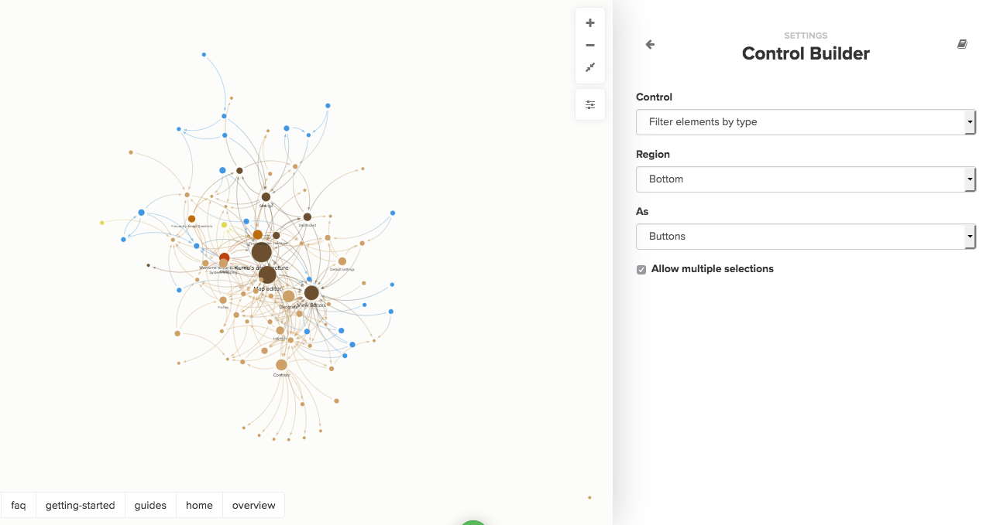

# Controls

Controls allow you to customize how people interact with your maps by adding buttons, dropdowns or toggles to your map. You can also use them to overlay metrics, images, text and more on! Interactive controls can be used to transform the current view's setting too, such as filter, focus, and clustering.




Want to dive a little deeper into controls? \
Check out our [Taking Control of Kumu webinar](https://youtu.be/H4mPfRw2cqM)


### Add controls through the Basic Editor

You can use the [Basic Editor](../overview/view-editors.md#basic-editor) to add a few simple types of controls to your map. Click the settings icon  to open the editor, then click **Add custom control**. Kumu will open up the controls builder, with a few options pre-selected:



Use the dropdown menus in the controls builder to set up your control, then, when you're done, click the back arrow to return to the main screen, and click **SAVE**.


Want to remove unneeded controls? You can use the [remove unneeded controls](<controls.md#remove-unneeded controls>) section of this guide to help troubleshoot.


### Add controls through the Advanced Editor

To unlock the full set of flexible controls features, you can use the [Advanced Editor](../overview/view-editors.md#advanced-editor). Here's an example of what controls look like in the Advanced Editor:

```scss
@controls {
  top {
    showcase {
      by: "Element type";
    }
  }
}
```

In general, controls are defined with the `@controls` block, grouped into regions, and customized using properties. You can add multiple controls to a region, and even override or move Kumu's built-in controls. Here's the general syntax that shows how multiple regions can be used, and how multiple controls can be added to the same region:

```scss
@controls {
  region {
    control {
      property: value;
      property: value;
      ....
    }

    another-control {
      property: value;
      property: value;
      ...
    }
  }

  another-region {
    some-other-control {
      ...
    }
  }
}
```

#### Regions

Adding a custom control to your map starts by picking where you want to place the control. Controls can be assigned to one of six **regions** on the map:

* `top`
* `top-left`
* `top-right`
* `bottom`
* `bottom-left`
* `bottom-right`

```scss
@controls {
  top-left {
    title {
      value: "This map has a title!";
    }
  }
}
```

#### Control type

After you set the region, you can choose what **type of control** you are adding. Here are the available control types:

* `title`: [Title control](controls/title-control.md)
* `text`: [Text control](controls/text-control.md)
* `label`: [Label control](controls/label-control.md)
* `showcase`: [Showcase control](controls/showcase-control.md)
* `filter`: [Filter control](controls/filter-control.md)
* `Focus`: [Focus control](controls/focus-control.md)
* `cluster`: [Cluster control](controls/cluster-control.md)
* `tagged-timeline`: [Tagged-timeline control](controls/tagged-timeline-control.md)
* `color-legend`: [Color-legend control](controls/color-legend-control.md)
* `image`: [Image control](controls/image-control.md)
* `sna-dashboard`: [Social Network Analysis Dashboard control](controls/sna-dashboard-control.md)
* `view-toggle`: [View toggle control](controls/view-toggle-control.md)

#### Properties

Controls are customized using **properties**, and each control understands a slightly different set of properties. In the example below, `by` is a property of the `showcase` control that accepts a field name (wrapped in quotes).

```scss
@controls {
  bottom {
    showcase {
      by: "Element type";
    }
  }
}
```

For a full list of the properties that each control understands, read the individual control guides (linked above), or check out the [controls reference](../overview/advanced-editor-hub/controls-reference.md).

Looking to change the order of the controls in your map? Have a look at [this guide](../faq/how-do-i-change-the-order-of-control-options.md).

#### Children

Sometimes, controls need to work with complex lists of options. Since these would be overwhelming to define in a single line, the items are included as **children** of the control instead, and follow a similar syntax to the controls themselves.

In the example below, we call the `option` blocks the "children" of the `showcase` control, and each child includes its own set of properties.

```scss
@controls {
  top-left {
    showcase {
      option {
        label: "People";
        selector: person;
      }

      option {
        label: "Orgs";
        selector: organization;
      }
    }
  }
}
```

You can read through the individual control guides (linked above) to see which controls accept children and which properties their children understand.

#### Groups

By default, controls are each stored on their own line, and they each have their own set of properties. However, if you want to display a group of controls on one line (for example, along the top of your map), and assign a few common properties and values (for example, `font-size: 16`) to all of them, you can use **groups**.

To group controls, use the following `group` syntax:

```scss
@controls {
  region {
    group {
      property: value;

      control {
        property: value;
        property: value;
        ...
      }
      another-control {...}
      an-additional-control {...}
    }
  }
}
```

The properties that get set underneath `group` will apply to all controls nested inside the group. And before you ask—yes, it's possible to nest groups inside of other groups as well!

### Remove unneeded controls

When you're adding [controls](controls.md) through the Basic Editor, you might sometimes add a duplicate control by accident, or add a control that says "No values found for \[some field name]". You can remove controls through the Basic Editor and the Advanced Editor.

**Basic Editor**

1. Click the settings icon on the right  to open the Basic Editor, then scroll down to "Add custom control"**.** You'll see all existing controls listed out below.
2. When hovering over an existing control, click on the edit pencil to edit your existing control, or click on the trash icon to delete it.

**Advanced Editor**

Open up the Advanced Editor (click Settings  (1) (1).png>) and then choose Switch to Advanced Editor at the bottom). Unless you have added [partial views](partial-views.md), there will be a block of code right at the top starting with `@controls`.

```scss
// Line 1 of your Advanced Editor:
@controls {
  ...There will be other code inside this block
}
```

If you don't want _any_ controls or "No values found for \[some field name]" messages on your map, simply delete the entire `@controls` block, then click "Save" at the bottom of the editor.

If you have some controls in there that you would like to preserve, you'll first need to learn the basics of how to read `@controls` code, so that you can tell which controls you want to delete and which you want to keep.

* If you want to delete all controls in a certain region of your map, then delete all the code saying `top`, or `top-left`, or `bottom` etc. Delete the whole block to delete all the controls in that region.
* If you want to delete just one control, locate it in the list of your controls and delete that whole block. You can recognize a control block by the fact that the first line is `filter`, or `showcase`, or `cluster`, or `focus`.

You can learn more about reading `@controls` code in [our full guide on controls](controls.md#add-controls-through-the-advanced-editor). Of course you can always send us an email at support@kumu.io to help out!

### Built-in controls

All of Kumu's built-in controls (search, zoom buttons, settings buttons, the [legend](legends.md)) are handled by the same platform that custom controls are built on. That means you can move the built-in controls around, omit ones you don't need, or even reset the built-in controls and start from scratch.

Although you won't see it in your Advanced Editor, here's the default `@controls` code working behind the scenes:

```scss
@controls {
  top-left {
    search {}
  }

  top-right {
    zoom-toolbar {}
    settings-toolbar {}
    focus-toolbar {}
  }

  bottom-left {
    legend {}
  }
}
```

You can omit individual controls by including the region in your `@controls` block, without the control inside of it. For example, if you wanted to keep the search bar, but omit all other built-in controls, you could use:

```scss
@controls {
  top-right {}
  bottom-left {}
}
```

Note that if you add controls to a region in your code, but don't explicitly include the default control, it will be hidden. For example, this code will hide the `zoom-toolbar`, `settings-toolbar`, and `focus-toolbar`:

```scss
@controls {
  top-right {
    title {
      value: "Oops! I hid some useful controls.";
    }
  }
}
```

If you want to quickly start from scratch without any of Kumu's built-in controls, you can use `reset: true`.

```scss
@controls {
  reset: true;

  top {
    title {
      value: "Check out my custom controls";
    }
  }

  bottom {
    showcase {
      by: "Element type";
    }
  }
}
```
