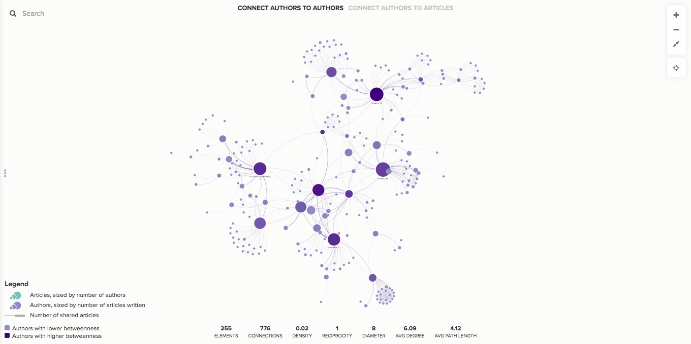

# SNA-dashboard control

**When do you use it?**

With the SNA Dashboard control, you can add a dashboard that shows key metrics for your network map.



## Advanced Editor

Here's the syntax for adding the SNA Dashboard control in the Advanced Editor:

```scss
@controls {
  bottom {
    sna-dashboard {}
  }
}
```

You can also use the `metrics` property to specify exactly which metrics get included:

```scss
@controls {
  bottom {
    sna-dashboard {
      metrics: element-count, connection-count, density, average-degree;
    }
  }
}
```


Here are all the possible values you can use in the `metrics` property:

* `element-count`
* `connection-count`
* `density`
* `reciprocity`
* `diameter`
* `average-degree`
* `average-path-length`

[Check out our controls reference](../../overview/advanced-editor-hub/controls-reference.md) to see the full list of properties and values recognized by the SNA-dashboard control.

## Available metrics

The metrics currently available in the dashboard are:

| Metric              | Description                                                                                                                                                                                                                                                              |
| ------------------- | ------------------------------------------------------------------------------------------------------------------------------------------------------------------------------------------------------------------------------------------------------------------------ |
| Total elements      | A count of all the elements on your map                                                                                                                                                                                                                                  |
| Total connections   | A count of all the connections on your map                                                                                                                                                                                                                               |
| Density             | Compares the number of actual connections to the number of potential connections in a network. \`1\` is the highest possible density number, and \`0\` is the lowest.                                                                                                    |
| Reciprocity         | In a directed network, reciprocity measures the likelihood that two elements will have an equal number of connections traveling in either direction between them.                                                                                                        |
| Diameter            | The shortest path between the two elements that are furthest apart in a network. If any part of your network is completely disconnected, the diameter will be infinity ∞.                                                                                                |
| Average degree      | Calculates the average number of connections across all elements in the network.                                                                                                                                                                                         |
| Average path length | Calculates the average number of steps it takes to get from one element to another in the network. If any part of your network is completely disconnected, or if any element has only incoming or only outgoing connections, the average path length will be infinity ∞. |
