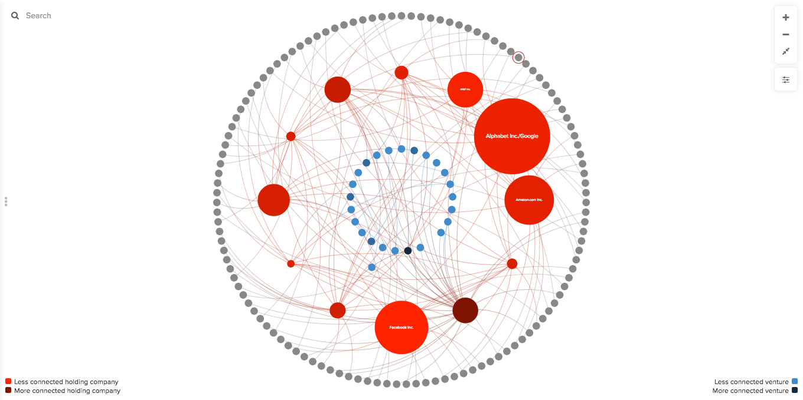

# Decorations

Decorations in Kumu allow you to change color, size, and other visual properties of elements, connections, and loops in your map. They are a powerful way to guide your map readers toward valuable insights about your system or network.

There are two types of decorations in Kumu:

1. [Direct decorations](direct-decorations.md)
2. [Data-driven decorations](data-driven-decorations.md)

**Direct decorations** are the right choice if you just need to make some quick visual changes to a few specific elements, connections, or loops. They're also great if you're just getting started with Kumu and want to get a sense of what is visually possible.

**Data-driven decorations** are the right choice if you want Kumu to decorate your map automatically, based on the data stored in [profiles](profiles.md). They're excellent in any situation where decorating each item individually would be tedious, and they're the best choice choice if your map is going to grow and add more data in the future.


More of a visual learner? [Make sure to check out our webinar on "Kumu Map Design: From Good to Great".](https://www.youtube.com/watch?v=KJbjLCO1y5c\&t)

