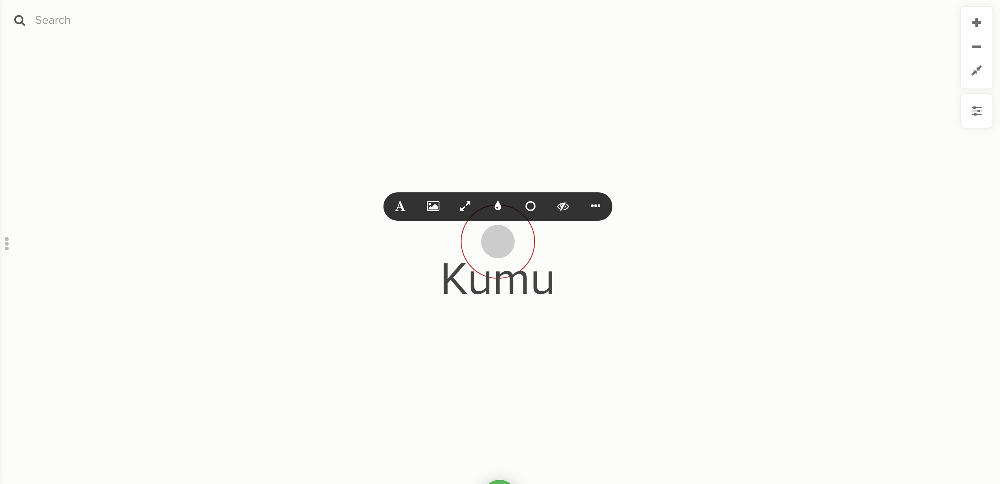

# Direct decorations

Usually, it's faster and easier to decorate elements, connections, and loops according to the data in their [fields](fields.md)—for example, creating a decoration rule that selects all elements with the element type "Organization", and color-codes them based on their tags.

But, if you haven't added field data, or you just want to tweak the style of one single item on the map, **direct decorations** is the perfect tool.

To use them, simply hover over an element, connection, or loop, and the direct decorations toolbar will appear:



If you'd rather have the toolbar appear when you click on an item instead of hover, add the following in the [Advanced Editor](../overview/view-editors.md#advanced-editor):

```scss
@controls {
  toolbar: click;
}
```

If the toolbar is a distraction and you prefer to use rule-based decorations, you can disable the toolbar altogether:

```scss
@controls {
  toolbar: false;
}
```

## Direct decorations reference

The table below lists all of the icons you'll find in the direct decorations toolbar for elements, connections, and loops, and what action each icon exposes to you.

<table><thead>
<tr><th>Icon</th><th>Action</th><th data-type="checkbox">Elements</th><th data-type="checkbox">Connections</th><th data-type="checkbox">Loops</th></tr></thead><tbody>
<tr><td></td><td>Edit label and type</td><td>true</td><td>true</td><td>true</td></tr>
<tr><td></td><td>Edit font color, font size, font style, and font alignment</td><td>true</td><td>true</td><td>true</td></tr>
<tr><td></td><td>Edit color</td><td>true</td><td>true</td><td>true</td></tr>
<tr><td></td><td>Edit size and/or shape</td><td>true</td><td>true</td><td>false</td></tr>
<tr><td></td><td>Add an image</td><td>true</td><td>false</td><td>false</td></tr>
<tr><td></td><td>Delete item</td><td>true</td><td>true</td><td>true</td></tr>
<tr><td></td><td>More options</td><td>true</td><td>true</td><td>true</td></tr>
<tr><td></td><td>Add a border</td><td>true</td><td>false</td><td>false</td></tr>
<tr><td></td><td>Add a bullseye</td><td>true</td><td>false</td><td>false</td></tr>
<tr><td></td><td>Add a shadow</td><td>true</td><td>false</td><td>false</td></tr>
<tr><td></td><td>Change connection direction</td><td>false</td><td>true</td><td>false</td></tr>
<tr><td></td><td>Add delay markings</td><td>false</td><td>true</td><td>false</td></tr>
<tr><td></td><td>Reset direct decorations</td><td>true</td><td>true</td><td>true</td></tr>
<tr><td></td><td>Visit these docs!</td><td>true</td><td>true</td><td>true</td></tr></tbody></table>

## Undo direct decorations

You can undo your direct decorations for either one, or all, of the entities on your map.

To view what has been decorated with the toolbar, click on the Settings button on the right-hand side of your map and **hover** over the blue text "Disable direct decorations". You'll then see what elements/connections have been affected by direct decorations.

If you wish to undo _all_ of the direct decorations, you can **click** on "Disable direct decorations" to return your map to the way it was before. Similarly, if you want to enable direct decorations again, click on the same blue text that is now "Enable direct decorations".

Another option is to disable direct decorations for one or a few single items on your map. To do so:

1. Hover over any element or connection
2. Click on the edit pencil to open the direct decorations toolbar
3. Choose the "More" icon at the end,
4. Click on the "Reset direct decorations" icon (represented as an eye with a dash through it)
5. In the next popup window, click "Reset".

_Note that you can here also choose for a "hard reset", which resets the direct decorations of your entire map._

Similarly, if you wish to undo the direct decorations of only _a few_ selected items, select those items first, and then follow the steps above.

## Caveats for direct decorations

There are just a few additional things you should know about direct decorations:

#### Direct decorations can't be used when importing from Google Sheets

If you're data is coming in from a Google Sheet, you'll notice that the direct decorations toolbar doesn't show up. If you'd still like to use direct decorations, please switch to importing your data with Excel.

#### Direct decorations always override decorations in your [Views](views.md).

This includes all the code in your Advanced Editor. For example, if you direct decorate an element to color it blue, and then you use the view to color it red, it will still be blue.

#### Direct decorations, just like element position and connection curvature, are stored separately for each map in the project.

If you want to change the direct decoration for an item, you can [duplicate the map](../overview/settings.md#map-settings) and make your changes in the new copy.

#### When you're editing the map, the direct decorations toolbar will hide [popovers](popovers.md).

However, anyone who has view-only access to the map or is viewing a [presentation](presentations.md) or a [shared/embedded map](share-and-embed.md) will still see your popovers (the direct decorations toolbar is hidden for them, since they can't make edits to your map).

If you're building popovers and just want to see how they look before you publish, you can either follow the instructions above to turn off the direct decorations toolbar, or click the ellipsis icon in the bottom right corner and select "Switch to preview mode".
