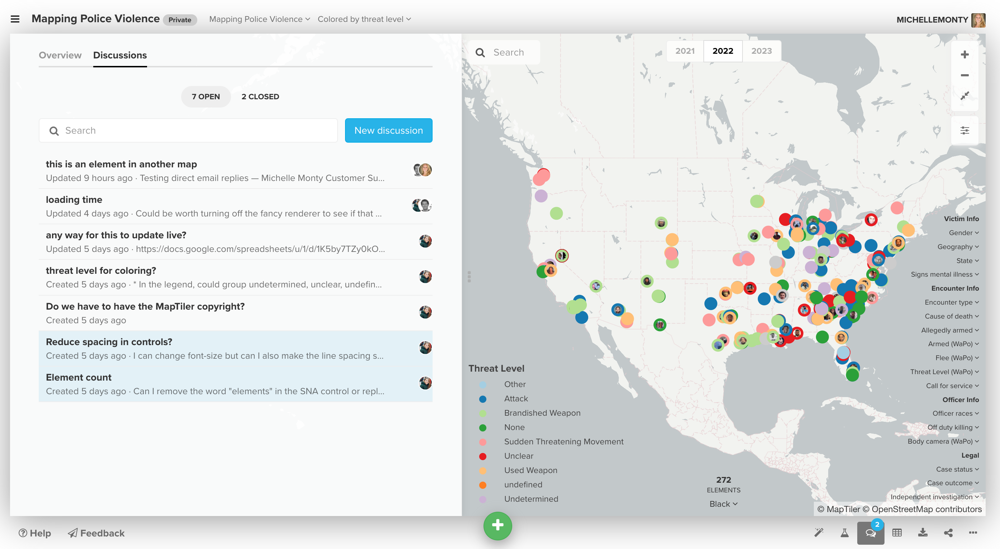

# Discussions

With Discussions (an exclusive feature for [Pro workspaces](pro-workspaces.md)) you can chat with your team and attach comments to items in your map—all within Kumu, all in real time!

To access, click the Discussions tab in the left-hand side panel, or click the Discussions icon in the bottom-right corner of your project.

<figure><figcaption></figcaption></figure>

To create a discussion topic, click the **New discussion** button, and to join an existing discussion, simply select it from the list. When you're commenting on a discussion topic, you can use [Markdown](markdown.md) to add basic formatting, as well as links, images, and even videos.

To tag team members, you can use `@username`. You can reference elements and labelled connections & loops on the map with `[[label]]`. Or, just type `[[`, and the comment box will prompt you with a list of available labels.

You can also attach a discussion topic directly to an element, connection, or loop on the map. To do that, select your item(s), and click the comment icon in the left-hand [side panel](../overview/map-editor.md#side-panel). An asterisk will appear next to that element. If you click on the asterisk it should open that element's specific discussion, even if you have another discussion open. f you click on an asterisk for an element that has been tagged in multiple discussions, it will take you to a page showing all of those discussions.

To close the Discussions tab, navigate back to the Overview tab, or click on any blank space in your map to collapse the side panel entirely.

## Email notifications

When a new discussion top is created, every Kumu user that is a member of the project will be notified by email, in addition to all the owners of the Pro Workspace that the project lives in. From the email, they can open the discussion thread in Kumu and respond, or they can simply reply to the email to add their new comment.

You can also subscribe to a certain discussion thread if you want to stay updated on any new comments. To do so, you can open a discussion topic and click on the notification icon "follow this discussion" in the top-right corner.

## Open, close, and search discussions

Once you've been working in a project for a while, your list of discussions might get a bit lengthy. To clean up the list, and to let your team members know which conversations are finished, you can close out old discussions.

From the list of open discussions, click on an discussion topic you'd like to close, then use the button in the upper right corner to close it. You can use this same button if you need to re-open the discussion in the future.

Closed discussions will be removed from the open discussion list, but stored in their own list, in case you need to reference them later. When you open up the discussion tab, you can use the buttons at the top to toggle between open and closed discussions.

If you're ever having trouble finding a conversation, just use the search bar at the top of the discussion tab—it searches not only titles but also contents of all your discussions.


Discussion are an exclusive feature for [Pro workspaces](pro-workspaces.md).

