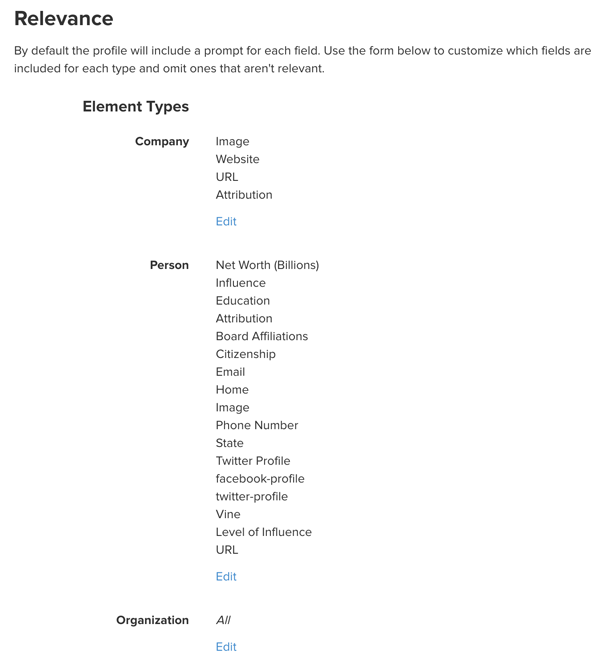
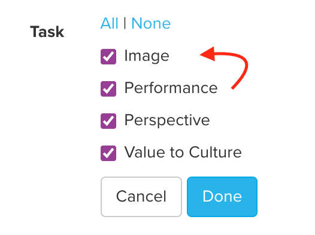

# Fields

Fields allow you to save additional data about the elements, connections and loops in your map. Create whatever fields you need and modify the settings to enable things like checklists, prompts, currencies, and much more.

**Skip to section:**

* [Add a custom field](fields.md#add-a-custom-field)
* [Customize a field](fields.md#customize-a-field)
  * &#x20;[Field type](fields.md#field-type)
  * [Field prompt](fields.md#field-prompt)
  * [Field category](fields.md#field-category)
  * [Field relevance or privacy](fields.md#field-relevance-or-privacy)
  * [Field ordering](fields.md#field-ordering)
* [Deleting a field](fields.md#deleting-a-field)
* [Deleting field values](fields.md#deleting-field-values)

***

## Core fields

Kumu comes with a set of core fields. Putting data in _all_ of these fields isn't necessary, but they get special visual treatment in [profiles](profiles.md) and have special functionality, so it's great to use them when you can!

<figure><figcaption></figcaption></figure>

#### Label

The Label field uniquely identifies an element, connection or loop. Look at it as the name for any of these entities. The label shows up all the way at the top of any element or connection profile. Your element, connection and loop labels will appear on the map by default. An element usually requires a label ([unless you're identifying by IDs](../faq/how-do-I-avoid-duplicating-data.md#use-ids-to-separate-identical-labels)), but a connection doesn't necessarily need to have a label, unless you like to give it one. Your map shows an element, connection or loop's label by default.

#### Type

Use the Type field to categorize elements and connections. Common element types include 'person', 'project', or 'company'. Common connection types include the nature of the relationship, e.g. 'personal', 'business', or 'family', or whether a connection has a positive affect (+) or a negative effect (-).&#x20;

What's important to note here is that Type values are _mutually exclusive,_ meaning that an element or connection type can only be one single value. For example, an element cannot be a 'person' and an 'organization' at the same time. &#x20;

#### Connection direction

In a connection's profile, you'll see whether a connection is directed, undirected, or mutual. Direction determines where/if an arrow is depicted on one or both ends of a connection, and is used in [Metrics](metrics.md) calculations to analyze the structure of a network. When you export your map to Excel, you'll also see this field included in the Connections tab of your sheet. To change the connection direction, please visit [this guide](../faq/how-do-I-add-arrows-to-my-connections.md).

#### Description

The description field is designed to hold longer-form content that describes an item. Descriptions can include multiple paragraphs, and even multimedia content. You can use [Markdown](markdown.md) to format your text and [widgets](widgets.md) to add multimedia content.

#### Tags

The tags field is designed to hold multiple values that each describe your item in a different way. This field is ideal for when an element can belong to _one or more_ categories that do not need to be mutually exclusive. For example, a connection between a person and a non-profit might have the following tags: "Strong relationship", "Board Member", "Donor", and "Advocate", all stored as separate values in the Tags field, adding rich detail to that person's relationship with the non-profit.

In the profile, tags appear under the description, and hovering your cursor over a tag will [showcase](showcase.md) other items with that same tag.

#### Image

Include an image URL or upload an image from your computer, and Kumu will display it on the map and in the profile. Learn more from [our full guide on images](images.md).

#### URL

Add any link to the URL, and the link will open when the element, connection, or loop is double-clicked.

#### Email

Add an email and Kumu will automatically include their [gravatar](http://en.gravatar.com/) on the map and in the profile. Gravatars can be a huge time saver when working with social network data!

#### ID

Add a unique ID to each element and connection when you want to have fine-tuned control over Kumu's decision to create or update items during a [spreadsheet import](import/). To learn more about this, check out [our guide on avoiding duplicate data](../faq/how-do-I-avoid-duplicating-data.md).

## Add a custom field

To add a custom field, select an element or connection and then click the **+New Field** button in the sidebar. You'll be prompted to name the field and then enter a value for the element or connection you selected.

By default, new fields are set to accept only one value and not prompt users with suggested values. While this is an easy way to get started adding values, you may have times where you want people to pick from a list of defined values (level of influence: high, medium or low) or multiple values from a list (skills: project management, web development, leadership, public speaking). In those cases, you can customize your field—keep reading to learn how!


Field's can't be named `YES`, `NO`, `ON`, `OFF`, `TRUE`, or `FALSE`. Uppercase and lowercase versions of these words will cause errors elsewhere in Kumu.


## Customize a field

To customize the settings for a given field, click on an element, and click the field in the element's profile.

A dropdown will appear with the following options:

* **Name** - change the name of your field
* **Type** - string, text, URL, email, number, currency
* **Limit** - one value **OR** none (one or more values)
* **Prompt** - none, autocomplete, or list
* **Category** - for grouping fields in sections on the profile
* **Visibility** - public **OR** private (whether or not viewers can see a given field)
* **Clustering** - whether to allow clustering by this field
* **More** - access settings, relevance, or delete the field

Let's look at a few of these options in more depth:

### Field type

Below are the choices for the field format and guidance on when to use each:

* **String** - This is the default value and used when entering simple, short pieces of text
* **Text** - Used for longer text fields like notes, addresses, and anywhere you want to use [Markdown](markdown.md) formatting
* **URL** - Used for website addresses
* **Email** - Used for email addresses
* **Number** - Used for numerical values that aren't currencies or dates
* **Currency** - Used for financial values to be displayed with standard currency format ($)
* **Date** - Used for dates, like February 14th (Kumu's birthday!)

### Field prompt

Field prompt is managed by clicking "more" and then "settings" in the dropdown. Below are the choices for the field prompt and guidance on when to use each:

* **None** - Use when you'd like to turn off any prompts for field values
* **Autocomplete** - Use when you'd like a tag-like interface for prompting values that match the current input
* **List** - Use when you want to pick from a list of defined values



### Field category

By default, all fields are ordered alphabetically based on the name of the field. You can also group fields by assigning them a category. For example, you may want to have all financial information (FY 2012 Investment, FY 2013 Investment and Cumulative Investment) under the category "Financials". You can create multiple categories and each will be ordered alphabetically.

We reserve a few category names that we give special treatment to:

* **General** - This is the default. Fields in this category will live at the top of the field section and won't have an explicit category label.
* **Footnotes** - This category is meant for things like attribution and citing your sources. Fields in this category will always be listed at the bottom of the profile.
* **Metrics** - This category holds any of the data you create using Kumu's [Metrics](metrics.md) tool.

### Field relevance or privacy

**When do I see a field?**\
By default, all fields are shown in the profiles of all elements, connections, and loops while you're editing the map. Even if a field has a blank value, it will still show up in the profile.

But, in each profile, Kumu will automatically _hide_ all blank fields in the following cases:

* When someone is viewing a [presentation](presentations.md)
* When someone is viewing a [shared/embedded map](share-and-embed.md)
* When someone is viewing the source project, but they don't have edit access

**Hide fields across all profiles**\
If you'd rather hide irrelevant fields while you're editing the map, you can use **field relevance** in your project settings. Click the menu in the top left of your map and then click "fields". Scroll down and you'll see a "relevance" section. To edit which fields should be included for each of the element, connection, and loop types in your project, click edit, uncheck the relevant fields, and click "Done" at the bottom of the field list.

If you'd like to limit the fields that are shown, simply click edit and then uncheck the field you'd like to hide in the profile for a given type. Label, type, description, and tags are always shown for all types regardless of what you enter. Above is an example of customizing the profile of elements with type of "Company" to only show Image, Website, URL and Attribution.

**Hide fields for viewers only**\
You might also want to hide a field from view for anyone who is not a contributor. For example, this is handy when you're working with information that is not relevant to the viewer. In this case, you can make a field "private" and hide it from view for anyone who is not a contributor.


**Note:** If you're hiding a field from viewers, the data is never completely hidden from your project. When viewing a map, the data is still passed to the browser to enable decorations and other view settings to work for those fields. This means that anyone who has access to view the map can technically get access to the data in hidden fields (even though it is hidden from the profile). If anything is unclear about this, please contact our support through support@kumu.io.&#x20;


To do so, click on any custom field and then check the Privacy checkbox:

**Hide fields in certain "entity" profiles only**\
You can also indicate whether you'd like profile fields to show up in element, connection, or loop profiles (or all of them). The field (and any field values) will then be hidden in any profiles in which you don’t want it to show up, whether it contains any values or not.

<figure><figcaption></figcaption></figure>


* By default, a field is ‘relevant’ (shows up) in all profiles.
* Default fields such as `element type`, `tags`, `description` etc. cannot use field relevance, as they must always be visible to editors in each profile.


### Field ordering

You can also use the field relevance menu to change the order fields are listed in the profile. By default all fields are listed alphabetically (and optionally broken into sections if you've assigned categories). The order of fields is unique to each element or connection type.

To change the order, click edit next to the element type that you'd like to adjust:

And then simply drag the fields to reorder them:

When you are finished, click "Done" and you'll see the new order reflected in the profile.

## Deleting a field

If you've created a field and want to delete it and all corresponding values, click on the label of the field in any profile and then go to more -> delete. Alternatively, you can use the menu in the upper left corner to go to the field settings page (choose fields). This will delete the field and any values assigned for any content in your project.


Note: when [importing data from a Google Sheet](import/#google-sheets), you have to add/edit/delete your fields in the Google Sheet directly. You're not able to make these changes within Kumu.


## Deleting field values

Occasionally you may want to delete the prompted choices for a given field, or the options that show up in your legend or in a [control](controls.md). To do this, you need to delete the underlying field value. This process is different depending on the field's [prompt](fields.md#customize-a-field).

For fields that have their prompt set to "Autocomplete" or "None" (this includes the Tags field), you can only delete the field value by removing it from every element, connection, and loop in the project, including the [trash](../overview/kumus-architecture.md#trash).

For all other fields (including Element Type, Connection Type, and Loop Type), follow these steps:

1. Click the menu in the upper left of your map and choose **FIELDS**
2. Click on the field you want to edit
3. Find the value you want to delete. Then, click the delete button next to the value to delete it.
4. Scroll down and click **SAVE** to save your changes
5. Refresh the page

After you follow these steps, the field value(s) you deleted will no longer show up in prompted lists, in legends, or in controls.
