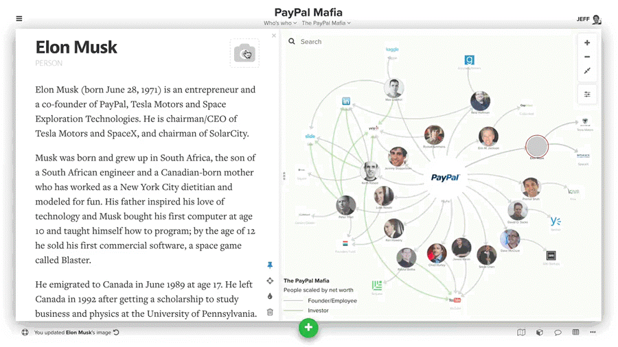
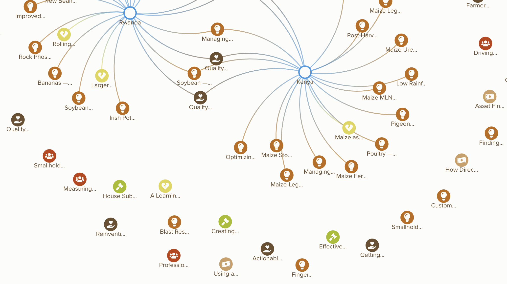

# Images

In Kumu, there are a number of different places where you can use images to enrich your project.&#x20;

**Skip to section:**

* [Adding images to elements](images.md#add-images-to-elements)
* [Adding icons to elements](images.md#add-icons-to-elements)
* [Adding a background image](images.md#add-a-background-image)



## Add images to elements

If you are [building a map by hand](../getting-started/first-steps.md#build-your-map-by-hand), you can easily upload an image file from your computer directly to Kumu. Just click an item (element, connection, or loop) on your map, click the camera icon in the upper right of the [profile](profiles.md), and click "select a file" to upload your image.



You can upload images to descriptions and the map overview as well. To do this, click to edit any text area in the [side panel](../overview/map-editor.md#side-panel), and look for "select a file" below the text area.


Note: when you're uploading images, only JPEG, PNG, and GIF files smaller than 5mb are supported at this time.


#### Importing images through Google Sheets

If you're [importing data with Google Sheets](import/), then you'll have to include a URL to an image hosted publicly on the web. First, add an "Image" column in the "Elements" sheet of your Google Sheets file, and then add the public URL for the image that you want to add to each element (e.g. each row).&#x20;


Note that the URL should lead _directly_ to the image, so you might need to create such a URL first through an [image hosting platform](https://imgbb.com/). Some images allow you to simply right-click on them and choose "Copy image address". You can then use that link as the image URL.&#x20;


#### Troubleshooting images

Have you uploaded images, but are not seeing images on the map? Here are a few steps you can take to troubleshoot the problem:

* Make sure you're not using the SNA template, which doesn't support images. If you are using that template, you can [switch to a different one](templates.md#switching-templates).
*   If you're entering image links directly:

    * Make sure your link leads directly to the image, rather than a webpage with the image on it. There are many places where you can host your images, but [this website](https://imgbb.com/) is generally a good place to start. Some images also allow you to simply right-click on them and choose "Copy image address".
    * Make sure your image URL is using a secure connection—that is, the link starts with `https` instead of just `http`
    * Disable image proxy: click the menu icon  in the upper left of the map editor, then click **Admin** and click **disable it**.


#### Using decorations to add images

With decorations, you can create rules that add the same image to multiple elements. To do this, [open the element decoration builder](decorate.md#refine-your-decorations), select which elements the rule will apply to, and check the box next to "Add image". You'll be prompted to add an image URL or upload an image from your computer, and your image will be added to the selected elements.

You can also use [advanced decorations](decorate.md#decorate-in-the-advanced-editor) to add images and tweak their appearance on the map. In a decoration in the Advanced Editor, use the `image-url` property to set the image url for your selection, and use the `image-visibility` property to hide images or make them visible on the map. You can also use the `image-size` property to choose whether images on the map will completely cover their parent elements, or be fully contained inside the parent element.

```scss
#my-element {
  image-url: url(https://example.com/my-element-image.png);
  image-size: contain;
  image-visibility: visible;
}
```

Be sure to check out our [property reference](../overview/advanced-editor-hub/property-reference.md) for full documentation on properties that can be used in the Advanced Editor.

## Add icons to elements

Using the Advanced Editor, you can easily bring in any [Font Awesome icon](https://fontawesome.com/icons) to decorate your elements.



For more guidance, check out [our full guide on icons](icons.md).

## Add a background image

To add a background image to a map, you can use a snippet of code in the [Advanced Editor](../overview/view-editors.md#advanced-editor). The following instructions will help you add an image of a world map, but they can be adapted to add any background image.

1. Create an element and change its label to `background`.
2. Pin the element (press `P` on your keyboard, or click the pin icon in the left side panel).
3. Copy/paste the following code into your Advanced Editor:

```scss
@settings {
  culling: off;
}
#background {
    image-url: url(https://s3.amazonaws.com/cloud.kumu.io/accounts/2057/201677/44522144-b11e-48dd-96b1-aeca8c3592d9.png);
    layer: background;
    shape: rectangle;
    height: 10000;
    width: 10000;
    color: transparent;
    image-size: contain;
    image-resolution: original;
    label-visibility: none;
}
```

1. Click **SAVE** at the bottom of the Advanced Editor to save your changes.

You can replace the `image-url` in that code with a link to any image online. To get an image URL from any image you see online, you can right-click the image and select "Copy Image Address". When you're pasting your new image url into the Advanced Editor, make sure to put it inside the `url( )` parentheses.

Also, if your image isn't big enough, or if it's so tall or wide that it's affecting your zoom fit, you can change the `height` and `width` numbers in the code to adjust the dimensions.


Some images won't be displayed in Kumu, because they are using an insecure connection (the link starts with `http` instead of `https`), or because they are traveling through a proxy server.\
\
If your image isn't displaying in Kumu, you can save the file to your computer and follow the steps below to upload the image directly to your Kumu project.


You can also use the [Basic Editor](../overview/view-editors.md#basic-editor) to upload an image from your computer to your Kumu project—this will override the `image-url` in your code. Follow these steps:

1. Complete the initial steps above to create your background element, add your Advanced Editor code, and save your changes.
2. Click the settings icon  to open the Basic Editor.
3. Click **More Options**
4. Select **Decorate elements**
5. In the element decoration builder, set the dropdown at the top to "Decorate custom selection"
6. Set the second row of dropdown menus to `Label` `is` `background` (assuming your background element's label is `background`)
7. Check the box next to "Add image", then click "upload image"
8. Upload your image, and click **Done** at the bottom of the decoration builder
9. Click **SAVE** at the bottom of the Basic Editor


If you need to adjust the position of the image element in the map, you'll need to remove the `layer: background;` line. Click and drag the element to adjust its position, and then add back that line of code when you're done.


**Notes:**

* "background" is the label of the element that will contain the background image in this example, but the label can be anything you want. Just make sure you update the `#background` [selector](selectors.md) in your code to match your new label.
* `image-resolution` can have values of `auto`, `original`, or any number. The number you include (e.g. `1000`) will adapt the resolution for an image of that width (1000px).


If you add a control to your map, you'll see that the background gets filtered out. If you want to keep your background as you filter, follow these steps:

1. Create the control first. Don't forget to save it!
2. Then go into the Advanced Editor and change the line from `target: element;` to `target: :not(#background);`
3. Now the control won't affect the background!


As always, if you have any questions on how this works, email us at [support@kumu.io](mailto:support@kumu.io) for help!
