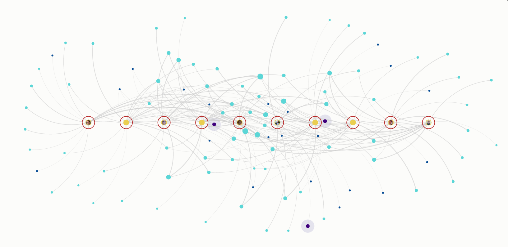

# Snap-to

Snap-to makes it easy to arrange a group of elements as a circle or a line. This can be useful for creating rings of stakeholders based on whether they are core vs. periphery, positioning elements along a linear timeline, or just bringing more order to a complex map. It also brings additional grouping and sorting functionality to support analysis of complex data.

There's two ways to use Snap-to:

1. [Set Snap-to manually](snap-to.md#set-snap-to-manually)
2. [Set Snap-to automatically](snap-to.md#set-snap-to-automatically)

## Set Snap-to manually

**1. Pick a selection**

To get started using snap-to, select one or more elements. You can do this by holding `shift` on your keyboard and dragging your mouse to draw a selection box over part of the map, or by clicking the search bar at the top of the map and then using the rocket icon  to build a [selector](../selectors.md).

**2. Arrange as a circle or line**

After you've selected multiple elements, right click the map and choose "snap to" from the menu. Then, you can choose whether you want to arrange the elements as a circle ("snap to circle") or a line ("snap to line").

**3. Adjust the spacing and angle of elements**

* **Spacing.** Once you've chosen whether you are using a circle or a line, scroll on your mouse or trackpad to adjust the spacing of elements on the circle (creating a larger or smaller circle) or the line (creating a longer or shorter line).
* **Angle (snap to line only).** By default, lines will be drawn horizontally. If you'd like to change the line to be vertical or any angle in between, hold `shift` and then scroll on your mouse or trackpad.
* **Snap to center.** After you've snapped your elements to a certain shape, right-click on the blank canvas again and choose "Snap to center" to bring the shape to the center of your Kumu map. This is especially useful when you're creating concentric circles.&#x20;

**4. Group and sort**

You can tweak the ordering of elements in the circle or line by using the "group by" and "sort by" options. "Group by" allows you to group elements from matching categories together while "sort by" allows you to order elements from low to high based on numerical values. You can combine both to achieve sorted groups where the elements in each group are ordered from low to high.

To group or sort, right click on the map again before hitting `enter` to save. You'll see an option for both "group by" and "sort by". It doesn't matter whether you choose to "group by" or "sort by" first. Simply pick one and then choose the relevant field from the menu.

**5. Save your work**

Once you're happy with how all the elements are positioned, hit `enter` to pin each element in place. If you'd like to start over, hit `esc`.

If you've already saved the positions by hitting `enter`, you can always change the positions later by repeating these steps or unpinning the elements.

If you don't like what it did to your map, simply hit the `escape` (esc) button on your keyboard, and your map will be back to normal.&#x20;

## Summary Cheat sheet

### Snap to circle

To snap to circle, follow these steps:

1. Select multiple elements by building a [selector](../selectors.md) using the search or by holding down `shift` and dragging a box over the elements
2. Right click anywhere on the map and click "snap to" and then "snap to circle"
3. Adjust the size of the circle by scrolling on your mouse or trackpad (optional)
4. Group or sort the elements in the circle by right-clicking again on the map (optional)
5. Press `enter` to save or `esc` to exit without saving.

### Snap to line

To snap to line, follow these steps:

1. Select multiple elements by building a [selector](../selectors.md) using the search or by holding down `shift` and dragging a box over the elements
2. Right click anywhere on the map and click "snap to" and then "snap to line"
3. Adjust the spacing of the line by scrolling on your mouse or trackpad (optional)
4. Group or sort the elements in the circle by right-clicking again on the map (optional)
5. Press `enter` to save or `esc` to exit without saving.

## Set Snap-to automatically&#x20;

You can also have a map snap to a certain shape automatically. This option is great when you're [importing through a Google Sheet](../import/#google-sheets), which doesn't allow you to pin elements in place.  \
\
**1. Pick a selection**

Open the Basic Editor by clicking on Settings .png>) on the right. Then choose "More" > "Snap To" > "Add a snap-to rule". This will automatically apply the snap to all the elements on your map. If you want to create a more specific selection, click on the little pencil icon to add a [selector](../selectors.md).&#x20;

**2. Adjust the settings**

Once you have the selection set, adjust the settings for the snap-to by using the `shape`, `x-coordinate`, `y-coordinate`, `size`, `angle` and `space`. Once you're done, click Save on the yellow bar at the bottom.&#x20;


**Note:** the connections don't adjust their position until you have saved your snap-to rule. This might look a bit wonky as you're creating the rule, but it will adjust once you have saved the settings. if it hasn't, please refresh the page and the connections should be updated.&#x20;


**3. Check the Advanced Editor**

Once you've saved the settings, click "Switch to Advanced Editor" at the bottom. You'll now be able to locate a code looking something like this:&#x20;

`selector {` \
&#x20; `position: circle(0, 0, 100, auto);` \
`}`

You can use that code to make any adjustments to your shape, in case you want to do a quick edit. Of course you can also make edits in the Basic Editor still, in the snap-to menu!&#x20;
