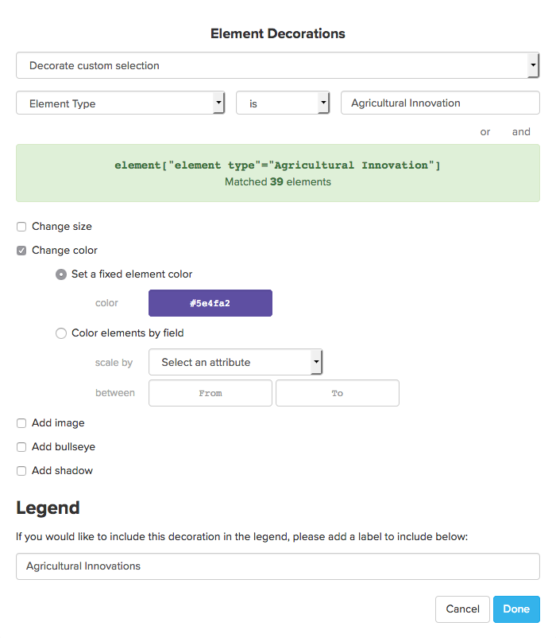
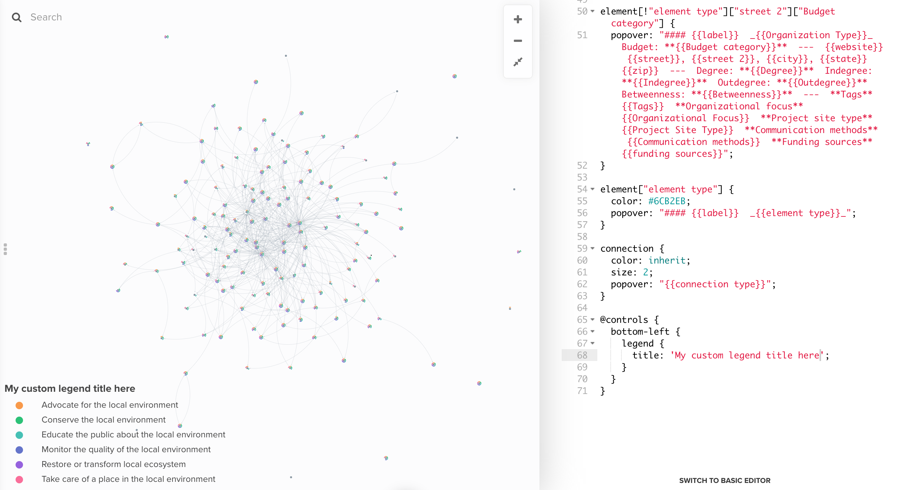

# Legends

Adding a legend to your map is an important step to make sure your readers can easily understand your decorations. There are a number of different ways to add and remove legend entries—this guide will explain all of them!

Note that you can only create a legend through [data-driven decorations](data-driven-decorations.md). If you're using [direct decorations](direct-decorations.md) (the toolbar) to color, then you won't have a legend.

**Skip to section:**&#x20;

* [Use the Color by tool to create a legend](legends.md#use-the-color-by-tool-to-create-a-legend)
* [Use the decoration builder to add custom legend entries](legends.md#use-the-decoration-builders-to-add-legend-entries)
* [Removing legend entries](legends.md#removing-legend-entries)
* [Reordering legend entries](legends.md#reordering-legend-entries)
* [Add legend entries through the Advanced Editor](legends.md#add-legend-entries-through-the-advanced-editor)
  * [Change the legend title](legends.md#change-the-legend-title)
  * [Hide the legend](legends.md#hide-the-legend)
  * [Legend code reference](legends.md#hide-the-legend)

***

## Add legend entries through the Basic Editor

There are two ways to create your legend from the [Basic Editor](../overview/view-editors.md#basic-editor):

1. Using the **Color by,** or **Shape by** options
2. Using the [decoration builders](decorate.md#refine-your-decorations) (Decorate Elements & Decorate Connections)

**Color by** is a great way to get a legend up and running quickly, while the decoration builders are useful when your legend needs to be a bit more customized. Read on to learn more about both options.

#### Use the Color by tool to create a legend

When you use the [Color by](decorate.md#color-by) tool in the Basic Editor, Kumu will automatically create your color legend, adding an item for each possible value in the field you're coloring by. For example, this map is colored by Element Type using the `bujumbra` scale:


This automatic legend feature also works when you're using **Color by** to add [flags](flags.md).

Note that the **Color by** tool will stop adding legend entries after it runs out of colors in its default color palette (seven colors). To make sure all your field values get included in the legend, you might need to click the expand icon and choose a [larger color palette](../overview/advanced-editor-hub/color-reference.md). If the **Color by** tool is including some unwanted field values in your legend, try [deleting the unwanted values](fields.md#deleting-field-values).

One more caveat about **Color by**: when you're using this tool, it's not possible to remove, replace, or edit individual colors from the color palette. To fully customize the colors in the palette, you can follow the guide to [define your own palette](../overview/advanced-editor-hub/color-reference.md#defining-your-own-color-palette). Alternatively, you can read through [the section below](legends.md#use-the-decoration-builders-to-add-legend-entries) to learn how to create a custom legend without using the **Color by** tool.

**Only color by the values being used**

In some projects, you might have a long list of field values, but only use _some_ of them on a given map. If that is the case, your **Color by** legend will include _all_ of the possible field values, not just the values being used on your map.

Using Kumu's [computed fields](computed-fields.md) feature, you can quickly solve this problem and create a legend with only the used values:

1. Open your [project settings](../overview/settings.md#project-settings) and click "Fields"
2. Add a new field—this new field can have any name, but something like "Color coding field" might be clear and easy to remember.
3. Scroll down to the fields "Advanced settings" section.
4. In the **Expression** box, paste in `{{Field Name}}`, replacing `Field Name` with the name of the field you originally wanted to color by. For example, if you want to color by the element type field, paste in `{{element type}}`.
5. Click "Save" to save the field

With that done, you can return to the map, and use the **Color by** tool to color by your new computed field. Regardless of how many possible values you have in the original field, the legend will now only include the values being used on the current map.

For bonus points, use [field relevance settings](fields.md#field-relevance) to hide your computed field from all profiles.

#### Use the decoration builders to add legend entries

To add custom colors and icons to your legend, use the [element and connection decoration builders](decorate.md#refine-your-decorations). Once you build out your decoration rule, fill in the "Label for Legend" box at the bottom of the decoration builder, and Kumu will add your decoration to the legend.



You can use the decoration builders to add many different kinds of items to your legend—for example, icons to indicate that elements or connections are being scaled in size:


For a full list of legend icons you can add, [jump to the legend reference](legends.md#legend-reference).

The legend entries added from the decoration builder will be listed in the Basic Editor among other [existing decorations](../overview/view-editors.md#existing-custom-decorations). If you hover over a custom decoration, you can click the pencil icon next to it to edit that entry, or you can click the trash can to delete that decoration.&#x20;

<figure><figcaption></figcaption></figure>

#### Removing legend entries

Legend entries added using the **Color by** tool can only be removed by [defining your own color palette](../overview/advanced-editor-hub/color-reference.md#defining-your-own-color-palette) or [deleting the field values](fields.md#deleting-field-values) that you don't want to see. To do this, you need to delete the underlying field value. This process is different depending on the field's [prompt](legends.md#customize-a-field).

For fields that have their prompt set to "Autocomplete" or "None" (this includes the Tags field), you can only delete the field value by removing it from every element, connection, and loop in the project, including the [trash](../overview/kumus-architecture.md#trash).

For all other fields (including Element Type, Connection Type, and Loop Type), follow these steps:

1. Click the menu in the upper left of your map and choose **FIELDS**
2. Click on the field you want to edit
3. Find the value you want to delete. Then, click the delete button next to the value to delete it.
4. Scroll down and click **SAVE** to save your changes
5. Refresh the page

After you follow these steps, the field value(s) you deleted will no longer show up in prompted lists, in legends, or in controls.

If you used the decoration builder to add a legend entry, you can go to the existing decorations section, click the pencil icon next to the decoration, and clear out the Label for Legend box. This will remove the legend item, but keep the decoration—if you'd rather delete both, you can click the delete icon in the existing decorations section.

Some legend entries get added automatically when you apply different [templates](templates.md). Here's how to delete those entries:

* For **Person** and **Organization** entries (stakeholder template), and **Stock**, **Flow**, **Variable**, **Source**, and **Sink** entries (stock and flow template), follow the guide to [delete field values](fields.md#deleting-field-values). Delete these values from the Element Type field.
* For **Adds to / same direction** and **Subtracts from / opposite direction** entries (causal loop template), follow the guide to [delete field values](fields.md#deleting-field-values). Delete these values from the Connection Type field.
* **Opposite** entry (system template): Open your [default settings](default-view-settings.md), and, in the **Template settings** section, clear out the "Opposite connection label" box and click **SAVE** at the bottom.

#### Reordering legend entries

There are two ways to re-order legend entries, depending on how they were added. If you added legend entries using the **Color by** tool, follow these steps to change the order:

1. Click the menu icon  to bring up the [project settings](../overview/settings.md#project-settings)
2. Select **Fields** from the sidebar on the left
3. Select the same field you selected in the **Color by** tool—it's settings panel will open up
4. Drag and drop field values to change their order
5. Click **Save** at the bottom of the field settings to save your changes, then reload the page

If you added legend entries using the decoration builder return to the Advanced Editor and locate the codes generated by Kumu for your custom decorations, cut and past the codes to re-arrange the legend entries the way you want them to appear on your map.


## Add legend entries through the Advanced Editor

If you're working on decorations in the [Advanced Editor](../overview/view-editors.md#advanced-editor), you can add a comment above a decoration to tell Kumu that it should be included in the legend. The syntax is:

```scss
/* entry-type: Entry Label */
```

Replace `entry-type` with either `elements` or `connections` to tell Kumu what your decoration rule applies to. Replace `Entry Label` with the text that will appear in the legend. Your decoration rule should start on the next line down in the Advanced Editor.

Here's a working example from a decoration in one of the screenshots above:

```scss
/* elements: Authors, sized by number of articles written */
author {
  color: #918dc2;
  scale: scale("total articles", 0.5, 3);
  border-width: 1;
  border-color: #fcfcfa;
}
```

Note that you can combine multiple decoration rules into one block of code, and Kumu's legend will combine many of your rules into one legend icon. The code above will create the following entry in the legend, complete with color, border color, and scale:


For a full list of legend icons and how to use them from the Advanced Editor, [jump to the legend reference](legends.md#legend-reference).

## Change the legend title

If you'd like to change the title of your legend from "Legend" to something more descriptive, you can use the following code:

```scss
@controls {
  bottom-left {
    legend {
      title: 'My custom legend title';
    }
  }
}
```

This is what it'll look like:



## Hide the legend

If you want to completely hide the legend, you can use the Advanced Editor to do so. Here's some sample code to get you started:

```scss
@controls {
  bottom-left {}
}
```

For more info on why and how this works, check out [our full guide on built-in controls](controls.md#built-in-controls).

## Legend reference

Below is a list of all the icons you can add to your legend, as well as instructions on how to access the icons from the Basic and Advanced Editors.

<table><thead><tr><th>Legend icon</th><th>Basic Editor</th><th>Advanced Editor</th></tr></thead><tbody><tr><td></td><td>Decorate elements ><br>Change color ><br>Set a fixed element color</td><td><pre><code>element {
    color: #34b3eb;
}
</code></pre></td></tr><tr><td></td><td>Decorate elements ><br>Add shadow ><br>color</td><td><pre><code>element {
    shadow-color: #34b3eb;
}
</code></pre></td></tr><tr><td></td><td>Decorate elements ><br>Add bullseye ><br>color</td><td><pre><code>element {
    bullseye-color: #34b3eb;
}
</code></pre></td></tr><tr><td></td><td><pre><code>element {
    border-color: #34b3eb;
}
</code></pre></td><td></td></tr><tr><td></td><td>Decorate connections ><br>Change size ><br>Scale connection widths by field</td><td><pre><code>connection {
    scale: scale("strength", 0.5, 3);
}
</code></pre></td></tr><tr><td></td><td>Decorate connections ><br>Change color ><br>Set a fixed connection color</td><td><pre><code>connection {
    color: #34b3eb;
}
</code></pre></td></tr><tr><td></td><td>Decorate connections ><br>Change style ><br>dashed</td><td><pre><code>connection {
    style: dashed;
}
</code></pre></td></tr></tbody></table>
