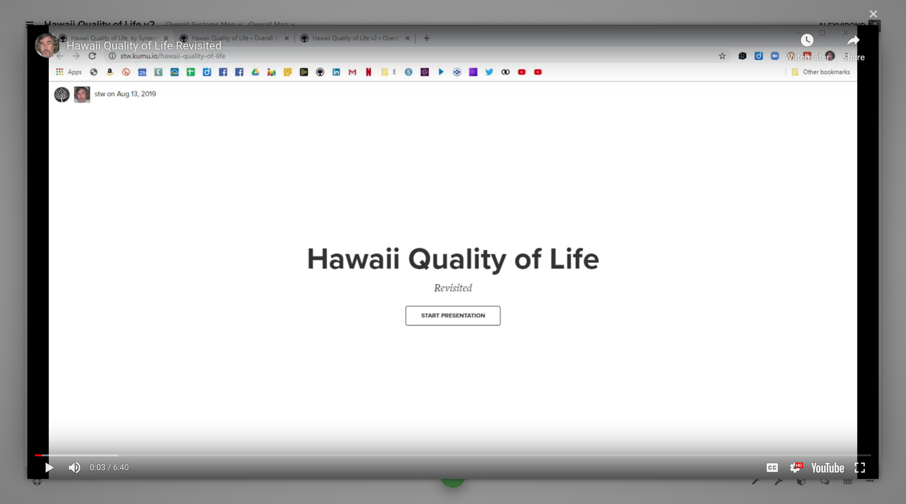

# Lightbox

In Kumu, you can embed content from external providers into a **lightbox**.

To show content in a lightbox, start by finding a link to the embeddable version of the external content. Once you have the link, just add add `?lightbox` to the end for the default lightbox, or add `?lightbox=full` for a nearly-fullscreen lightbox.

Add the completed link into one of the following places in your map:

* The Map Overview located in the [side panel](../overview/map-editor.md#side-panel)
* The text for any [presentation](presentations.md) slide
* The Description field in any [profile](profiles.md)
* Any custom field with its [field type](fields.md#customize-a-field) set to Text or URL


Tip: Add the lightbox to a custom field named `URL` with its type set to URL, and the lightbox will open when your element, connection, or loop is double-clicked.



**Note:** If you're looking to put a Youtube video in a lightbox, make sure to use the full URL. More info [here](widgets.md#youtube).&#x20;

