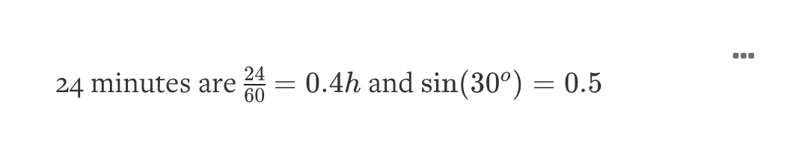

# Markdown

## Markdown

Markdown is an easy and powerful way to format your descriptions and long text fields using simple, natural syntax.

### The basics

```md
*italic* and **bold**
```

\-> Creates _italic_ and **bold**

```md
An inline link: [Kumu](http://launch.kumupowered.com)
```

\-> Creates an inline link: [Kumu](http://kumu.io)


Note that inline links always open the website in the same tab and direct your viewer away from your Kumu map. If you wish to open the link in a separate tab, you can use the following HTML syntax:&#x20;

`<a href="https://kumu.io" target="_blank">Kumu website</a>`

Replace the URL with your own and swap the word "Kumu website" for any word(s) you'd like your viewers to click. Make sure that target= stays the same.&#x20;


```md
An auto-generated link: http://kumu.io
```

\-> Creates an auto-generated link: [https://kumu.io](https://kumu.io)

### Lists

```md
* Milk
* Cookies
* Marshmallows
```

Looks like:

* Milk
* Cookies
* Marshmallows

```md
1. California
2. Texas
3. New York
```

Looks like:

1. California
2. Texas
3. New York

### Links within your account

We also support linking to elements, connections and loops (even other maps in your account).

You can use the following syntax:

**Selectors**

```md
[link text](= selector)
```

Replace `link text` with the text for your link, and replace `selector` with any valid [selector](selectors.md).

**Maps**

```md
[link text](#map-slug)
```

Replace `link text` with the text for your link, and replace `map-slug` with the [slug](slugs.md) of your map.

**Views**

```md
[link text](#map-slug/view-slug)
```

Replace `link text` with the text for your link, replace `map-slug` with the [slug](slugs.md) of your map, and replace `view-slug` .with the [slug](slugs.md) of your view.

### Images

```md

```

Replace `alt text` with an image caption that screen readers can read, and replace `image-url` with a link to your image.

#### Widgets

See our guide to [widgets](widgets.md) to learn more about embedding videos, podcasts, slideshows, and other interactive content inside markdown.

### Headings

```md
# Heading 1
## Heading 2
### Heading 3
#### Heading 4
##### Heading 5
###### Heading 6
```

Looks like:

## Heading 1

### Heading 2

#### Heading 3

**Heading 4**

**Heading 5**

**Heading 6**


Learn how to create anchors that skip to certain sections of your map description [with this guide](../frequently-asked-questions/how-do-i-add-anchors-to-my-map-description.md).&#x20;


### Code

Simply indent lines with four spaces or wrap the code with three backticks:

````
```md
<div class="footer">
    &copy; 2013 Kumu Systems LLC
</div>
```
````

Looks like:

```md
<div class="footer">
    &copy; 2013 Kumu Systems LLC
</div>
```

### Blockquotes

```
> Add quote text here
```

Looks like:

> Add quote text here

### Tables

```md
One | Two | Three
--- | --- | ---
Blue | White | Gray
Green | Yellow | Red
```

If you are using Markdown in the Description column of an [import](import/), you will have to use the [HTML table tag](https://www.w3schools.com/tags/tag\_table.asp) rather than the usual Markdown syntax. Make sure to remove all line breaks from your HTML, or your table will render with a large white space above it.


```md
| One   | Two    | Three |
| ----- | ------ | ----- |
| Blue  | White  | Gray  |
| Green | Yellow | Red   |
```

| One | Two | Three |
| ----- | ------ | ----- |
| Blue | White | Gray |
| Green | Yellow | Red |

### Horizontal Rules

```
Three or more dashes or asterisks
---
***
```

\
Now you know the basics of formatting with markdown! For more information, visit [Daring Fireball's markdown syntax documentation](http://daringfireball.net/projects/markdown/syntax#precode).

### Inline HTML

Kumu's markdown editor also recognizes a limited amount of inline HTML.&#x20;


More HTML fun:&#x20;

* Learn how to create anchors that skip to certain sections of your map description [with this guide](../frequently-asked-questions/how-do-i-add-anchors-to-my-map-description.md).&#x20;
* Learn how to add text dropdowns that show/hide additional text upon click [with this guide](../frequently-asked-questions/how-do-i-add-text-dropdowns-to-my-map-overview.md).&#x20;



Here are the tags you can use in Kumu, anywhere that accepts markdown:

```md
<a>
<aside>
<b>
<blockquote>
<br>
<caption>
<code>
<del>
<dd>
<dfn>
<div>
<dl>
<dt>
<em>
<h1>
<h2>
<h3>
<h4>
<h5>
<h6>
<hr>
<i>

<ins>
<kbd>
<li>
<ol>
<p>
<pre>
<q>
<samp>
<span>
<strike>
<strong>
<sub>
<sup>
<table>
<tbody>
<td>
<tfoot>
<th>
<thead>
<tr>
<tt>
<ul>
<var>
```

And here are the HTML attributes that use can use for each tag:

```md
<a>
  href


  src

<div>
  itemscope
  itemtype

all tags
  abbr
  accept
  accept-charset
  accesskey
  action
  align
  alt
  axis
  border
  cellpadding
  cellspacing
  char
  charoff
  charset
  checked
  cite
  clear
  cols
  colspan
  color
  compact
  coords
  datetime
  dir
  disabled
  enctype
  for
  frame
  headers
  height
  hreflang
  hspace
  ismap
  label
  lang
  longdesc
  maxlength
  media
  method
  multiple
  name
  nohref
  noshade
  nowrap
  prompt
  readonly
  rel
  rev
  rows
  rowspan
  rules
  scope
  selected
  shape
  size
  span
  start
  summary
  tabindex
  target
  title
  type
  usemap
  valign
  value
  vspace
  width
  itemprop
```

### LaTeX

Good news for people using Kumu in science, math, or academia—anywhere you write Markdown in Kumu, you can also write LaTeX to include equations!

You can write LaTeX inline or on its own separate line. To write inline, put two dollar signs on either side of your LaTeX code, like so:

```md
24 minutes are $$\frac{24}{60}=0.4h$$ and $$\sin(30^o)=0.5$$
```

Here's what you would see:



Or, for more complex expressions, you can write inside a codeblock marked as `latex`, like so:

````
```latex
f(x) = \int_{-\infty}^\infty
    \hat f(\xi)\,e^{2 \pi i \xi x}
    \,d\xi
```
````

Here's what you would see:


Kumu uses a tool called KaTeX to render these equations. For a full list of supported equations, [visit the KaTeX docs](https://katex.org/docs/supported.md).
