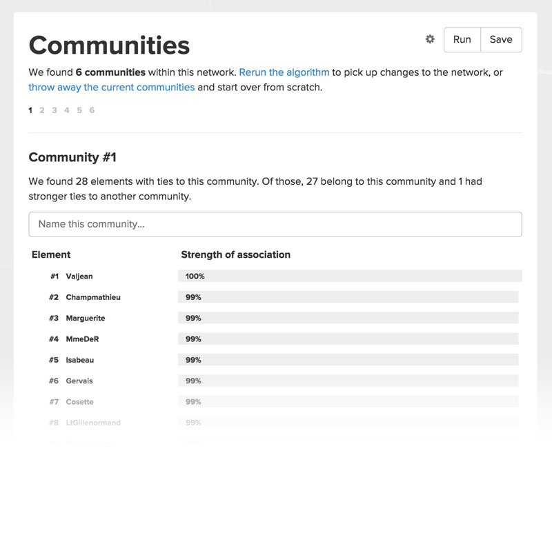

# Metrics
Kumu has a powerful metrics engine which includes a number of popular social network analysis (SNA) metrics as well as community detection and other helpful calculations.

## How to run basic metrics
1. Click on the Blocks icon <i class="fa fa-cube"></i> in the bottom right of the map
2. Select "Social Network Analysis"
3. Choose a metric from the dropdown list
4. Click the large button "Discover ..." (e.g. "Discover the connectors/hubs" for the "degree" metric)

**Good to know:**
- To rerun metrics (for example, if you added new elements and connections), just follow the same steps again.
- Metrics will not be calculated for elements that are filtered out of the map.

<iframe width="560" height="315" src="https://www.youtube.com/embed/1o0AraW1MbM" frameborder="0" allowfullscreen></iframe>

## SNA metrics
You can run the following metrics in Kumu:

<input type="text" id="search-box" onkeyup="searchTable()" placeholder="Type to filter...">

<table id="search-table" class="table borderless"><tbody>
        <tr>
            <th class="text-left">Metric</th>
            <th class="text-left">Description</th>
        </tr>

        <tr>
              <td>Degree</td>
              <td>Degree centrality is the simplest of the centrality metrics, counting the number of connections an element has. In general, elements with high degree are the local connectors / hubs, but aren't necessarily the best connected to the wider network.</td>
        </tr>
        <tr>
            <td>Closeness centrality</td>
            <td>Closeness measures the distance each element is from all other elements. In general, elements with high closeness can spread information to the rest of the network most easily and usually have high visibility into what is happening across the network.</td>
        </tr>
        <tr>
            <td>Betweenness centrality</td>
            <td>Betweenness centrality measures how many times an element lies on the shortest path between two other elements. In general, elements with high betweenness have more control over the flow of information and act as key bridges within the network. They can also be potential single points of failure.</td>
        </tr>
        <tr>
            <td>Size</td>
            <td>Size measures the number of neighbors an elements has (plus the element itself). It's similar to degree, but counts the number of elements instead of connections.</td>
        </tr>
        <tr>
            <td>Indegree</td>
            <td>Indegree measures the number of incoming connections for an element. In general, elements with high indegree are the leaders, looked to by others as a source of advice, expertise, or information.</td>
        </tr>
        <tr>
            <td>Outdegree</td>
            <td>Outdegree measures the number of outgoing connections for an element. In general, elements with high outdegree can reach a high number of elements and spark the flow of information across a network (but may not be the most efficient at spreading the information).</td>
        </tr>
        <tr>
            <td>Eigenvector</td>
            <td>Eigenvector centrality measures how well connected an element is to other well connected elements. In general, elements with high eigenvector centrality are the leaders of the network, though they may not have the strongest local influence.</td>
        </tr>
        <tr>
            <td>Reach (two-step out)</td>
            <td>Reach measures the portion of the network within two steps of an element. In general, elements with high reach can spread information through the network through close friend-of-a-friend contacts.</td>
        </tr>
        <tr>
            <td>Reach efficiency</td>
            <td>Reach efficiency normalizes reach by dividing it by size (number of neighbors). In general, elements with high reach efficiency are less connected but gain more exposure through each direct relationship.</td>
        </tr>
        <tr>
            <td>MICMAC</td>
            <td>MICMAC is a system analysis that explores element exposure (how much a given element is affected by other elements) and influence (how much a given element affects other elements). When plotted on an XY axis, these scores help you identify potential leverage points within the overall system.</td>
        </tr>

</tbody></table>

Looking for group metrics that describe your entire network? Check out the <a class="alert-link" href="/guides/controls/sna-dashboard-control.md">SNA Dashboard control</a>.

### Weighted metrics
Certain fields also support weighting so you can include fields like strength and frequency in the calculations. Betweenness, closeness and degree use connection fields for weighting while size and reach use element fields for weighting.

For the metrics that allow weighting, you'll see an Advanced Options link once you select the metric:

You can choose any numerical field for the weighting, but make sure you have values saved for the elements or connections based on which is used for the weighting. If you don't see the field you want to use listed, make sure the type for that field is set to numeric.

### Saving multiple versions of a single metric

By default, all metrics are saved to a field with the name of the metric (betweenness calculations are saved to the "betweenness" field). Each time you run the metric the previous values are overwritten. If you'd like to keep the previous values, rename the field (maybe it's "2014 betweeness" or "betweeness before") so that future saves don't overwrite the values.

<iframe width="560" height="315" src="https://www.youtube.com/embed/YZuJheC3zNc" frameborder="0" allowfullscreen></iframe>

**Using metrics for a social network analysis?** Don't miss our [SNA / Network Mapping guide](sna-network-mapping.md).

## Community detection

Kumu includes support for community detection based on the [SLPA algorithm](https://scholar.google.com/scholar?q=slpa+community+detection). With the SLPA algorithm, communities are identified based on communication flows and, unlike older algorithms (such as the Louvain method used by Gephi), the algorithm can detect overlapping communities (which is helpful since community membership is rarely black and white).

### Detecting communities

Click the blocks icon <i class="fa fa-cube"></i> in the lower right corner of your map and choose "community detection". If you haven't run community detection before, clicking this will automatically detect communities. If you're already run community detection, clicking the icon will bring you to a window showing you the previous results.

Good to know: Connection direction <em>does</em> influence community detection.

### Reviewing community breakdowns

After running the algorithm, we present the results to you in a table that allows you to browse each of the communities, ordered by popularity (defined as the size of the community).

Within each community, elements are listed in order of their strength of association to that community. Think of this value as the probability of that element belonging to the given community. Elements in grey are ones that had ties to the community but ultimately had stronger ties somewhere else.

When analyzing the communities, you may notice that a common theme runs across all members of that community. Maybe they all went to the same graduate school, or worked at the same law firm (maybe they even went to the same high school). If you notice a theme like this, we provide an easy way to override the community name and replace it with a descriptive one.

Don't forget to click save once you're done!

<b>Note:</b> Some community detection algorithms treat communities as black and white—you're either in, or you're out. While this helps simplify the analysis, it throws away a lot of useful information about the overlapping community structures within the network.  The SLPA algorithm preserves this data, and we believe the breakdown is even more valuable than simply knowing the primary community an element belongs to.

### Color by communities

First, make sure to save the community results. This will save the best match for each element to the "Community" field so you can use the community values to decorate your maps.

To quickly color-code elements by community, you can use the [Color by](/guides/decorate.md#color-by) tool in the Basic Editor.

### Rerun from scratch (optional)

When you rerun community detection, we'll use the existing communities to seed the algorithm by default. This keeps the communities more stable, but occasionally you may want to throw away the previous communities and start fresh. For instance, if you've made a number of changes to the map the previous communities will unfairly dominate the new network. Just click "throw away the current communities" and we'll dump the existing communities and rerun the algorithm from scratch.

Remember, not all networks have meaningful community structure! Use the default settings and try to avoid fiddling too much just to get a pretty picture.

Also remember that the science of community detection is still evolving. Use the results from the algorithm to ask better questions about your maps, but don't take them as fact.

<a href="https://github.com/kumu/docs/blob/master/guides/metrics.md" target="_blank"><i class="fa fa-github"></i> edit this page</a>
