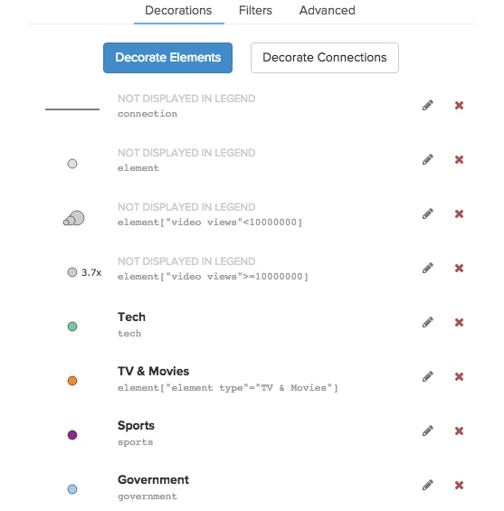

# Perspectives / Style Sheets

Perspectives allow you to create different views of your map and easily switch between them. Each perspective can include a combination of styles, decorations, and filters.

## Adding decorations

Decorations are powerful ways to change the color and/or size of your map based on the attributes of elements and connections.

### Coloring by qualitative attributes

If you have a qualitative attribute like "industry" you'll need to create a decoration for each value. Click "decorate elements" and then use the top dropdowns to identify which industry you want to color. Let's use "tech" as an example:

Next, choose the decoration you'd like to use. For example, you could choose "change color" and then set the color as green (try using #16BD7F instead of standard green).

The same process applies for connections as well (just choose the "Decorate Connections" button instead).

## Coloring or scaling by quantitative attributes

When you have a quantitative attribute, it makes it even easier to decorate the elements. You might have a "net worth" attribute and you'd like to scale every element based on this value. In this case, you can leave the top dropdown option as "decorate all elements" and then just add the size scale below:

## Decorations are applied top to bottom

You might run into some cases where your decorations compete with one another (you decorated all "people" blue but highlighted those tagged with "influential" orange). In this case, the decorations are applied from top to bottom. Simply re-order your decorations by dragging them to achieve the desired result.

## Filters

Filters are a powerful way to hide elements and connections and create different views of your map. You can filter by type or create a custom selector.

### By type
You can easily filter elements and connections by type using the checkboxes within the filter section. Simply uncheck any element types that you don't want to display on the map. You can do the same with connection types.

### By selector
You can also add filters based on any selector. This gives you a lot of power to change what is displayed on your map. You have two options:

* **Include** For include to work properly, first uncheck the types. Remember that include adds things back to the map so if everything is already there, this field has no effect.
* **Ignore** This field works as a blacklist to remove elements and connections from your map.

Click the rocket icon (<i class="fa fa-rocket"></i>) on the right side of the input to build out the selector which defines what you want to include or ignore.

  Don't forget to first uncheck some element or connection types if you are using <strong>include</strong>, otherwise they are all automatically included!

## Advanced editor

We've intentionally limited the decorations available through the builder to keep the UI simple
and avoid overwhelming new users. In order to harness the full power of perspectives, you'll need to roll up your sleeves and do a little coding. Don't be scared! Beneath the surface perspectives are controlled by css and it's a very easy language to learn.

If you're comfortable with CSS, we highly recommend using the advanced editor. Read the [advanced  guide](/perspectives-advanced.md) to dive in.

<a href="https://github.com/kumu/docs/blob/master/guides/perspectives.md" target="_blank"><i class="fa fa-github"></i> edit this page</a>
