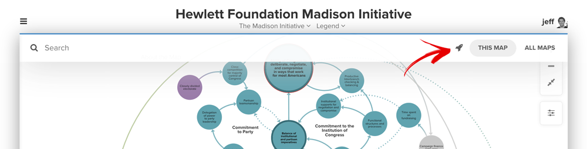

# Selectors

Selectors are a powerful tool, allowing you to select multiple items within your project based on the information stored in their [fields](fields.md).

#### Jump to a section:

* [Why should I use selectors?](selectors.md#why-should-i-use-selectors)
* [Where can I use selectors?](selectors.md#where-can-i-use-selectors)
* [How do I write selectors?](selectors.md#how-do-i-write-selectors)

## Why should I use selectors?

In Kumu, you can always select items using your mouse and keyboard:

* Clicking one element, connection, or loop to select it
* Hold the `shift` key and click to select multiple items
* Hold the `shift` key, then click-and-drag to select a group of items

Once you have an active selection, you can do all sorts of things: [decorate](decorate.md) your selection, [change field values](../overview/map-editor.md#multiple-selections) for your selection, [focus](focus.md) on your selection, etc. Long story short, selections are extremely useful in Kumu!

But what if you need to select a large group of items that are densely interconnected with other items that you _don't_ want to select? You can't hold `shift` & click-and-drag, because you'll select some unwanted items in that area. You could hold `shift` and click on each individual item, but that could take a _reaaally_ long time for bigger maps.

The solution: **selectors**!

Think of selectors as a super-powered mouse & keyboard—they allow you to click on a lot of elements, connections, and loops extremely quickly and with perfect precision. Learning how to recognize, read, and write selectors will _definitely_ come in handy when you're working in Kumu.

Check out the overview video below to learn the basics of selectors, then read through the rest of this guide for detailed instructions.



## Where can I use selectors?


Before you start: [use fields](fields.md) to add additional information to your elements, connections, and loops.


#### Search bar

You can use selectors in the search bar on your map to select multiple items.

In the upper left of the map, click "Search" next to the search icon to start searching. Then, click the rocket icon  on the far right to bring up the selector builder, and use it to build out your selector.



If you'd rather write your selector instead of use the selector builder, just type an equal sign `=` in the search bar, then write your selector. Press `enter` on your keyboard to select all items that match your selector.

#### In the Basic Editor

There are several places in the [Basic Editor](../overview/view-editors.md#basic-editor) where you can use selectors:

* [Filter tool](filter.md)
* [Connect By tool (clustering)](clustering.md)
* [Showcase tool](showcase.md)
* [Decoration builder](decorate.md)

The Connect By tool and decoration builder allow you to use the same selector builder from the search bar, and the filter and showcase tools allow you to either use the selector builder or write your own selector.

#### In the Advanced Editor

The [Advanced Editor](../overview/view-editors.md#advanced-editor) is where selectors _really_ shine. Advanced decorations, filters, focuses, controls—you name it! Almost every block of code in the Advanced Editor contains some sort of selector.

In all of the guides on this documentation site, keep an eye out for Advanced Editor instructions—they'll teach you how to use selectors to enhance all of Kumu's most powerful tools.

## How do I write selectors?

In this section, we'll teach you how to write all kinds of selectors, which fall into these categories:

1. [Shorthand selectors](selectors.md#shorthand-selectors)
2. [Longhand selectors](selectors.md#longhand-selectors)
3. [Pseudo-selectors](selectors.md#pseudo-selectors)
4. [Traversals](selectors.md#traversals)

We'll also teach you how to [chain selectors together](selectors.md#chain-selectors) to run complex queries involving AND and OR logic.

After you read this section, check out our [selector reference](../overview/advanced-editor-hub/selector-reference.md)—it's a great cheat sheet for every possible selector in Kumu.

You can also use our experimental [selector builder interface](https://selector-builder.netlify.app/) to write selectors for you!

## Shorthand selectors

#### Slugs

All shorthand selectors use slugs—pieces of text that have had all letters converted to lowercase, all special characters removed, and all spaces and replaced with hyphens. To learn more about recognizing, reading, and writing slugs, check out [our full guide on slugs](slugs.md).

#### Universal selector

The universal selector is just an asterisk `*`, and it matches all elements, connections, and loops—everything on the map!

```scss
*       // select everything
```

#### Select elements, connections, or loops

Selecting all elements, connections, or loops is simple:

```scss
element                // select all elements
connection             // select all connections
loop                   // select all loops
```

#### Select by type

Selecting all of a specific type is pretty simple too. For elements, just take the element type and turn it into a [slug](slugs.md). For connections, turn the connection type into a slug and add `-connection`.

```scss
person                 // select all elements with "Person" element type
future-project         // select all elements with "Future Project" element type
personal-connection    // select all connections with "Personal" connection type
business-connection    // select all connections with "Business" connection type
```

#### Select by label

Selecting specific items by label is—you guessed it—pretty simple! Just turn the item's label into a slug, then add `#` in front of it:

```scss
#jeff-mohr             // select element "Jeff Mohr"
#thinking-in-systems   // select element "Thinking in Systems"
#b1                    // select loop "B1"
```

#### Select by assigned ID

In Kumu, you might sometimes assign custom, unique IDs—see our guide on [avoiding duplicates](../faq/how-do-I-avoid-duplicating-data.md) for more info on when and why you would want to do this.

If you have custom IDs in your project, you can use those IDs in shorthand selectors. The syntax is the exact same as the label selector: create a slug of the ID, then add `#` in front of it:

```scss
#project-1234          // select the item with id "project-1234"
```

#### Select by system ID

Behind the scenes, Kumu assigns a unique ID to each element, connection, and loop, as soon as you create the items. We call this a "system ID", and you can use this in shorthand selectors, too!

System IDs are created as slugs by default, so to turn turn them into selectors, all you need to do is add a `#` in front:

```scss
elem-1h04vQRH          // select the element with the system id "elem-1h04vQRH"
conn-9Gp2zuYg          // select the connection with the system id "conn-9Gp2zuYg"
loop-mt57r8Gb          // select the loop with the system id "loop-mt57r8Gb"
```

System IDs are guaranteed to be unique and permanent.

#### Select by tag

To select by tag, simply turn the tag into a slug, then add a `.` to the front of it:

```scss
.mission-critical      // select anything tagged with "Mission Critical"
```

#### Select by presence/absence of field values

The presence/absence selector allows you to select items based on whether they have **any** value or **no** values in a given field. To select by presence (**any** value in the field), turn the field name into a slug, and put it inside of square brackets:

```scss
[element-type]         // select any item with anything in the "element type" field
```

To select by absence (**no** values in the field), just follow the same steps, but put a `!` in front of the field name's slug:

```scss
[!element-type]        // select any item (including connections and loops) with no value in the "element type" field
```

## Longhand selectors

While the shorthand selectors are great for many cases, they're only supported for the fields and selections described above. For all other fields, or for more complex selections, you can use longhand selectors. Longhand selectors have three parts:

1. Field name
2. Operator
3. Field value

And the syntax is as follows:

```scss
["field name" operator "field value"]
```

Replace `field name` and `field value` with a name and value from your project, depending on what you are trying to select, and keep them wrapped in `""` double quotes. `field name` and `field value` are **not** case-sensitive in selectors.

Then, replace `operator` with a logical operator recognized by Kumu, for example, `=` (equal to) or `>` (greater than). You can see the full list of operators and their meanings in the [selector reference](../overview/advanced-editor-hub/selector-reference.md#operators).

Here are some examples:

```scss
["element type" = "person"] // select all items whose element type equals "Person"
["description" *= "kumu"]   // select all items whose description text contains "kumu"
```


When using the **Type** field in longhand selectors, you need to specify whether it is **Element** Type, **Connection** Type, or **Loop** Type. For example, use `"connection type"` instead of just `"type"` when selecting by connection type.


Here are a few more examples, using **relative** operators (greater-than, less-than, greater-than-or-equal-to, and less-than-or-equal-to):

```scss
[team-members < 20]         // select all items that have a number less than 20 in the Team Members field
[team-members > 20]         // select all items that have a number greater than 20 in the Team Members field
[team-members <= 20]        // select all items that have a number less than or equal to 20 in the Team Members field
[team-members >= 20]        // select all items that have a number greater than or equal to 20 in the Team Members field
```

Note also that these examples use `team-members` as the field name, instead of `"Team Members"`. This works just fine, because you're allowed to use the slug of `field-name` instead of using `"field name"` wrapped in the double quotes. It's up to you!

You can also use relative operators with the built-in `created` and `updated` fields to select items by when they were created or most recently updated in Kumu:

```scss
[created > 2017]            // select all items that were created after the year 2017
[updated < 2017-10-01]      // select all items that were updated before October 1, 2017
```

## Pseudo-selectors

Pseudo-selectors allow you to select elements, connections, and loops based on information stored outside of their profiles—for example, in the profile of an adjacent element, or in the [focus](focus.md) settings of your view.

#### Connected from and connected to

With the `:from` and `:to` pseudo-selectors, you can select connections based on the elements those connections are attached to. The basic syntax is `:from(selector)` and `:to(selector)`.

To build your own, just replace `selector` with any valid selector. For example:

```scss
:from(organization)    // select all connections that are coming from elements with type "organization"
:to(#my-element)       // select all connections pointing to an element with the label "My Element"
```

#### Connection direction

Use the `:directed`, `:undirected`, and `:mutual` pseudo-selectors to select connections based on their direction.

```scss
:directed              // select all directed connections
:undirected            // select all undirected connections
:mutual                // select all mutual connections
```

#### Focus root

When you click and hold on an element, you'll apply the [focus](focus.md) effect to your map. The element you clicked will be the **root** of the focus, and the focus will extend a certain distance away from the root.

You can also select multiple elements or connections before you apply the focus effect. In that case, all the elements and connections you selected will be considered **focus roots**.

Use the `:focus` selector to select your focus root(s).

```scss
:focus                 // select all focus roots
```

#### Orphaned elements

In graphs and networks, an element that has zero connections is often referred to as an **orphan**. In Kumu, you can use the `:orphan` pseudo-selector to select all the orphans on your map.

```scss
:orphan                // select all orphaned elements
```

#### Loop contents

If you're using [loops](../faq/what-are-loops.md) in your map, you can use the `:loop` pseudo-selector to select elements and connections that are part of a specific loop or loops.

The syntax is an element or connection selector with `:loop()` at the end of it. You can also put a loop selector inside the parentheses to specify the loop or loops.

```scss
element:loop()                          // select any element that is part of any loop
*:loop(["loop type" = "reinforcing"])   // select anything that is part of a reinforcing loop
```

#### Not

The `:not` pseudo-selector is useful when you want to select items that **do not** match a selector. The basic syntax is `:not(selector)`.

To build your own, just replace `selector` with any valid selector. For example:

```scss
:not(organization)       // select any item that doesn't have the element type "Organization"
:not(:orphan)            // select any item that is not an orphan, i.e. any item that has 1 or more connections
:not([tags ~= "blue"])   // select any item whose Tags field does not include the tag "blue"
```

### Traversals

Traversals allow you to select elements based on the structure of your map. For example, you can select elements based on:

* Which other elements they are connected to or from
* The information stored in connection's profiles (including connection direction)



The basic syntax is `selector arrow selector`. You'll replace the first and last `selector` with any valid selector (including another traversal), and you'll replace `arrow` with one of the following options:

| Arrow  | Meaning              |
| ------ | -------------------- |
| `-->`  | Connected to         |
| `<--`  | Connected from       |
| `<-->` | Connected to or from |

Here are some examples:

```scss
person --> organization                     // Select all elements with the type "Person" that are connected to elements with the type "Organization"
person <-- organization                     // Select all people that are connected from organizations
person.democrat <--> person.republican      // Select all people tagged as Democrats who are connected to or from a person tagged as Republican
```

You can also add any valid connection selector inside of the arrow to specify exactly which connections are allowed:

```scss
element <--["field name" = "field value"]-- element       // Basic syntax for traversals. Select an element based on specific field information in the profile of a connection from another element
person.democrat --[strength > 5]--> person.republican      // Select all people tagged as Democrats who are connected to a person tagged as Republican, via a a connection whose strength is greater than 5
```

When you add connection selectors in the middle, be sure to put two dashes on the outside:

```scss
/* Two dashes, then a connection selector, then two more dashes. */
--strong-connection-->      // Connected to, via a connection with the type Strong
<--weak-connection--        // Connected to, via a connection with the type Weak
<--connection-->            // Connected to or from, via any connection
```

If you're writing a shorthand selector for connection type, for example, `strong-connection`, you can omit the `-connection`. Taking the example from above:

```scss
// These two selectors select the exact same thing
person.democrat --strong--> person.republican
person.democrat --strong-connection--> person.republican
```

### Chain selectors

The selectors we've covered so far are building blocks. You can combine those building blocks to create complex queries involving AND and OR logic—this action is called **chaining selectors**.

| Logic | Description                                                       | How to use in Kumu                                                          |
| ----- | ----------------------------------------------------------------- | --------------------------------------------------------------------------- |
| AND   | Only items that match all selectors in the chain will be selected | Write selectors back-to-back, with no white space or punctuation in between |
| OR    | Items that match any selector in the chain will be selected       | Join selectors with a comma                                                 |

Here are some examples of selectors chained in different ways:

```scss
person[description]                         // select all items with the element type "Person" AND any value in the Description field

organization, person, project               // select all elements with the element type "Organization" OR "Person" OR "Project"

woman.young.influential                     // select all elements with the type "Woman" AND the tags "Young" AND "Influential"

:to(nonprofit):from(donor, foundation)      // select all connections leading to elements with the type "Nonprofit" AND leading from elements with the type "Donor" OR "Foundation"

:mutual[strength > 1]                       // select all mutual connections whose Strength is greater than 1

:directed[connection-type = "donation"]     // select all directed connections whose connection type is Donation
```
