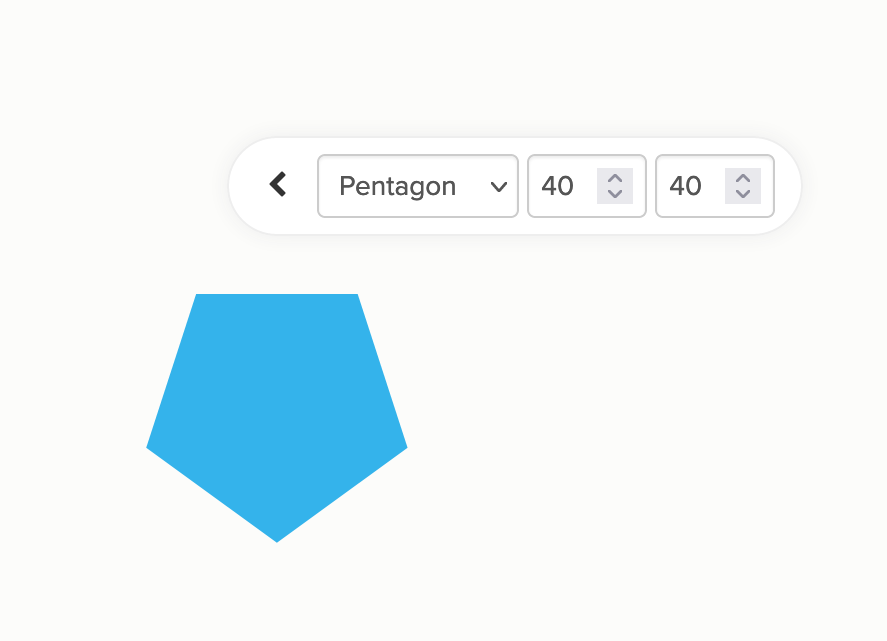

# Shapes

Shapes are are a useful visual tool when you need to differentiate between different types of elements. Kumu has several tools you can use to customize elements' shapes—this guide will help you pick which tool is the right one for your use case:

* [Assigning shapes manually](shapes.md#Assigning-shapes-manually)
* [Assigning shapes to specific selections](shapes.md#Assigning-shapes-to-specific-selections)
* [Assigning shapes to all elements automatically](shapes.md#Assigning-shapes-to-all-elements-automatically)
* [Assigning shapes from the Advanced Editor](shapes.md#Assigning-shapes-from-the-Advanced-Editor)

## Assigning shapes manually

If you just need to assign shapes to a handful of elements, we recommend using the [direct decoration toolbar](direct-decorations.md). Hover over any element, then click the Size/Shape icon , and pick a shape from the dropdown.



## Assigning shapes to specific selections

To assign a shape to a specific selection of elements, use the **element decoration builder**.

1. Open the [Basic Editor](../overview/view-editors.md#basic-editor)
2. Click **Decorate elements**
3. Check the **Add shape** box, and pick a shape
4. If you'd like to add your shape decoration to the legend, fill in the **Legend** box


## Categorizing your elements with shapes automatically

The quickest way to assign shapes to all elements automatically based on their profile data is the **Shape By** tool. Open the Basic Editor, and use the Shape By tool to pick a field from your elements' profiles. Note that Shape By only works with fields that can hold one value, like Element Type.

<figure><figcaption><p>Automatic shaping by element type</p></figcaption></figure>

When you use Shape By, legend entries will be created for you automatically.


## Assigning shapes from the Advanced Editor

In the Advanced Editor, you can use the `shape` property to assign shapes. Here's the basic syntax:

```scss
element {
  shape: circle;
}
```

You can replace `element` with any element [selector](selectors.md), and `circle` with any valid shape:

* `circle`
* `triangle`
* `square`
* `rectangle`
* `pill`
* `diamond`
* `pentagon`
* `hexagon`
* `octagon`

**Two things to note:**

* When choosing the `rectangle` or `pill` shape, you also need to indicate their `width` and `height`:

```scss
element {
  shape: rectangle; 
  height: 100;
  width: 420;
}
```

* To change the size of any shape other than the `square`, `rectangle`, or `pill`, use the `size` property, instead of width & height:

```scss
element {
  shape: triangle; 
  size: 200;
}
```

### More tips for shapes

Instead of setting a shape directly, you can also use the `categorize()` function to assign shapes based on a field:

```scss
element {
  shape: categorize("Element Type");
}
```

The `categorize()` function has its own list of default shapes, but you can list your own shapes to customize which ones are used, and in what order:

```scss
element {
  shape: categorize("Element Type", diamond, hexagon, triangle);
}
```

Or, list a shape and a specific field value to control precisely how those shapes get assigned:

```scss
element {
  shape: categorize("Element Type", diamond "Person", hexagon "Organization");
}
```

Finally, if you'd like your categorized shapes to be automatically added to the legend, use the `element-shape` rule inside a `@settings` block:

```scss
@settings {
  element-shape: categorize("Element Type", diamond, hexagon, triangle);
}
```

By default, the [geo template](templates/geo.md) limits you to squares and straight lines, but if you want it to support all shapes, add `@settings { renderer: canvas; }` to your Advanced Editor.
