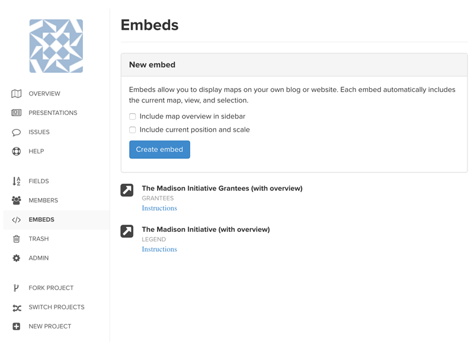

# Share and embed maps

To share or embed your public or private maps, click the "Share" icon in the lower-right corner of your Kumu map. From there, you can create **a shareable link** or generate an **iframe embed code** to add the Kumu map directly to your website.

You'll be prompted with this window:



**Title** allows you to add a title to the shareable link. This won't be displayed to your readers—it will simply add a label to the link in your embed modal, so that you can identify it when you have a long list of links that you've created.

**Password**, only available when the project is private, allows you to add a password to protect the map. When people visit the shareable link, they won't be able to see the map until they enter the password.

**Include map overview in sidebar** allows you to include the sidebar in your shared/embedded map. If you don't select this option, the map will be displayed full screen. When your readers start to interact with the map, the sidebar will follow the standard behavior—when an element, connection, or loop is clicked, the profile will expand.

**Include current position and scale** allows you to override the default "zoom fit" positioning of the map and instead use a custom position and zoom level.

When you're done adjusting the settings, click "Create embed / share link". Then, just copy the share link and send it to a friend, or copy and paste the iframe code into your website to embed.


Anyone who has access to the the share link or the embedded version (and, when applicable, the password) will be able to view the map, even if the project is private. Want to prevent this? Consider [adding users to a private project directly](../overview/collaboration.md#add-a-contributor).&#x20;



Shared/embedded maps will reflect updates you have made to the content of the map (elements, connections, and loops) and to views. Note that updates may take up to one hour to appear.


## Enable scrolling for embeds

To avoid interfering with page scrolling, scroll-to-zoom is disabled by default for maps that are embedded in other web pages. To enable scrolling, add `?scroll=1` to the end of the embed URL.

```
embed.kumu.io/abc123?scroll=1
```

## Hide the settings button and other tools

When you're editing a map, it's usually helpful to have the search bar, settings button, zoom buttons, etc. For the shareable version of a map, though, you might want to hide some or all of these parts of the interface.

For more information on how to do that, check out our guide on [hiding the settings button](../faq/how-do-i-hide-the-settings-button.md).

## Embed a presentation

In Kumu, you can create [presentations](presentations.md) to walk your readers through a map, step-by-step. You can also embed presentations on other websites—[check out the presentations guide](presentations.md#embed-a-presentation).
