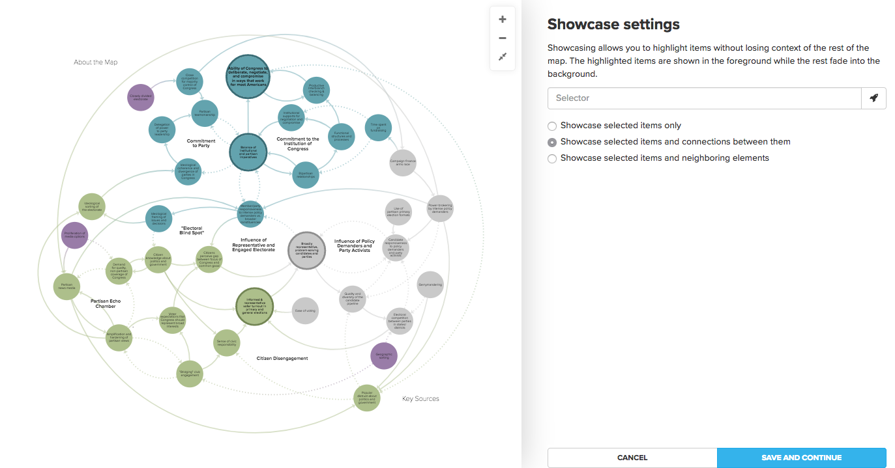

# Showcase

Showcase is similar to [Filter](filter.md), which allows you to show or hide elements, connections, and loops based on the information they contain. But, instead of hiding your unselected data, showcase will make it translucent, fading it into the background.

To quickly test out showcasing, simply hover your cursor over any element, connection, or loop:


Showcase settings can be saved to a [view](views.md), and these settings can be fully customized in two ways: through the Basic Editor, and through the Advanced Editor.

## Showcase in the Basic Editor

Click the settings icon on the right side of your map to open the Basic Editor. Then, click **MORE OPTIONS**, and select **Showcase elements and connections**.



Click the rocketship icon to build the selection of items that you want to showcase, or type a [selector](selectors.md) into the box.

## Showcase in the Advanced Editor

To activate showcase using the advanced editor, add the `showcase` property within `@settings`:

```scss
@settings {
  showcase: person;
}
```

In the code above, `person` is a selector that will showcase all elements with the element type "Person" on the map. Replace `person` with any [selector](selectors.md) to showcase different data.

You can further customize what is included in the showcase by changing the showcase mode:

* `normal` showcase the selection plus any connections between the showcased elements (default)
* `loose` showcase the selection plus neighboring elements
* `strict` only showcase the selection itself

Simply add the mode you'd like to use to the end of the selector with an `!` in front of the mode. If we use the above example but wanted to have the showcase be `strict`, we'd use:

```scss
@settings {
  showcase: person !strict;
}
```

Using the Advanced Editor, you can also control the extent to which items are faded out during showcase. To set the opacity of showcased items, use the `foreground-opacity` property in `@settings`, and to set the opacity of items outside of the showcase, use the `background-opacity` property:

```scss
@settings {
  foreground-opacity: 1;
  background-opacity: 0.1;
}
```

## Activating showcase using controls

If you'd like to make it easy for readers to activate showcase on their own with predefined options, check out the [showcase control](controls/showcase-control.md).
