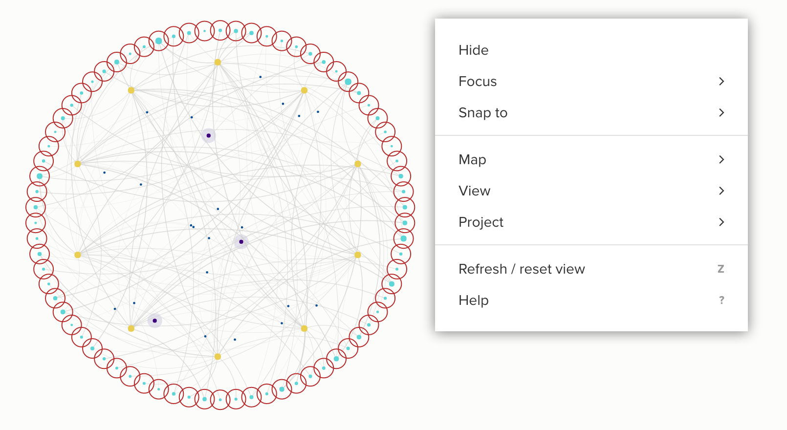

# Snap To

The Snap To feature makes it easy to move a group of elements into a circle or into a line. This can be helpful in quickly positioning elements in your map in a line or a circle, while also enabling you to do analysis based on grouped or sorted elements positioned quickly. You can group or sort the elements in the line or circle based on field data stored in their profile. Select an element or group of element, then right click and choose "Snap to line" or "Snap to circle".

## Snap to line

To snap-to line, follow these steps:
1) Select a group of elements by holding down `shift` as you drag a box over the elements, or using a `[selector](../guides/selectors.md)`
2) Right click anywhere on the map
3) Click "Snap to"
4) Select "snap to line"
5) (optional) Adjust the size of the line by scrolling on your mouse or trackpad
6) (optional) Group or sort the elements in the line by right-clicking again on the map and selecting the pertinent option
7) Press `enter` to save or `esc` to exit without saving.

## Snap to circle

To snap-to circle, follow these steps:
1) Select a group of elements by holding down `shift` as you drag a box over the elements, or using a `[selector](../guides/selectors.md)`
2) Right click anywhere on the map
3) Click "Snap to"
4) Select "snap to circle"
5) (optional) Adjust the size of the circle by scrolling on your mouse or trackpad
6) (optional) Group or sort the elements in the circle by right-clicking again on the map and selecting the pertinent option
7) Press `enter` to save or `esc` to exit without saving.

## Sort elements

After snapping elements to a line or circle, if you right-click on the map again before hitting `enter` to save, you will see an option for "sort by". This option allows you to sort the elements in the line or circle based on a field value of your choice. Select the field in the menu to sort the elements by that value.

## Group elements

After using the snap to feature, if you right-click on the map again before hitting `enter` to save, you will see an option for "group by". This option allows you to group elements by field values, and then sorts the entire list after the grouping is made. Select the field in the menu to group elements by that value.
