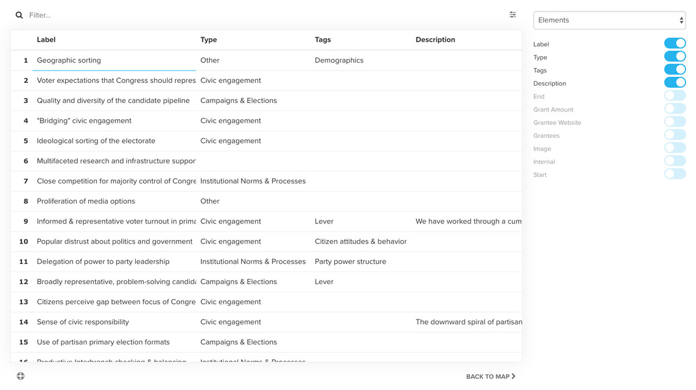

# Table

Table allows you to view and edit your map's underlying data as a spreadsheet. You can access Table by clicking the spreadsheet icon in the lower right corner of your map.

<iframe width="560" height="315" src="https://www.youtube.com/embed/t1lDPgcmr-I" frameborder="0" allowfullscreen></iframe>

## The basics

**Click any cell to edit.** Click on any value to edit it within the spreadsheet. Depending on the field type, you'll either be able to edit directly within the cell or a modal will appear.

**Customize which fields are included.** Click on the settings icon in the upper right to open the sidebar, then select the fields you want to see in the table.

**Filter the results.** Enter a search term or a [selector](/guides/selectors.md) in the upper left to narrow down the results. The filter will search across all fields included in the table.

**Sort a column.** Click on the header of any column to sort that column. Click again to reverse the sort order.

**Fill down values in bulk.** Right click to access the fill down (populate the current value down the entire column) and fill down to value (populate the current value down to the next non-blank cell) options.

**Switch between elements, connections and loops.** The data editor only shows elements, connections or loops at any one time. Click on the settings icon in the upper right and then use the dropdown to switch between elements, connections or loops.

**Return to your map.** Click the "Back to map" link to return to your map. All edits are saved as you make them so you don't need to worry about a separate "save" step.

## Adding new elements or connections

You can quickly and easily add new elements or connections by scrolling to the bottom of the table and entering text into the blank row at the bottom.

Make sure to add a label for elements and both from and to for connections or it won't get saved.

## Using keystrokes

Table is built for fast navigation using keystrokes.

* Use the **directional arrows** to move between cells
* Hit **enter** to edit the active cell
* Hit **tab** to move horizontally across columns
* Use **ctrl + c** to copy and **ctrl + v** to paste

<a href="https://github.com/kumu/docs/blob/master/guides/table.md" target="_blank"><i class="fa fa-github"></i> edit this page</a>
