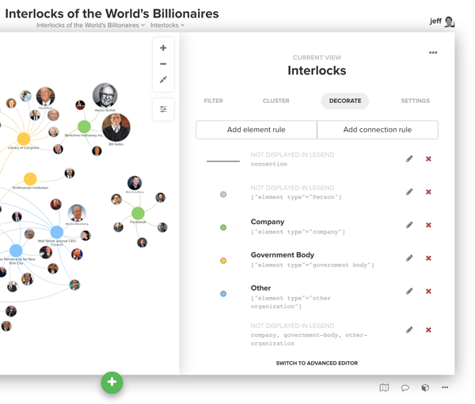
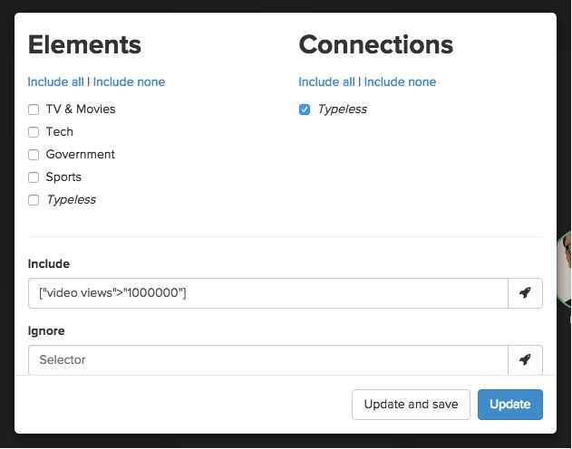

# Views

Styles and decorations are controlled by views. You can create multiple views to highlight different aspects of your map. Switch between views using the navigation at the top of the map. Views include focus, filter, cluster and settings. To edit the view, click the settings button (<i class="fa fa-sliders fa-rotate-270"></i>) on the right side of the map.

## Adding decorations

Decorations are powerful ways to change the color and/or size of the element, connections and loops in your map.

### Coloring by qualitative fields

If you have a qualitative field like "element type" you'll need to create a decoration for each value. Click "new element rule" and then use the top dropdowns to identify which element type(s) you want to color. Let's use "civic engagement" as an example:

Next, choose the decoration you'd like to use. For example, you could choose "change color" and then set the color as green (try using #ADB8FB instead of standard green).

The same process applies for connections as well (just choose the "new connection rule" button instead).

## Coloring or scaling by quantitative fields

When you have a quantitative field, it makes it even easier to decorate the elements. You might have a "net worth" field and you'd like to scale the size of all the people on the map based on this value. In this case, you'd change the top dropdown to "decorate custom selection" and set it as `element type` `is` `person`. From there, just add the size scale as shown below:

## Decorations are applied top to bottom

You might run into some cases where your decorations compete with one another (you decorated all "people" blue but highlighted those tagged with "influential" orange). Decorations are applied from top to bottom. Simply re-order your decorations by dragging them to achieve the desired result.

## Filters

Filters make it easy to show and hide elements, connections or loops based on data stored in the profile. Click the settings button (<i class="fa fa-sliders"></i>) on the right side of the map and then choose "filter".

If you're filtering by element or connection type, simply uncheck the types you want to hide. To filter using other views, use the "also include" and "but ignore" fields. Click the rocket icon (<i class="fa fa-rocket"></i>) to the right of the input of each field to build out the selector for what you want to hide or make visible.

* **Also include** If you've hidden certain elements and connections using the type checkboxes, you can use the "also include" field to bring things back into view. **So unless you have some types unchecked, this field will have no effect!**
* **But ignore** Use this field to hide elements and connections from your map. Whatever selector you add here will win out over anything you've set using the checkboxes or the "also include" field.

  Don't forget to first uncheck some element or connection types if you are using <strong>also include</strong>, otherwise they are all automatically included!

## Advanced editor

We've intentionally limited the decorations available through the builder to keep the UI simple
and avoid overwhelming new users. In order to harness the full power of views, you'll need to roll up your sleeves and do a little coding. Don't be scared! Beneath the surface views are controlled by css and it's a very easy language to learn.

If you're comfortable with CSS, we highly recommend using the advanced editor. Read the [advanced  guide](/views-advanced.md) to dive in.

<a href="https://github.com/kumu/docs/blob/master/guides/views.md" target="_blank"><i class="fa fa-github"></i> edit this page</a>
