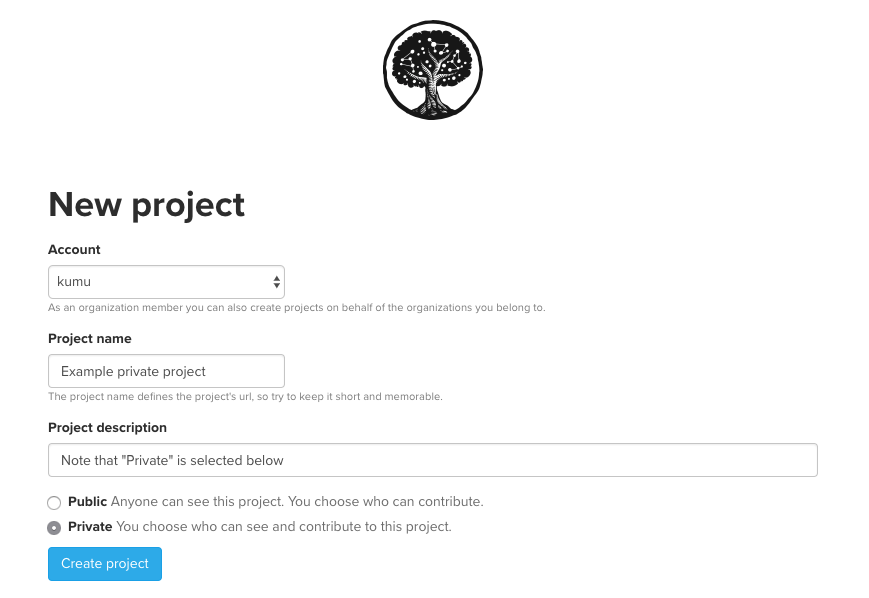

# Billing

At Kumu, we use an automated billing system to accept payments for private projects and [Pro workspace](../guides/pro-workspaces.md) fees. Amounts can be billed on either a monthly or annual basis. If you choose to be billed on an annual basis, you'll receive a 20% discount.

We handle all payments with [full PCI-compliance](https://www.pcisecuritystandards.org/) through [Stripe](https://stripe.com/), the industry standard, and you can use any credit card that is [accepted by Stripe](https://stripe.com/payments/payment-methods-guide#cards). We do not store any sensitive billing information on our own servers.

To change the credit card you use with Kumu, you can do the following:

1. Decide which [workspace](accounts-and-workspaces.md) you want to add card details to (you can add different credit cards to each of your workspaces, making it easy to separate personal bills and work-related bills).
2. [Go to your list of workspaces](https://kumu.io/dashboard#workspaces) and select the workspace from the list
3. In the Billing section of the workspace's settings, add your credit card details.

Kumu charges you based on two factors:

1. Whether you have a Basic Workspace or a [Pro Workspace](../guides/pro-workspaces.md)
2. The number of private projects you have in your workspace

#### Monthly billing

If you are on a monthly billing cycle, Kumu will bill your account on the same day each month. Basic Workspaces are free, and each private project costs $9/month. Pro Workspaces are $10 per month, and each private project costs an additional $20/month.

To add more private projects to a monthly Basic or Pro workspace, you can [create a new project](https://kumu.io/new) and use the New Project form to set the project to **Private**.

To remove private projects from the monthly bill in a Basic workspace, you can use the [project admin menu](../guides/project-admin.md) to delete the project, transfer it, or make it public. In a Pro workspace, you can do the same, but you also have the option to [archive](../guides/archiving-projects.md) the project.

When your bill is increased or decreased during a billing cycle, Kumu's billing system automatically **prorates** the final charge based on the amount of time left in your cycle, and incorporates the proration into the next bill.

#### Annual billing

To switch your account to annual billing:

1. Click on the Workspaces tab in your Dashboard
2. Click on the workspace you'd like to change the billing frequency for
3. Make sure to use the button "Add card" to add a credit card, if you hadn't already done so
4. Click on "Switch to yearly billing and save 20%" below the **Billing** header. You'll be charged immediately.

#### Adding private projects to the annual plan

If you are on an annual billing cycle, Kumu will bill your account once per year based on the type of workspace you have, and a pre-set private project limit. If you **add** a new private project, your private project limit will increase, and you'll be charged a pro-rated amount for the rest of the annual billing cycle _immediately_. This also means that deleting and archiving private projects _will not_ automatically reduce your annual bill; it will only make more private projects available under your total private project limit.

However, you can increase or decrease your private project limit at any time during the year, and this _will_ increase or decrease your next bill. To adjust your private project limit, go to the billing settings for your personal account or organization, and use the interface to add or subtract private projects.

When your bill is increased or decreased during a billing cycle, Kumu's billing system **prorates** the final charge based on the amount of time left in your cycle, and (if applicable) charges the card on file immediately.


When you increase your private project limit on an annual plan, a prorated charge will be billed immediately to the credit card on file. If you need to pay by invoice instead of by credit card, please [reach out Kumu support](mailto:support@kumu.io) before increasing your project limit.


#### Enterprise billing

If you're using the [Enterprise version of Kumu](kumu-io-and-kumu-enterprise.md), you'll be billed according to how many users you have, instead of how many projects you have. Enterprise customers are billed annually, and seats are sold in packs of 5 users.

## Free trials

When you create a new workspace (including the Basic workspace that Kumu creates for you when you first sign up), you automatically receive a 7-day free trial of private projects in that workspace. At any time during your free trial, you can add a credit card to your billing settings to start a subscription plan as soon as the free trial ends.

If you haven't added a credit card before the free trial ends, your private projects will be locked (you won't be able to view or edit them), and Kumu will prompt you to make your projects public or update your billing settings in order to unlock.

## Payment receipts

Our billing system automatically sends a receipt to the email on file each time a payment is made. From time to time, these receipts might get sent to your email's spam folder—if you don't see a receipt, be sure to check there first.

For a Basic Workspace, if you want to change the email that receipts are sent to, you can go to the [profile section of your account settings](https://kumu.io/settings#profile). To do this for a Pro Workspace, you can go to your Pro Workspace's[ dashboard](../guides/pro-workspaces.md#create-a-pro-workspace) and scroll down to the profile section.

## Paying by invoice

If you can't enter a credit card into Kumu's website for repeat billing, you can pay by invoice instead. An invoice will allow you to make a one-time payment via credit card, ACH transfer, or a check in the mail. To request an invoice, you can [email support@kumu.io](mailto:support@kumu.io).


Have any other questions about billing? Send an email to [support@kumu.io](mailto:support@kumu.io) and we'll get back to you!


## Downgrade or cancel your Kumu subscription

Kumu charges you based on two factors:

1. Whether you have a Basic Workspace or a Pro Workspace
2. The number of private projects you have in your workspace

You can downgrade or cancel your plan at any moment. Follow [this guide](../faq/how-do-i-downgrade-my-subscription.md) to learn how to do this in your account.

_Note: When your bill is increased or decreased during a billing cycle, Kumu's billing system automatically **prorates** the final charge based on the amount of time left in your cycle, and incorporates the proration into the next bill._
