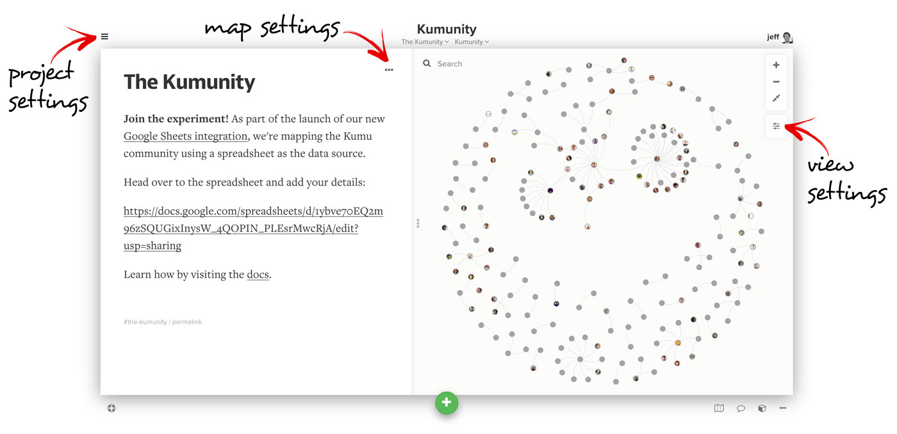
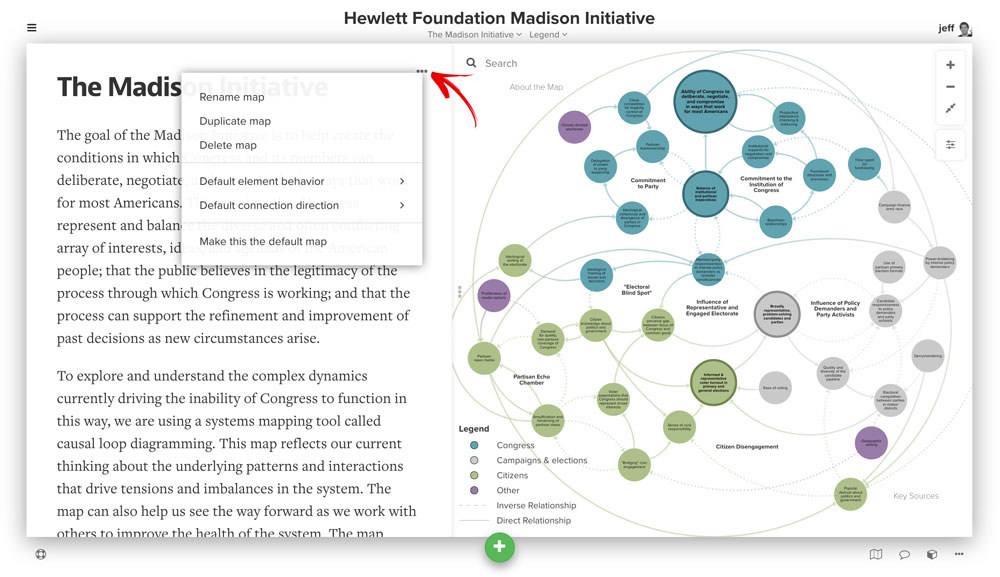
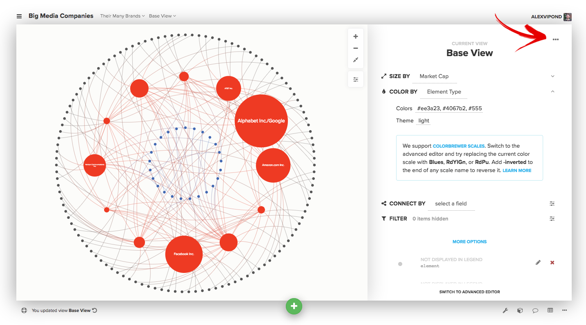

# Settings

You can edit settings for each [project](kumus-architecture.md#projects), [map](kumus-architecture.md#maps), and [view](kumus-architecture.md#views) in Kumu.

## Project settings

Project settings are accessed via the menu icon  in the upper left of your screen (on the [top toolbar](map-editor.md#top-toolbar)).

Within the project settings, you have the following options:

* **Overview.** Add a project overview and a [license](../guides/licensing.md) for everyone to see.
* **Presentations.** Create, edit, and publish [presentations](../guides/presentations.md) to walk others through your project. Break down your complex project using the slide format of presentations, adding text, images, videos, and fully interactive map slides.
* **Activity feed.** Use the activity feed to keep tabs on who’s making each change across your project (only visible for projects created in [Pro workspaces](../guides/pro-workspaces.md)).&#x20;
* **Help.** Access how-to videos, the Kumu Docs and a list of keyboard shortcuts.
* **Fields.** Manage the [fields](../guides/fields.md) for your project. Add and edit new fields, change field relevance (which fields appear in the profiles for elements, connections, and loops), and manage field appearance and behavior.
* **Members.** Give other people access to edit your map. [Learn more about collaborating in Kumu](collaboration.md).
* **Embeds.** Create a shareable link to a map, or create an iFrame to [embed your map](../guides/share-and-embed.md) on another site.
* **Trash.** View and empty the [trash](kumus-architecture.md#trash) for your project.
* **Admin.** Change privacy, rename the project, [archive the project](../guides/archiving-projects.md), or delete the project. You can also enable/disable the image proxy when [working with images](../guides/images.md).
* **Add-ons.** Install one of Kumu's [add-ons](../guides/add-ons.md).
* **Fork project.** Create a copy of a project. [Learn more about forking](../guides/forking.md).
* **Switch project.** Navigate back to your [dashboard](dashboard.md).
* **New project.** Create a new project.

## Map settings

Map settings are accessed from the map sidebar via the ellipsis icon  in the upper right corner of the [side panel](map-editor.md#side-panel).

Each map has the following available actions:

* Rename map
* Duplicate map
* Delete map
* Make this the default map

And each map has the following settings:

* **Default view.** Select the default view for a map. This is the view that will automatically load when someone visits the map.
* **Default element behavior.** Set whether new elements should be fixed or floating. [Learn more about fixed and floating layouts](../guides/layouts.md).
* **Default connection direction.** Set whether new connections should be undirected, directed, or mutual.
  * **Undirected.** No arrows will appear at either end of the connection.
  * **Directed.** An arrow will appear at the **To** end of the connection.
  * **Mutual.** Arrows will appear at both ends of the connection.

## View settings

View settings are accessed via the settings icon  on the right side of the map. If you want to save, rename, duplicate, or delete a view, you can click the ellipsis icon in the upper right. You can also use that icon to set the default view for the current map.

To learn more about editing the view itself (for example, adding decorations, filtering, changing default settings, etc.), [read the guide on View Editors](view-editors.md).


Pro tip: right-click on any blank space in your map to access a quick-access toolbar that allows you to edit or delete your Project, Map or View. You can also use it to hide the direct decorations toolbar, reset your view, or access Kumu Support through here!

