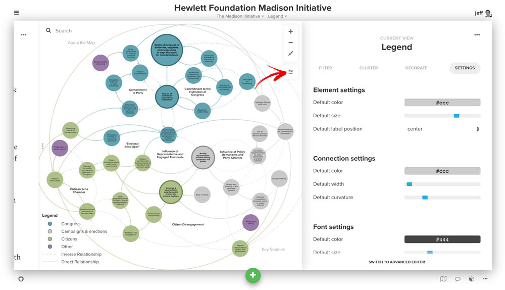

# Settings

You can edit settings for each project, map and view in Kumu.

*Before diving in, make sure you:*

* [Understand what a view is](../guides/views.md)
* [Know how maps relate to projects](../overview/data-architecture.md)

*After reading this you'll know:*

* Where to find project, map, and view settings
* Which options are available in each
* Where to go for additional guidance on changing the settings

## Locations of the various settings menus

## Project settings

Project settings are accessed via the menu in the upper left of your map.

Within the project settings, you have the following options:

* **Overview.** Add a project overview for everyone to see. On this page, you can also add a project license and access our Licensing Guide if you need help.
* **Presentations.** Create, edit, and publish [presentations](../guides/presentations.md) to walk others through your project. Break apart complexity using the slide format of presentations, adding text, images, videos, and snapshots of your maps.
* **Issues.** Access issues for the particular project. Issues give you and your team a forum to discuss the project and suggest changes and improvements as you’re collaborating on a map.
* **Help.** Access videos, docs, and keyboard shortcuts.
* **Fields.** Manage the [fields](../guides/fields.md) for your project. Add and edit new fields, change field relevance (which fields appear in the profiles for elements, connections, and loops), and manage field appearance and behavior.
* **Members.** Give others access to edit your map. Learn more about [collaborating in Kumu](../overview/collaboration.md).
* **Embeds.** Create an iFrame to [embed](../guides/embeds.md) your map on another site.  
* **Trash.** View and empty the project trash. If you delete an element from a map (and it isn't included in any other map), it ends up in the trash. Remember to empty your trash before reimporting a spreadsheet to make sure the elements and connections from the trash aren't pulled back into the map!
* **Admin.** Switch from public to private (and vice versa), delete a project, or rename a project.
* **Fork project.** Create a copy of a project. Learn more about [forking](../guides/forking.md).
* **Switch project.** Navigate back to your dashboard to work in a different project.
* **New project.** Create a new project.

## Map settings

Map settings are accessed from the map sidebar via the more button (...) in the upper right corner.

Each map has the following settings:

* **Default view.** Select the default view for a map. This is the view that will automatically load when someone visits the map.
* **Default element behavior.** Set whether new elements should be fixed or floating. **Note:** This does not change the behavior of existing elements (use `a` keystroke to select all and then pin/unpin).
* **Default connection direction.** Set whether new connections should be undirected, directed, or mutual.
  * **Undirected.** No arrows will appear at either end of the connection.
  * **Directed.** An arrow will appear at the leading end of the connection.
  * **Mutual.** Arrows will appear at both ends of the connection.

## View settings

View settings are accessed via the settings button on the right side of the map.

* **Element settings**
  * **Default color.** Set the default color for all elements.
  * **Default size.** Set the default size for all elements in the view.
  * **Default label position.** Change the position of the label to either **bottom** (below the element) or **center** (centered within the element).
* **Connection settings**
  * **Default color.** Set the color of connections in the map. Note: use `inherit` to inherit element colors along a gradient.
  * **Default width.** Change the default width of your connections.
  * **Default curvature.** Set the default curvature for each connection.
* **Font settings**
  * **Default color.** Set the default font color across the map.
  * **Default size.** Set the default size for all text on the map (elements, connections, and loops).
* **Showcase settings**
  * **Selector.** Build a selector to specify showcasing within the map.  
* **Layout settings**
  * **Preset.** Only applicable to the `force-directed` layout. Start with `auto` and move to `dense` or `hairball` as your map gets larger and more interconnected.
* **General settings**
  * **Theme.** Change the background color of the map between dark and light. Font color and buttons will change as well.
  * **Template.** Switch the underlying template for the view. We’ve set up the templates to quickly get you started with building and decorating a map.
  * **Quality.** Stick with `high` (circular elements, curved connections) unless you have a large map (>1000 elements). `Low/fast` (square elements, straight connections) improves the performance of large maps.
  * **Layout.** Change the layout that drives the positions for elements. Turning the layout `off` will prompt you to pin all elements. `Force-directed` will position elements automatically using our custom algorithm.
 
<a href="https://github.com/kumu/docs/blob/master/overview/settings.md" target="_blank"><i class="fa fa-github"></i> edit this page</a>
