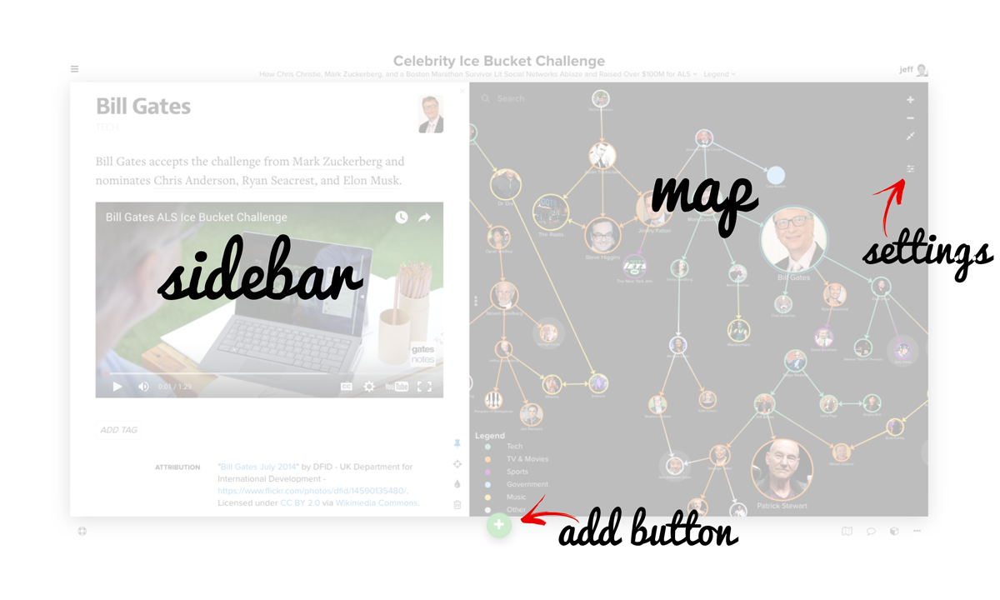
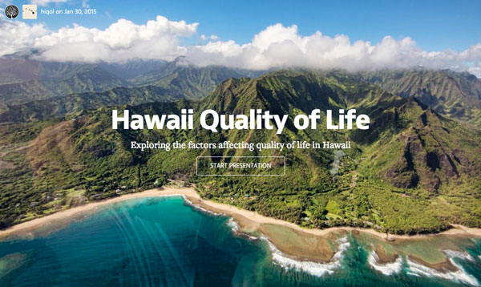

# The Essentials

This page contains everything you need to hit the ground running with Kumu. Carve out 20 minutes to review this page and you'll have awareness of at least 80% of Kumu's features. Then explore the guides to learn all that Kumu has to offer.

## Getting to know the user interface

### Map
Elements are the circles you see on the map and connections are the lines between the elements. To select either of them, simply click on the circle or the line.

### Sidebar
 The sidebar displays either the Map Overview or the profile for an element, connection or loop (if you've selected one). Hide the sidebar by clicking the three vertical dots (<i class="fa fa-ellipsis-v"></i>) on the edge of the sidebar.

### Settings
Click the settings button to edit the current view. This include options to filter, decorate, cluster, and showcase as well as other default settings for your map (font size, layout settings, templates, etc.).

### Add button
Click the green "+" button anytime you want to add content to your map. You can add elements, connections and loops as well as importing data and activating sketch mode.

### Map Navigation
The upper right corner has buttons to zoom in and out and zoom fit.

<!--
### Main menu (<i class="fa fa-th"></i>)

Use this menu to quickly change between maps and perspectices or switch between projects. You'll also find links to manage fields, members, rename a project, and delete a project.

### Pin (<i class="fa fa-map-marker"></i>)

Pinning allows you to add a fix the position of the element on the map. You can pin individual elements by selecting the element and then clicking the pin button. You can also select mutiple elements (or all of the elements by hitting the ***a*** keystroke) and then click the pin button to pin multiple elements at once.

### Direction (<i class="fa fa-random"></i>)

Connections can be directed, undirected, or mutual (arrows both ways). Select a connection and then click the direction button to choose between the options. You also have an option to switch directions when the connection is directed.

### Delay (<i class="fa fa-warning"></i>)

Delays are used in system maps (especially causal loop diagrams) to signify a time delay between two factors. A delay shows up as two perpendicular lines on a connection and can be added by selecting a connection and then clicking the delay button.

### Delete (<i class="fa fa-trash-o"></i>)

Elements, connections and loops can be deleted by selecting it and then clicking the delete button (or by clicking delete on your keyboard). When elements are deleted, they are initially moved into a "trash can" and can later be permanently deleted by emptying the trash can.

### Cluster

Clustering is a powerful way to connect elements based on data stored in the profile. To learn more, read our [Clustering Guide](/guides/clustering.html). To activate clustering, click the cluster button and then choose the field you want to cluster by. You can then choose to permanently save a cluster by clicking "save" or remove the cluster by clicking "cancel." If you refresh the page any unsaved clusters will be removed.

### Decorate (<i class="fa fa-tint"></i>)

The decorate button allows you to quickly add decorations to your map. To learn more, read [Decorating Your Map](/basics/decorations.html).

### Filter (<i class="fa fa-filter"></i>)

The filter button allows you to change which element and connection types are visible by choosing which to display. Keep all the options checked to have all types displayed or uncheck specific types to hide only those entities with the given type. The undefined option allows you to show and hide entities which do not have any type assigned.

### Focus (<i class="fa fa-crosshairs"></i>)

Focus allows you to show only a certain part of your map. Click on an element and then click the focus button and you'll be presented with the following options:

* **Selected** - Hide all but the specific element
* **Direct (1 degree)** - Display the specific element and one step out
* **Indirect (2 degrees)** - Display the specific element and two steps out
* **Extended (3 degrees)** - Display the specific element and three steps out

We've also wrapped the focus behavior into your navigation of the map by allowing you to click and hold on a specific element to activate the direct focus. Below are the primary actions for activating focus using a long click:

<dl>
<dt>Click and hold an element without focus activated</dt>
<dd>Activates direct focus for the specified element</dd>
<dt>Click and hold another element when focus is already activated</dt>
<dd>Adds the selected element to the given focus, allowing you to expand outward</dd>
<dt>Click and hold on the map background</dt>
 <dd>Deactivates the focus</dd>
 </dl>
-->

## Building your first map

### Adding elements and connections one by one

**Use the green "+" button.** Add an element by clicking the green "+" button at the bottom of the map and choose "add element". Type the name of the element you want to add and then hit enter. Add a connection by clicking the green "+" button and choose "add connection". Type the name of the elements you want to connect and hit enter. You can also select an element before choosing "add connection" and that element will automatically be included in the from input for the add connection interface.

  Speed up this process by using keyboard shortcuts! Just hit "e" to add an element and "c" to add a connection.

**Sketch mode.** Activate sketch mode by clicking the green "+" button and then clicking "sketch mode". Once activated, you can add an element by clicking anywhere on the map and you can add a connection by dragging from an existing element. You can move elements by holding alt while dragging the element.

**Alt and click or click & drag.** Alt is a great shortcut for building a map. Hold alt and click anywhere on the map to add an element. Hold alt and drag from an existing element to add a connection.

### Importing data

**Import data from a spreadsheet.** Drag a spreadsheet onto the map or click the green "+" button at the bottom of the map. Make sure your spreadsheet (.xlsx or .csv) includes the following columns:

- *For elements:* Label, Type (optional), Description (optional)
- *For connections:* From, To, Type (optional), Label (optional)

Additional fields can be imported by including extra columns in your spreadsheet. Here's an example:

<table class="table">
  <thead>
    <tr>
      <th>Label</th>
      <th>Type</th>
      <th>Description</th>
      <th>Tags</th>
    </tr>
  </thead>
  <tbody>
    <tr>
      <td>Jeff Mohr</td>
      <td>Person</td>
      <td>Co-Founder and CEO, always  up for learning</td>
      <td>Founder|Male|Runner</td>
    </tr>
    <tr>
      <td>Kumu</td>
      <td>Company</td>
      <td>A web-based platform for mapping relationships...</td>
      <td>Mapping|Technology</td>
    </tr>
  </tbody>
</table>

And here's a sample of what your connection spreadsheet might look like:

<table class="table">
  <thead>
    <tr>
      <th>From</th>
      <th>To</th>
      <th>Type</th>
      <th>Strength</th>
    </tr>
  </thead>
  <tbody>
    <tr>
      <td>Barack</td>
      <td>Michelle</td>
      <td>Personal</td>
      <td>Strong</td>
    </tr>
    <tr>
      <td>Ed Snowden</td>
      <td>NSA</td>
      <td>Contractor</td>
      <td>It's complicated</td>
    </tr>
  </tbody>
</table>

Head over to the [import guide](/guides/import.md) for more details.

### Positioning elements and changing the curvature of connections

Depending on the template you selected, elements will either be fixed (manually positioned by you) or floating (automatically positioned using our layout algorithm). Here's a few things people run into with positioning:

* **My elements won't stop moving, how do I stop them?** Use the "a" keystroke to select all elements and then hit the pin button in the lower right corner of the selection profile.
* **New elements I add keep moving even though others are pinned...** You'll see an option in the map settings to change the default behavior (fixed or floating). Choose fixed to have them pinned by default.

If your elements are pinned in place, you can also change the curvature of the connections by dragging them.

### Adding information to the profile

Each element, connection and loop has a profile which can be used to store additional fields.

Make sure to provide context for each element and connection using the description, and then click "+ New Field" to add a custom field.

## Styling your maps with views

Styles and decorations are controlled by views. You can create multiple views to highlight different aspects of your map. Switch between views using the navigation at the top of the map. Views include focus, filter, cluster and settings.

### Default settings and colors

Click the settings icon (<i class="fa fa-sliders fa-rotate-90"></i>) on the right side of the map and then click "settings" to change default map settings:

If you're running into bunching and overlap with your map, try adjusting the layout settings from "auto" to "hairball." Make sure to save your changes to active view by clicking save when you are finished.

### Decorating elements

You can easily decorate elements based on the data stored in the profile for any element. Click the settings button on the right side of the map and then click "decorate."

Click "add element rule".

Use the top dropdowns to indicate which elements should be decorated, and then use the checkboxes below to determine whether you want to change size, change color, add a bullsye, or add a shadow. Optionally add text to the "label" field to add a legend entry in the lower left corner of your map. If you leave this blank the decoration won't be included in the legend.

### Decorating connections

Decorating connections is quite similar to decorating elements. Just follow the instructions above but choose the "add connection rule" button instead.

## Keeping things comprehensible

As your map grows in size you'll want to use both focus and filter to keep users from being overwhelmed.

### Focus
Focus is activated in one of two ways, by clicking and holding on any element or connection or by selecting one or more elements, connections or loops and clicking the focus button in the bottom right of the selection profile. Once activated, you can walk in and out by degree using the "+" and "-" keys on your keyboard (don't hold shift, just hit the respective keys) or using the 1-9 numerical keys.

When you click the focus button, you'll be prompted with a menu of how many degrees out you'd like to focus. Once focus is activated, you can click and hold on any element to bring that element's direct connections into view.

### Filter
Filters can be edited by clicking the settings button on the right side of the map.

If you're filtering by element or connection type, simply uncheck the types you want to hide. To filter using other fields, use the "also include" and "but ignore" fields. Click the rocket icon (<i class="fa fa-rocket"></i>) to the right of the input of each field to build out the selector for what you want to hide or make visible.

* **Also include** If you've hidden certain elements and connections using the type checkboxes, you can use the "also include" field to bring things back into view. **So unless you have some types unchecked, this field will have no effect!**
* **But ignore** Use this field to hide elements and connections from your map. Whatever selector you add here will win out over anything you've set using the checkboxes or the "also include" field.

## Collaborating with teammates

### Public vs. private

Projects can be either public or private. With a public project, anyone can view your maps but you control who can edit. With a private project, you're in complete control of who can view and edit your maps.

### Inviting members

**Personal Accounts.** For projects under a personal account, you can add collaborators through the main menu within your project. Click the menu in the upper left corner and choose "Members" and then type the username of who you'd like to add (they need to first have a free Kumu account before they can be added).

**Organization Accounts.** For projects under an organization account, you have additional flexibility to add people to a project with view, edit, or admin access. Access is controlled via teams and managed in the organization settings.

### Conflicts

With Kumu you can work at the same time with other members of your team but it is *not* realtime. In order to pull in recent changes, just refresh the page. We'll do the work to combine any edits that can be automatically merged and then prompt you if we run into any conflicts. If you see the conflict window, follow the prompts to resolve the conflict and save the final version.

## Sharing your work

### Presentations

Use [presentations](/guides/presentations.md) to create a slide by slide walkthrough of your map(s). Combine text, video, images and maps into a single, engaging presentation that anyone can access via URL.

Access presentations by clicking the menu in the upper left corner of your map and clicking on "presentations".

### Share via URL/embed

You can also share maps through our embed feature. Click the more menu in the lower right corner of your map and then choose "embed map on another website." Once an embed has been created, you can use the link created for the embed to share with others (without them needing to be added to your project).

## Advanced features

### Clustering

Use [clustering](/guides/clustering.md) to quickly connect elements based on their shared fields.

### Metrics

Kumu has a powerful [metrics engine](/guides/metrics.md) which includes a number of popular social network analysis (SNA) metrics like betweeness, closeness, degree, indegree, outdegree, eigenvector and community detection.

Run metrics and then use size and color scales to quickly and easily analyze the results. You can access metrics via the blocks icon (<i class="fa fa-cube"></i>) in the lower right corner of the map.

<a href="https://github.com/kumu/docs/blob/master/getting-started/introduction.md" target="_blank"><i class="fa fa-github"></i> edit this page</a>
