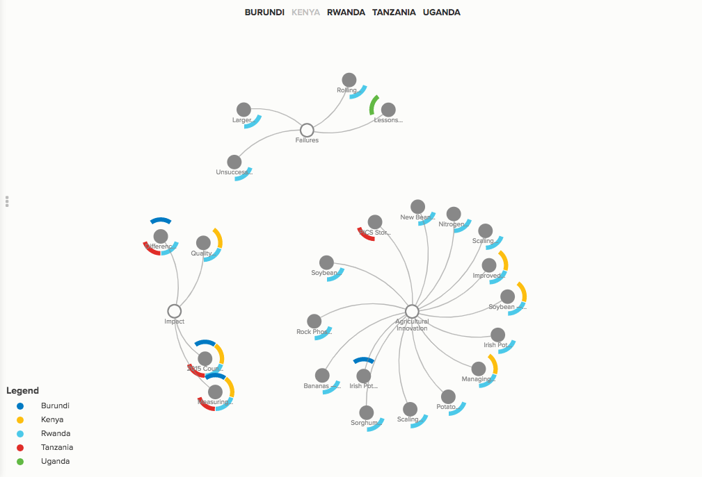
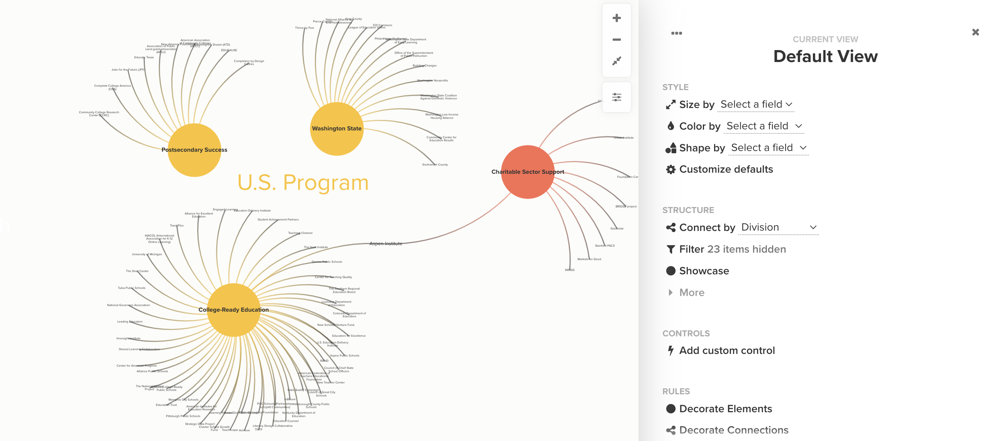
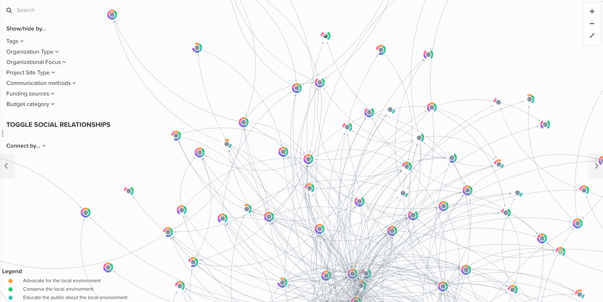
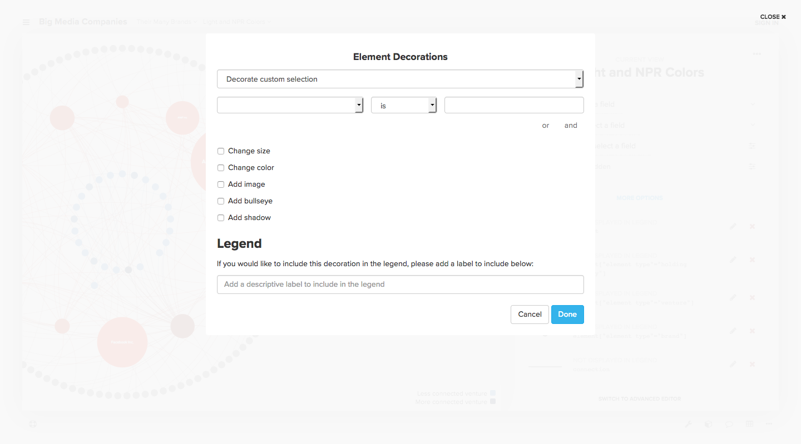

# View editors

Kumu allows you to create multiple different views to visualize your data in multiple different ways.&#x20;

## Create, rename, duplicate or delete a view

* To create a new view: click on the first dropdown next to the project title in the top-left corner of your screen, and choose **+ NEW VIEW.**&#x20;
* To rename a view: click on the first dropdown next to the project title in the top-left corner of your screen, hover over a view, and choose the edit pencil. Alternatively, right-click on any blank space in your map, click on View, choose Rename  View.&#x20;
* To duplicate a view: right-click on any blank space in your map, click on View, choose Duplicate View. **NOTE:** making changes to a duplicate view _may_ affect your original view. Read more about that in [this guide](kumus-architecture.md#projects).&#x20;
* To delete a view, click on the first dropdown next to the project title in the top-left corner of your screen, hover over a view, and choose the trash icon. Alternatively, right-click on any blank space in your map, click on View, choose Delete View.&#x20;

## Visualizing your data with views

You can edit [views](kumus-architecture.md#views) with two different editors: the Basic Editor and the Advanced Editor.

The Basic Editor allows you to click through different menus to access many of Kumu's powerful features—decorations, filtering, clustering, layouts, and more. The Advanced Editor allows you to write code in Kumu's CSS-inspired coding language to access all of the same features.

There are also some features of Kumu that can only be accessed through the Advanced Editor, but if you're unfamiliar with coding, we recommend starting with the Basic and switching to the Advanced as needed. The features that are exclusive to the Advanced Editor are thoroughly documented on this site, and if you ever need help writing some code, just reach out to the Kumu team!

## Basic Editor

To open the Basic Editor, open your map and click the settings icon  on the right side of the map.

<figure><figcaption></figcaption></figure>

You'll see Kumu's most commonly used view settings:

### Size by

**Size by** allows you to scale the size of your elements based on numbers stored inside them. For example, if you have a map of organizations, you could create a field called "Net Assets" and fill out the numbers for each element. Then you can use the Basic Editor to scale the size the organizations according to their Net Assets, allowing you to quickly compare everyone's resources.

<figure><figcaption><p>Size by</p></figcaption></figure>

Don't like the default sizes? Click the expand icon next to the **Size by** dropdown to fine-tune your sizing options.

Note that if you don't have any fields with numbers, the **Size by** dropdown menu won't have any options in it. If you don't have this kind of data available, try using Kumu's [Metrics](../guides/metrics.md) feature to create some!

Need more precise control over your sizes? Check out our guide on [refining your decorations](../guides/decorate.md#refine-your-decorations).


Are your fields with numbers not showing up in the **Size by** dropdown? Try [changing the field type to "Number"](../guides/fields.md#customize-a-field).


### Color by

**Color by** allows you to color-code your elements based on any field. Select a field from the dropdown, and any elements that have data in that field will be colored!

Don't like the default colors? Click the expand icon next to the **Color by** dropdown to fine-tune your coloring options. This example colors by Element Type using the `bujumbra` scale:


The default color scale, `neon2`, can support seven different colors. If you need more colors (for example if you have 10 or 11 different element types), [check out our color reference](advanced-editor-hub/color-reference.md) to find a scale that will work for your data.

If you color by a multi-pick field like Tags, Kumu will color code your elements with flags (colored arcs around the outside of your elements). Each flag represents one of the possible values in the multi-pick field.



To learn more about flags, [read the full guide](../guides/flags.md).

Need more precise control over your colors? Check out our guide on [refining your decorations](../guides/decorate.md#refine-your-decorations).

### Shape by

**Shape by** allows you to shape your elements based on any field that can hold only one value. Select a field from the dropdown, and any elements that have data in that field will get a new shape!

<figure><figcaption><p>Shapes</p></figcaption></figure>

To learn more about shapes, [read the full guide](../guides/shapes.md).

### Customize Defaults

The [default view settings](../guides/default-view-settings.md) is your one-stop-shop for adjusting the underlying settings in your [view](../guides/views.md). Templates, layouts, default element and connection styles, and more, can all be changed with default view settings.

<figure><figcaption><p>Customize defaults</p></figcaption></figure>

### Connect by

**Connect by** allows you to activate clustering on your map. Clustering is a powerful tool that allows you to connect elements based on the data in their fields, and it's particularly useful on stakeholder and network maps.

When clustering is activated, Kumu will create new elements to represent each possible value for a field of your choice, and it will draw a connection between your elements and the value(s) in their field.

<figure><figcaption></figcaption></figure>

[Check out our full clustering guide](../guides/clustering.md) to learn more.

### Filter

**Filter** allows you to show and hide elements, connections or loops based on data stored in the profile. Click on **Filter** to open up your filter settings.


[Check out our full filtering guide](../guides/filter.md) to learn more.

### Showcase

**Showcase** is similar to Filter, which allows you to show or hide elements, connections, and loops based on the information they contain. But, instead of _hiding_ your unselected data, showcase will make it translucent, effectively _fading it_ into the background.&#x20;

<figure><figcaption><p>Showcase</p></figcaption></figure>

To learn more about Showcase, [find our full guide here](../guides/showcase.md).

### More

Underneath the three core tools in the "Structure" section of the Basic Editor, you'll see a **MORE** link. Clicking this link will bring up a list of three additional features.

Follow these links below to learn more about any of these individual options:

* [Bridge](../guides/bridge.md): draw connections between any two elements that are connected to a _mutual_ element
* [Snap-to](../guides/layouts/snap-to.md): arrange a custom selection of elements in a perfect _circle_ or _line_
* [Grids & Guides](../guides/underlays.md): use a grid-based layout for arranging with numerical field data.

### Add custom control

**Controls** is a super powerful feature that allows you to customize how people interact with your maps. You can use them to add buttons, images, text and more to your map! You can also use interactive controls to transform the current view's setting, such as filter, focus, and clustering.&#x20;

<figure><figcaption><p>Controls in the upper left corner</p></figcaption></figure>

Check out [our full controls guide](../guides/controls.md) to learn more.&#x20;

### Decorate Elements & Decorate Connections

If you need more precise control over the size and color of your decorations, you can choose either of the last two options on the list. If you click **Decorate elements,** Kumu will bring up the custom decoration builder for elements, which allows you to decorate your map in great detail. Similarly, if you wish to decorate your connections, choose **Decorate connections** to bring up the decoration builder for connections.&#x20;

<figure><figcaption><p>Custom decorations builder for elements</p></figcaption></figure>

To learn more about how to add custom decorations, find the [full guide here](../guides/data-driven-decorations.md#use-decoration-builders-to-create-custom-decorations).&#x20;

### Existing custom decorations&#x20;

If you have already one or more decorations to your map, the Basic Editor will show those existing decorations underneath the **Rules** section (below Decorate connections). They'll be listed in chronological order from top to bottom (the most recently created decoration rules will be at the bottom of the list).

This section of the Basic Editor shows each decoration's legend label you added through the Decoration Builder. You can click the pencil icon next to a decoration to edit it, or click the delete icon to delete it.

<figure><figcaption><p>Custom decorations</p></figcaption></figure>

## Advanced Editor

To open the Advanced Editor, click the settings icon  to open the Basic Editor, then click **SWITCH TO ADVANCED EDITOR** at the bottom of the Basic Editor.


Everything you change in the Basic Editor is automatically coded into the Advanced Editor, and most Advanced Editor code follows the same pattern:

```scss
selector {
    property: value;
}
```

`selector` can be replaced with any valid [selector](../guides/selectors.md), and you can read our [property reference](advanced-editor-hub/property-reference.md) to find documentation on `properties` and their possible `values`. You can also use some standard [CSS properties](https://developer.mozilla.org/en-US/docs/Web/CSS/Reference) throughout the Advanced Editor.

### At-rules

At-rules are pieces of code in the Advanced Editor that look and behave a bit differently, compared to the usual `selector {property: value;}` code. They start with an `@` symbol, and they give Kumu special instructions on how to display your map.

#### @controls

`@controls` allow you to customize how people interact with your maps. If you have coded in any `@controls`, they will show up at the top of your Advanced Editor code. To learn more about `@controls`, [read the full guide](../guides/controls.md).

#### @import

`@import` rules allow you to import code from one of your project's views to another. To learn more about `@import` rules, [see our full guide](../guides/imported-views.md).

#### @settings

Unless you have coded in `@controls` or `@import` rules, your Advanced Editor code will have a block of `@settings` code right at the top, where you can adjust default view settings like layout, template, render quality, and more.

[Check out our default view settings guide](../guides/default-view-settings.md#change-default-view-settings-in-the-advanced-editor) to learn more about `@settings`.

#### @view

`@view` can be used to define partial views. You can find more info in the [full guide on partial views](../guides/partial-views.md).

## Saving changes

Whether you're using the Basic Editor or Advanced Editor, your changes don't get saved automatically. However, as soon as you make a change, Kumu will show a prompt at the bottom of the view editors to either **SAVE** your changes or **REVERT** to your last saved version.

A best practice when working in the view editors is to save your changes frequently! This will allow you to revert when you need to, without undoing a lot of progress that you wanted to keep.
