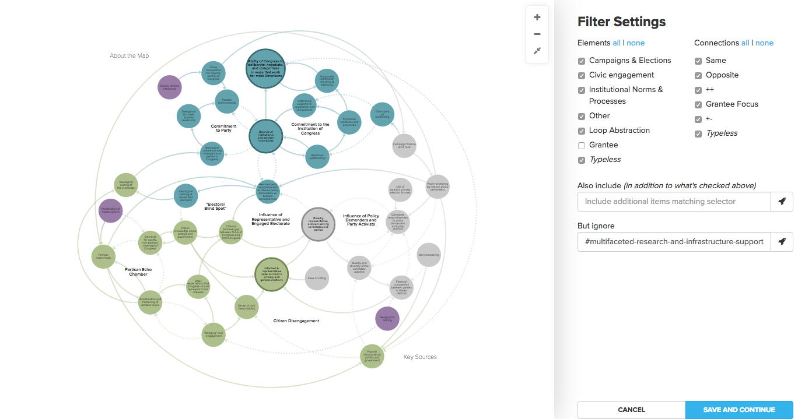

# View Editors

You can edit [views](/overview/kumus-architecture.html#views) with two different editors: the Basic Editor and the Advanced Editor.

The Basic Editor allows you to click through different menus to access many of Kumu's powerful features—decorations, filtering, clustering, layouts, and more. The Advanced Editor allows you to write code in Kumu's CSS-inspired coding language to access all of the same features.

There are also some features of Kumu that can only be accessed through the Advanced Editor, but if you're unfamiliar with coding, we recommend starting with the Basic and switching to the Advanced as needed. The features that are exclusive to the Advanced Editor are thoroughly documented on this site, and if you ever need help writing some code, just reach out to the Kumu team!

## Basic Editor

To open the Basic Editor, open your map and click the Settings icon <i class="fa fa-sliders"></i> on the right side of the map.

<span class="small plain">

</span>

You'll see four of Kumu's most commonly used view settings.

### Size by

**Size by** allows you to scale the size of your elements based on numbers stored inside them. For example, if you have a map of organizations, you could create a field called "Net Assets" and fill out the numbers for each element. Then you can use the Basic Editor to scale the size the organizations according to their Net Assets, allowing you to quickly compare everyone's resources.

Don't like the default sizes? Click the expand icon <i class="fa fa-angle-down"></i> next to the **Size by** dropdown to fine-tune your sizing options.

Note that if you don't have any fields with numbers, the **Size by** dropdown menu won't have any options in it. If you don't have this kind of data available, try using Kumu's [Metrics](/guides/metrics.html) feature to create some!

Need more precise control over your sizes? Check out our guide on [refining your decorations](/guides/decorate.html#refine-your-decorations).

<p class="alert alert-warning">
    Are your fields with numbers not showing up in the <b>Size by</b> dropdown? Try <a class="alert-link" href="/guides/fields.html#customize-a-field">changing the field type to "Number"</a>.
</p>


### Color by

**Color by** allows you to color-code your elements based on any field. Simply select a field from the dropdown, and any elements that have data in that field will be colored!

Don't like the default colors? Click the expand icon <i class="fa fa-angle-down"></i> next to the **Color by** dropdown to fine-tune your coloring options. This example colors by Element Type using the `bujumbra` scale:


The default color scale, `neon2`, can support seven different colors. If you need more colors (for example if you have 10 or 11 different element types), [check out our color reference](/guides/color-reference.html) to find a scale that will work for your data.

If you color by a multi-pick field like Tags, Kumu will color code your elements with flags (colored arcs around the outside of your elements). Each flag represents one of the possible values in the multi-pick field.


To learn more about flags, [read the full guide](/guides/flags.html).

Need more precise control over your colors? Check out our guide on [refining your decorations](/guides/decorate.html#refine-your-decorations).


### Connect by

**Connect by** allows you to activate clustering on your map. Clustering is a powerful tool that allows you to connect elements based on the data in their fields, and it's particularly useful on stakeholder and network maps.

When clustering is activated, Kumu will create new elements to represent each possible value for a field of your choice, and it will draw a connection between your elements and the value(s) in their field.

[Check out our full clustering guide](/guides/clustering.html) to learn more.


### Filter

**Filter** allows you to show and hide elements, connections or loops based on data stored in the profile. Click the settings icon to the right of **Filter** to open up your filter settings.



[Check out our full filtering guide](/guides/filter.html) to learn more.


### More Options

Underneath the four core tools in the Basic Editor, you'll see a **MORE OPTIONS** link. Clicking this link will bring up a list of everything you can do in the Basic Editor.


Follow these links below to learn more about any of these individual options:
* [Customize defaults](/guides/default-view-settings.html)
* [Decorate elements and connections](/guides/decorate.html#refine-your-decorations)
* [Filter elements and connections](/guides/filter.html)
* [Showcase elements and connections](/guides/showcase.html)
* [Connect elements with similar values](/guides/clustering.html)


### Existing decorations

If you have already one or more decorations to your map, the Basic Editor will show those existing decorations underneath the **MORE OPTIONS** link. They'll be listed in chronological order from top to bottom (the most recently created decoration rules will be at the bottom of the list).


This section of the Basic Editor shows each decoration's legend label, if you have added them through the Decoration Builder. You can click the pencil icon <i class="fa fa-pencil">  </i> next to a decoration to edit it, or click the delete icon <i class="fa fa-remove"> </i> to delete it.


## Advanced Editor

To open the Advanced Editor, click the Settings icon <i class="fa fa-sliders"></i> to open the Basic Editor, then click **SWITCH TO ADVANCED EDITOR** at the bottom of the Basic Editor.

<span class="small plain">

</span>

Everything you change in the Basic Editor is automatically coded into the Advanced Editor, and most Advanced Editor code follows the same pattern:
```
selector {
    property: value;
}
```
`selector` can be replaced with any valid [selector](/guides/selectors.html), and you can read our [property reference](/guides/property-reference.html) to find documentation on `properties` and their possible `values`. You can also use some standard [CSS properties](https://developer.mozilla.org/en-US/docs/Web/CSS/Reference) throughout the Advanced Editor.

### At-rules

At-rules are pieces of code in the Advanced Editor that look and behave a bit differently, compared to the usual `selector {property: value;}` code. They start with an `@` symbol, and they give Kumu special instructions on how to display your map.


#### @controls

`@controls` allow you to customize how people interact with your maps. If you have coded in any `@controls`, they will show up at the top of your Advanced Editor code. To learn more about `@controls`, [read the full guide](/guides/controls.html).

#### @import

`@import` rules allow you to import code from one of your project's views to another. To learn more about `@import` rules, [see our full guide](/guides/imported-views.html).

#### @settings
Unless you have coded in `@controls` or `@import` rules, your Advanced Editor code will have a block of `@settings` code right at the top, where you can adjust default view settings like layout, template, render quality, and more.

[Check out our default view settings guide](/guides/default-view-settings.html#change-default-view-settings-in-the-advanced-editor) to learn more about `@settings`.

#### @view
`@view` can be used to define partial views. You can find more info in the [full guide on partial views](/guides/partial-views.html).

## Saving changes

Whether you're using the Basic Editor or Advanced Editor, your changes don't get saved automatically. However, as soon as you make a change, Kumu will show a prompt at the bottom of the view editors to either **SAVE** your changes or **REVERT** to your last saved version.

A best practice when working in the view editors is to save your changes frequently! This will allow you to revert when you need to, without undoing a lot of progress that you wanted to keep.

<span class="edit-link"><a href="https://github.com/kumu/docs/blob/master/overview/view-editors.md" target="_blank"><i class="fa fa-github"></i> edit this page</a></span>
